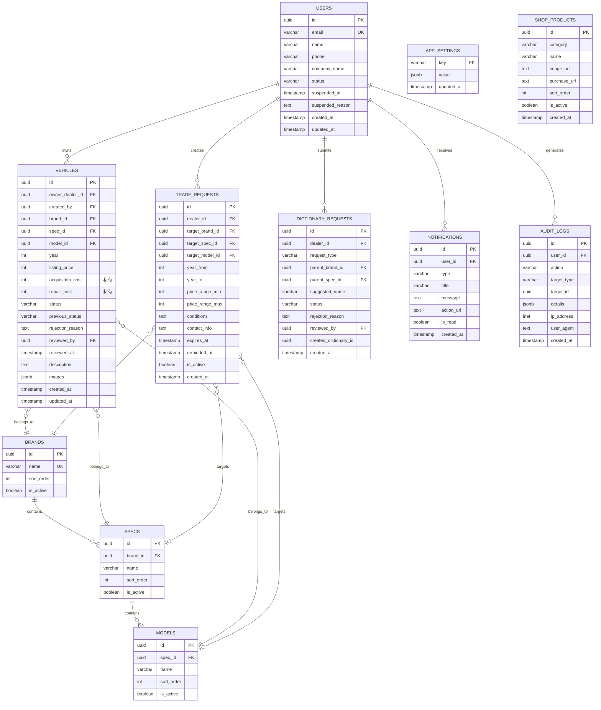

# 發財B平台 - 資料庫與模型設計

**版本**: 1.1.0  
**建立日期**: 2026-03-18  
**最後修訂**: 2026-03-19 (安全性修補 - ANALYZE-01)  
**對應規格書**: spec.md v1.5.0  

---

## 📌 版本更新記錄

| 版本 | 日期 | 變更內容 |
|------|------|----------|
| 1.1.0 | 2026-03-19 | 🔒 安全性修補：階層一致性觸發器、停權帳號阻擋、dictionary_requests RLS 補全 |
| 1.0.0 | 2026-03-18 | 初始版本 |

---

## 一、資料表總覽

| 表名 | 說明 | 主要關聯 |
|------|------|----------|
| `users` | 車行會員（擴充 Supabase Auth） | - |
| `brands` | 品牌字典 | - |
| `specs` | 規格字典 | brands |
| `models` | 車型字典 | specs |
| `vehicles` | 車輛 | users, brands, specs, models |
| `trade_requests` | 盤車調做需求 | users, brands, specs, models |
| `dictionary_requests` | 字典檔新增申請 | users, brands, specs |
| `notifications` | 站內通知 | users |
| `audit_logs` | 稽核日誌 | users |
| `app_settings` | 全域設定（含導流網址） | - |
| `shop_products` | 線上商城商品 | - |

---

## 二、完整資料表定義

### 2.1 users（車行會員）

> **說明**：擴充 Supabase Auth 的 `auth.users`，儲存車行業務資訊。角色透過 `app_metadata.role` (Custom Claims) 識別。

```sql
CREATE TABLE public.users (
  -- 主鍵：對應 Supabase Auth
  id UUID PRIMARY KEY REFERENCES auth.users(id) ON DELETE CASCADE,
  
  -- 基本資訊
  email VARCHAR(255) NOT NULL UNIQUE,
  name VARCHAR(100) NOT NULL,
  phone VARCHAR(20) NOT NULL,
  company_name VARCHAR(100) NOT NULL,
  
  -- 狀態管理
  status VARCHAR(20) NOT NULL DEFAULT 'active' 
    CHECK (status IN ('active', 'suspended')),
  suspended_at TIMESTAMP,
  suspended_reason TEXT,
  
  -- 時間戳
  created_at TIMESTAMP NOT NULL DEFAULT NOW(),
  updated_at TIMESTAMP NOT NULL DEFAULT NOW()
);

-- 索引
CREATE INDEX idx_users_status ON users(status);
CREATE INDEX idx_users_email ON users(email);
CREATE INDEX idx_users_company ON users(company_name);

-- 觸發器：自動更新 updated_at
CREATE OR REPLACE FUNCTION update_updated_at_column()
RETURNS TRIGGER AS $$
BEGIN
  NEW.updated_at = NOW();
  RETURN NEW;
END;
$$ LANGUAGE plpgsql;

CREATE TRIGGER trigger_users_updated_at
  BEFORE UPDATE ON users
  FOR EACH ROW EXECUTE FUNCTION update_updated_at_column();
```

| 欄位 | 型別 | NULL | 預設值 | 說明 |
|------|------|------|--------|------|
| id | UUID | NO | - | PK, FK → auth.users |
| email | VARCHAR(255) | NO | - | 登入 Email（唯一） |
| name | VARCHAR(100) | NO | - | 聯絡人姓名 |
| phone | VARCHAR(20) | NO | - | 聯絡電話 |
| company_name | VARCHAR(100) | NO | - | 車行名稱 |
| status | VARCHAR(20) | NO | 'active' | 狀態：active/suspended |
| suspended_at | TIMESTAMP | YES | - | 停權時間 |
| suspended_reason | TEXT | YES | - | 停權原因 |
| created_at | TIMESTAMP | NO | NOW() | 建立時間 |
| updated_at | TIMESTAMP | NO | NOW() | 更新時間 |

---

### 2.2 brands（品牌字典）

```sql
CREATE TABLE public.brands (
  id UUID PRIMARY KEY DEFAULT gen_random_uuid(),
  name VARCHAR(100) NOT NULL UNIQUE,
  sort_order INTEGER NOT NULL DEFAULT 0,
  is_active BOOLEAN NOT NULL DEFAULT true,
  created_at TIMESTAMP NOT NULL DEFAULT NOW()
);

-- 索引：模糊搜尋
CREATE EXTENSION IF NOT EXISTS pg_trgm;
CREATE INDEX idx_brands_name_trgm ON brands USING gin (name gin_trgm_ops);
CREATE INDEX idx_brands_sort ON brands(sort_order) WHERE is_active = true;
```

| 欄位 | 型別 | NULL | 預設值 | 說明 |
|------|------|------|--------|------|
| id | UUID | NO | gen_random_uuid() | PK |
| name | VARCHAR(100) | NO | - | 品牌名稱（唯一） |
| sort_order | INTEGER | NO | 0 | 排序權重 |
| is_active | BOOLEAN | NO | true | 是否啟用 |
| created_at | TIMESTAMP | NO | NOW() | 建立時間 |

---

### 2.3 specs（規格字典）

```sql
CREATE TABLE public.specs (
  id UUID PRIMARY KEY DEFAULT gen_random_uuid(),
  brand_id UUID NOT NULL REFERENCES brands(id) ON DELETE CASCADE,
  name VARCHAR(100) NOT NULL,
  sort_order INTEGER NOT NULL DEFAULT 0,
  is_active BOOLEAN NOT NULL DEFAULT true,
  created_at TIMESTAMP NOT NULL DEFAULT NOW(),
  
  -- 同品牌下規格名稱唯一
  UNIQUE(brand_id, name)
);

-- 索引
CREATE INDEX idx_specs_brand ON specs(brand_id) WHERE is_active = true;
CREATE INDEX idx_specs_name_trgm ON specs USING gin (name gin_trgm_ops);
```

| 欄位 | 型別 | NULL | 預設值 | 說明 |
|------|------|------|--------|------|
| id | UUID | NO | gen_random_uuid() | PK |
| brand_id | UUID | NO | - | FK → brands |
| name | VARCHAR(100) | NO | - | 規格名稱 |
| sort_order | INTEGER | NO | 0 | 排序權重 |
| is_active | BOOLEAN | NO | true | 是否啟用 |
| created_at | TIMESTAMP | NO | NOW() | 建立時間 |

---

### 2.4 models（車型字典）

```sql
CREATE TABLE public.models (
  id UUID PRIMARY KEY DEFAULT gen_random_uuid(),
  spec_id UUID NOT NULL REFERENCES specs(id) ON DELETE CASCADE,
  name VARCHAR(100) NOT NULL,
  sort_order INTEGER NOT NULL DEFAULT 0,
  is_active BOOLEAN NOT NULL DEFAULT true,
  created_at TIMESTAMP NOT NULL DEFAULT NOW(),
  
  -- 同規格下車型名稱唯一
  UNIQUE(spec_id, name)
);

-- 索引
CREATE INDEX idx_models_spec ON models(spec_id) WHERE is_active = true;
CREATE INDEX idx_models_name_trgm ON models USING gin (name gin_trgm_ops);
```

| 欄位 | 型別 | NULL | 預設值 | 說明 |
|------|------|------|--------|------|
| id | UUID | NO | gen_random_uuid() | PK |
| spec_id | UUID | NO | - | FK → specs |
| name | VARCHAR(100) | NO | - | 車型名稱 |
| sort_order | INTEGER | NO | 0 | 排序權重 |
| is_active | BOOLEAN | NO | true | 是否啟用 |
| created_at | TIMESTAMP | NO | NOW() | 建立時間 |

---

### 2.5 vehicles（車輛）

```sql
CREATE TABLE public.vehicles (
  id UUID PRIMARY KEY DEFAULT gen_random_uuid(),
  
  -- 擁有者與建檔者
  owner_dealer_id UUID NOT NULL REFERENCES users(id) ON DELETE CASCADE,
  created_by UUID REFERENCES users(id),  -- Admin 代客建檔時記錄
  
  -- 車輛規格（階梯式關聯）
  brand_id UUID NOT NULL REFERENCES brands(id),
  spec_id UUID NOT NULL REFERENCES specs(id),
  model_id UUID NOT NULL REFERENCES models(id),
  year INTEGER NOT NULL CHECK (year >= 1990 AND year <= EXTRACT(YEAR FROM NOW()) + 1),
  
  -- 價格資訊
  listing_price INTEGER CHECK (listing_price IS NULL OR listing_price >= 0),
  acquisition_cost INTEGER CHECK (acquisition_cost IS NULL OR acquisition_cost >= 0),
  repair_cost INTEGER CHECK (repair_cost IS NULL OR repair_cost >= 0),
  
  -- 狀態管理
  status VARCHAR(20) NOT NULL DEFAULT 'pending'
    CHECK (status IN ('pending', 'approved', 'rejected', 'archived', 'hidden')),
  previous_status VARCHAR(20),  -- 停權恢復用
  
  -- 審核資訊
  rejection_reason TEXT,
  reviewed_by UUID REFERENCES users(id),
  reviewed_at TIMESTAMP,
  
  -- 車輛詳情
  description TEXT,
  images JSONB NOT NULL DEFAULT '[]',  -- 圖片 URL 陣列
  
  -- 時間戳
  created_at TIMESTAMP NOT NULL DEFAULT NOW(),
  updated_at TIMESTAMP NOT NULL DEFAULT NOW()
);

-- 索引
CREATE INDEX idx_vehicles_owner ON vehicles(owner_dealer_id);
CREATE INDEX idx_vehicles_status ON vehicles(status);
CREATE INDEX idx_vehicles_brand ON vehicles(brand_id) WHERE status = 'approved';
CREATE INDEX idx_vehicles_spec ON vehicles(spec_id) WHERE status = 'approved';
CREATE INDEX idx_vehicles_model ON vehicles(model_id) WHERE status = 'approved';
CREATE INDEX idx_vehicles_year ON vehicles(year) WHERE status = 'approved';
CREATE INDEX idx_vehicles_created ON vehicles(created_at DESC) WHERE status = 'approved';
CREATE INDEX idx_vehicles_pending ON vehicles(created_at DESC) WHERE status = 'pending';

-- 觸發器：自動更新 updated_at
CREATE TRIGGER trigger_vehicles_updated_at
  BEFORE UPDATE ON vehicles
  FOR EACH ROW EXECUTE FUNCTION update_updated_at_column();

-- 🔒 [ANALYZE-01 修補] 階層一致性約束
-- 約束：images 必須為陣列格式
ALTER TABLE vehicles ADD CONSTRAINT chk_images_array 
  CHECK (jsonb_typeof(images) = 'array');
```

#### 2.5.1 階層一致性觸發器 (ANALYZE-01 修補)

> **檔案路徑**: `supabase/migrations/20260319000001_add_hierarchy_trigger.sql`

```sql
-- ═══════════════════════════════════════════════════════════════════════════
-- 🔒 階層一致性觸發器：確保 brand -> spec -> model 關聯正確
-- ═══════════════════════════════════════════════════════════════════════════

CREATE OR REPLACE FUNCTION check_vehicle_hierarchy()
RETURNS TRIGGER AS $$
BEGIN
  -- 驗證 spec_id 屬於 brand_id
  IF NOT EXISTS (
    SELECT 1 FROM specs 
    WHERE id = NEW.spec_id AND brand_id = NEW.brand_id
  ) THEN
    RAISE EXCEPTION 'HIERARCHY_VIOLATION: spec_id (%) does not belong to brand_id (%)', 
      NEW.spec_id, NEW.brand_id;
  END IF;
  
  -- 驗證 model_id 屬於 spec_id
  IF NOT EXISTS (
    SELECT 1 FROM models 
    WHERE id = NEW.model_id AND spec_id = NEW.spec_id
  ) THEN
    RAISE EXCEPTION 'HIERARCHY_VIOLATION: model_id (%) does not belong to spec_id (%)', 
      NEW.model_id, NEW.spec_id;
  END IF;
  
  RETURN NEW;
END;
$$ LANGUAGE plpgsql;

-- 綁定觸發器至 vehicles 表
CREATE TRIGGER trigger_check_vehicle_hierarchy
  BEFORE INSERT OR UPDATE ON vehicles
  FOR EACH ROW EXECUTE FUNCTION check_vehicle_hierarchy();
```

**驗證方式**:
```sql
-- 測試錯誤資料（應拋出異常）
INSERT INTO vehicles (owner_dealer_id, brand_id, spec_id, model_id, year)
VALUES (
  'some-user-id',
  (SELECT id FROM brands WHERE name = 'Toyota'),
  (SELECT id FROM specs WHERE name = '3 Series'),  -- BMW 的規格
  (SELECT id FROM models LIMIT 1),
  2024
);
-- 預期結果: ERROR: HIERARCHY_VIOLATION: spec_id does not belong to brand_id
```

| 欄位 | 型別 | NULL | 預設值 | 說明 |
|------|------|------|--------|------|
| id | UUID | NO | gen_random_uuid() | PK |
| owner_dealer_id | UUID | NO | - | FK → users（車輛擁有者） |
| created_by | UUID | YES | - | FK → users（建檔者，代客建檔用） |
| brand_id | UUID | NO | - | FK → brands |
| spec_id | UUID | NO | - | FK → specs |
| model_id | UUID | NO | - | FK → models |
| year | INTEGER | NO | - | 出廠年份 |
| listing_price | INTEGER | YES | - | 展示價（NULL = 洽詢） |
| acquisition_cost | INTEGER | YES | - | 收購成本（私有） |
| repair_cost | INTEGER | YES | - | 整備費（私有） |
| status | VARCHAR(20) | NO | 'pending' | 狀態 |
| previous_status | VARCHAR(20) | YES | - | 原狀態（停權恢復用） |
| rejection_reason | TEXT | YES | - | 退件理由 |
| reviewed_by | UUID | YES | - | 最後審核者 |
| reviewed_at | TIMESTAMP | YES | - | 最後審核時間 |
| description | TEXT | YES | - | 車輛描述 |
| images | JSONB | NO | '[]' | 圖片 URL 陣列 |
| created_at | TIMESTAMP | NO | NOW() | 建立時間 |
| updated_at | TIMESTAMP | NO | NOW() | 更新時間 |

---

### 2.6 trade_requests（盤車調做需求）

```sql
CREATE TABLE public.trade_requests (
  id UUID PRIMARY KEY DEFAULT gen_random_uuid(),
  dealer_id UUID NOT NULL REFERENCES users(id) ON DELETE CASCADE,
  
  -- 目標車型（品牌必填，規格/車型選填）
  target_brand_id UUID NOT NULL REFERENCES brands(id),
  target_spec_id UUID REFERENCES specs(id),
  target_model_id UUID REFERENCES models(id),
  
  -- 年份區間
  year_from INTEGER CHECK (year_from IS NULL OR (year_from >= 1990 AND year_from <= 2030)),
  year_to INTEGER CHECK (year_to IS NULL OR (year_to >= 1990 AND year_to <= 2030)),
  
  -- 預算區間
  price_range_min INTEGER CHECK (price_range_min IS NULL OR price_range_min >= 0),
  price_range_max INTEGER CHECK (price_range_max IS NULL OR price_range_max >= 0),
  
  -- 其他條件
  conditions TEXT,
  contact_info TEXT NOT NULL,
  
  -- 有效期與狀態
  expires_at TIMESTAMP NOT NULL,
  reminded_at TIMESTAMP,  -- 已發送提醒時間
  is_active BOOLEAN NOT NULL DEFAULT true,
  
  -- 時間戳
  created_at TIMESTAMP NOT NULL DEFAULT NOW(),
  updated_at TIMESTAMP NOT NULL DEFAULT NOW(),
  
  -- 約束
  CONSTRAINT chk_year_range CHECK (year_from IS NULL OR year_to IS NULL OR year_from <= year_to),
  CONSTRAINT chk_price_range CHECK (price_range_min IS NULL OR price_range_max IS NULL OR price_range_min <= price_range_max)
);

-- 索引
CREATE INDEX idx_trade_requests_dealer ON trade_requests(dealer_id);
CREATE INDEX idx_trade_requests_brand ON trade_requests(target_brand_id) WHERE is_active = true;
CREATE INDEX idx_trade_requests_active ON trade_requests(expires_at DESC) WHERE is_active = true;
CREATE INDEX idx_trade_requests_expiring ON trade_requests(expires_at) WHERE is_active = true AND reminded_at IS NULL;

-- 觸發器：自動更新 updated_at
CREATE TRIGGER trigger_trade_requests_updated_at
  BEFORE UPDATE ON trade_requests
  FOR EACH ROW EXECUTE FUNCTION update_updated_at_column();
```

#### 2.6.1 階層一致性觸發器 (ANALYZE-01 修補)

> **檔案路徑**: `supabase/migrations/20260319000001_add_hierarchy_trigger.sql`（同 vehicles）

```sql
-- ═══════════════════════════════════════════════════════════════════════════
-- 🔒 階層一致性觸發器：trade_requests 的 brand -> spec -> model 驗證
-- 注意：spec_id 與 model_id 為選填，僅在有值時驗證
-- ═══════════════════════════════════════════════════════════════════════════

CREATE OR REPLACE FUNCTION check_trade_request_hierarchy()
RETURNS TRIGGER AS $$
BEGIN
  -- 若有 target_spec_id，驗證其屬於 target_brand_id
  IF NEW.target_spec_id IS NOT NULL THEN
    IF NOT EXISTS (
      SELECT 1 FROM specs 
      WHERE id = NEW.target_spec_id AND brand_id = NEW.target_brand_id
    ) THEN
      RAISE EXCEPTION 'HIERARCHY_VIOLATION: target_spec_id (%) does not belong to target_brand_id (%)', 
        NEW.target_spec_id, NEW.target_brand_id;
    END IF;
  END IF;
  
  -- 若有 target_model_id，驗證其屬於 target_spec_id
  IF NEW.target_model_id IS NOT NULL THEN
    -- 若沒有 target_spec_id，但有 target_model_id，必須先推導 spec
    IF NEW.target_spec_id IS NULL THEN
      RAISE EXCEPTION 'HIERARCHY_VIOLATION: target_model_id requires target_spec_id to be set';
    END IF;
    
    IF NOT EXISTS (
      SELECT 1 FROM models 
      WHERE id = NEW.target_model_id AND spec_id = NEW.target_spec_id
    ) THEN
      RAISE EXCEPTION 'HIERARCHY_VIOLATION: target_model_id (%) does not belong to target_spec_id (%)', 
        NEW.target_model_id, NEW.target_spec_id;
    END IF;
  END IF;
  
  RETURN NEW;
END;
$$ LANGUAGE plpgsql;

-- 綁定觸發器至 trade_requests 表
CREATE TRIGGER trigger_check_trade_request_hierarchy
  BEFORE INSERT OR UPDATE ON trade_requests
  FOR EACH ROW EXECUTE FUNCTION check_trade_request_hierarchy();
```

| 欄位 | 型別 | NULL | 預設值 | 說明 |
|------|------|------|--------|------|
| id | UUID | NO | gen_random_uuid() | PK |
| dealer_id | UUID | NO | - | FK → users（發布者） |
| target_brand_id | UUID | NO | - | FK → brands（必填） |
| target_spec_id | UUID | YES | - | FK → specs（選填） |
| target_model_id | UUID | YES | - | FK → models（選填） |
| year_from | INTEGER | YES | - | 年份起 |
| year_to | INTEGER | YES | - | 年份迄 |
| price_range_min | INTEGER | YES | - | 預算下限 |
| price_range_max | INTEGER | YES | - | 預算上限 |
| conditions | TEXT | YES | - | 其他條件描述 |
| contact_info | TEXT | NO | - | 聯絡方式 |
| expires_at | TIMESTAMP | NO | - | 到期時間 |
| reminded_at | TIMESTAMP | YES | - | 已提醒時間 |
| is_active | BOOLEAN | NO | true | 是否有效 |
| created_at | TIMESTAMP | NO | NOW() | 建立時間 |
| updated_at | TIMESTAMP | NO | NOW() | 更新時間 |

---

### 2.7 dictionary_requests（字典檔新增申請）

```sql
CREATE TABLE public.dictionary_requests (
  id UUID PRIMARY KEY DEFAULT gen_random_uuid(),
  dealer_id UUID NOT NULL REFERENCES users(id) ON DELETE CASCADE,
  
  -- 申請內容
  request_type VARCHAR(20) NOT NULL CHECK (request_type IN ('brand', 'spec', 'model')),
  parent_brand_id UUID REFERENCES brands(id),
  parent_spec_id UUID REFERENCES specs(id),
  suggested_name VARCHAR(100) NOT NULL,
  
  -- 審核狀態
  status VARCHAR(20) NOT NULL DEFAULT 'pending' 
    CHECK (status IN ('pending', 'approved', 'rejected')),
  rejection_reason TEXT,
  reviewed_by UUID REFERENCES users(id),
  reviewed_at TIMESTAMP,
  
  -- 審核通過後關聯
  created_dictionary_id UUID,
  
  created_at TIMESTAMP NOT NULL DEFAULT NOW()
);

-- 索引
CREATE INDEX idx_dictionary_requests_status ON dictionary_requests(status) WHERE status = 'pending';
CREATE INDEX idx_dictionary_requests_dealer ON dictionary_requests(dealer_id);
```

| 欄位 | 型別 | NULL | 預設值 | 說明 |
|------|------|------|--------|------|
| id | UUID | NO | gen_random_uuid() | PK |
| dealer_id | UUID | NO | - | FK → users（申請者） |
| request_type | VARCHAR(20) | NO | - | 類型：brand/spec/model |
| parent_brand_id | UUID | YES | - | FK → brands（申請 spec/model 時） |
| parent_spec_id | UUID | YES | - | FK → specs（申請 model 時） |
| suggested_name | VARCHAR(100) | NO | - | 建議名稱 |
| status | VARCHAR(20) | NO | 'pending' | 審核狀態 |
| rejection_reason | TEXT | YES | - | 拒絕原因 |
| reviewed_by | UUID | YES | - | 審核者 |
| reviewed_at | TIMESTAMP | YES | - | 審核時間 |
| created_dictionary_id | UUID | YES | - | 建立的字典 ID |
| created_at | TIMESTAMP | NO | NOW() | 建立時間 |

---

### 2.8 notifications（站內通知）

```sql
CREATE TABLE public.notifications (
  id UUID PRIMARY KEY DEFAULT gen_random_uuid(),
  user_id UUID NOT NULL REFERENCES users(id) ON DELETE CASCADE,
  
  -- 通知內容
  type VARCHAR(50) NOT NULL,
  title VARCHAR(100) NOT NULL,
  message TEXT,
  action_url TEXT,
  
  -- 狀態
  is_read BOOLEAN NOT NULL DEFAULT false,
  
  created_at TIMESTAMP NOT NULL DEFAULT NOW()
);

-- 索引
CREATE INDEX idx_notifications_user_unread ON notifications(user_id, created_at DESC) WHERE is_read = false;
CREATE INDEX idx_notifications_user ON notifications(user_id, created_at DESC);
```

| 欄位 | 型別 | NULL | 預設值 | 說明 |
|------|------|------|--------|------|
| id | UUID | NO | gen_random_uuid() | PK |
| user_id | UUID | NO | - | FK → users |
| type | VARCHAR(50) | NO | - | 通知類型 |
| title | VARCHAR(100) | NO | - | 標題 |
| message | TEXT | YES | - | 內容 |
| action_url | TEXT | YES | - | 跳轉連結 |
| is_read | BOOLEAN | NO | false | 已讀狀態 |
| created_at | TIMESTAMP | NO | NOW() | 建立時間 |

**通知類型對照表**:

| type | 觸發時機 |
|------|----------|
| VEHICLE_APPROVED | 車輛審核通過 |
| VEHICLE_REJECTED | 車輛審核拒絕 |
| TRADE_REQUEST_EXPIRING | 調做需求即將到期 |
| ACCOUNT_SUSPENDED | 帳號被停權 |
| ACCOUNT_REACTIVATED | 帳號已恢復 |
| DICTIONARY_REQUEST_APPROVED | 字典申請通過 |
| DICTIONARY_REQUEST_REJECTED | 字典申請拒絕 |

---

### 2.9 audit_logs（稽核日誌）

```sql
CREATE TABLE public.audit_logs (
  id UUID PRIMARY KEY DEFAULT gen_random_uuid(),
  user_id UUID NOT NULL REFERENCES users(id),
  
  -- 操作資訊
  action VARCHAR(50) NOT NULL,
  target_type VARCHAR(50) NOT NULL,
  target_id UUID,
  details JSONB,
  
  -- 來源資訊
  ip_address INET,
  user_agent TEXT,
  
  created_at TIMESTAMP NOT NULL DEFAULT NOW()
);

-- 索引
CREATE INDEX idx_audit_logs_user ON audit_logs(user_id, created_at DESC);
CREATE INDEX idx_audit_logs_target ON audit_logs(target_type, target_id);
CREATE INDEX idx_audit_logs_action ON audit_logs(action, created_at DESC);
```

| 欄位 | 型別 | NULL | 預設值 | 說明 |
|------|------|------|--------|------|
| id | UUID | NO | gen_random_uuid() | PK |
| user_id | UUID | NO | - | FK → users（操作者） |
| action | VARCHAR(50) | NO | - | 操作類型 |
| target_type | VARCHAR(50) | NO | - | 目標類型 |
| target_id | UUID | YES | - | 目標 ID |
| details | JSONB | YES | - | 詳細資訊 |
| ip_address | INET | YES | - | IP 位址 |
| user_agent | TEXT | YES | - | User Agent |
| created_at | TIMESTAMP | NO | NOW() | 建立時間 |

**操作類型對照表**:

| action | 說明 |
|--------|------|
| PROXY_CREATE_VEHICLE | Admin 代客建檔 |
| VEHICLE_APPROVED | 車輛核准 |
| VEHICLE_REJECTED | 車輛拒絕 |
| VEHICLE_ARCHIVED | 車輛下架 |
| VEHICLE_PERMANENTLY_DELETED | 車輛永久刪除 |
| USER_SUSPENDED | 會員停權 |
| USER_REACTIVATED | 會員解除停權 |
| TRADE_REQUEST_DELETED | 調做需求刪除 |

---

### 2.10 app_settings（全域設定）

```sql
CREATE TABLE public.app_settings (
  key VARCHAR(50) PRIMARY KEY,
  value JSONB NOT NULL,
  updated_at TIMESTAMP NOT NULL DEFAULT NOW()
);

-- 預設資料
INSERT INTO app_settings (key, value) VALUES 
('external_services', '{
  "entertainment": { "name": "娛樂城", "url": null, "is_active": false },
  "relaxation": { "name": "紓壓專區", "url": null, "is_active": false },
  "comfort": { "name": "舒服專區", "url": null, "is_active": false }
}');
```

| 欄位 | 型別 | NULL | 預設值 | 說明 |
|------|------|------|--------|------|
| key | VARCHAR(50) | NO | - | PK（設定鍵） |
| value | JSONB | NO | - | 設定值 |
| updated_at | TIMESTAMP | NO | NOW() | 更新時間 |

---

### 2.11 shop_products（線上商城商品）

```sql
CREATE TABLE public.shop_products (
  id UUID PRIMARY KEY DEFAULT gen_random_uuid(),
  
  -- 商品資訊
  category VARCHAR(20) NOT NULL CHECK (category IN ('car_wash', 'android_device')),
  name VARCHAR(100) NOT NULL,
  image_url TEXT,
  purchase_url TEXT NOT NULL,
  
  -- 排序與狀態
  sort_order INTEGER NOT NULL DEFAULT 0,
  is_active BOOLEAN NOT NULL DEFAULT true,
  
  -- 時間戳
  created_at TIMESTAMP NOT NULL DEFAULT NOW(),
  updated_at TIMESTAMP NOT NULL DEFAULT NOW()
);

-- 索引
CREATE INDEX idx_shop_products_category ON shop_products(category, sort_order) WHERE is_active = true;

-- 觸發器
CREATE TRIGGER trigger_shop_products_updated_at
  BEFORE UPDATE ON shop_products
  FOR EACH ROW EXECUTE FUNCTION update_updated_at_column();
```

| 欄位 | 型別 | NULL | 預設值 | 說明 |
|------|------|------|--------|------|
| id | UUID | NO | gen_random_uuid() | PK |
| category | VARCHAR(20) | NO | - | 分類：car_wash/android_device |
| name | VARCHAR(100) | NO | - | 商品名稱 |
| image_url | TEXT | YES | - | 商品圖片 |
| purchase_url | TEXT | NO | - | 購買連結 |
| sort_order | INTEGER | NO | 0 | 排序權重 |
| is_active | BOOLEAN | NO | true | 是否啟用 |
| created_at | TIMESTAMP | NO | NOW() | 建立時間 |
| updated_at | TIMESTAMP | NO | NOW() | 更新時間 |

---

## 三、Supabase RLS 政策定義

### 3.0 停權帳號阻擋機制 (ANALYZE-01 修補)

> **檔案路徑**: `supabase/migrations/20260319000003_suspended_account_blocking.sql`

#### 3.0.1 RLS 層級阻擋

所有涉及寫入操作的 RLS 政策，皆需驗證用戶狀態為 `active`：

```sql
-- ═══════════════════════════════════════════════════════════════════════════
-- 🔒 停權帳號阻擋：建立共用驗證函數
-- ═══════════════════════════════════════════════════════════════════════════

-- 檢查當前用戶是否為活躍狀態
CREATE OR REPLACE FUNCTION is_user_active()
RETURNS BOOLEAN AS $$
BEGIN
  RETURN EXISTS (
    SELECT 1 FROM users 
    WHERE id = auth.uid() 
    AND status = 'active'
  );
END;
$$ LANGUAGE plpgsql SECURITY DEFINER;

-- 檢查當前用戶是否被停權
CREATE OR REPLACE FUNCTION is_user_suspended()
RETURNS BOOLEAN AS $$
BEGIN
  RETURN EXISTS (
    SELECT 1 FROM users 
    WHERE id = auth.uid() 
    AND status = 'suspended'
  );
END;
$$ LANGUAGE plpgsql SECURITY DEFINER;
```

#### 3.0.2 受影響的 RLS 政策清單

| 表名 | 操作 | 阻擋條件 |
|------|------|----------|
| vehicles | INSERT | `is_user_active()` 必須為 true |
| vehicles | UPDATE | `is_user_active()` 必須為 true |
| trade_requests | INSERT | `is_user_active()` 必須為 true |
| trade_requests | UPDATE | `is_user_active()` 必須為 true |
| dictionary_requests | INSERT | `is_user_active()` 必須為 true |

#### 3.0.3 後端中間件阻擋 (雙重防護)

> 詳見 `plan.md` - Step 2.2 中間件設定

```typescript
// backend/src/middleware/suspendedCheck.ts
// 🔒 [ANALYZE-01 修補] 停權帳號阻擋中間件
```

---

### 3.1 users 表 RLS

```sql
-- 啟用 RLS
ALTER TABLE users ENABLE ROW LEVEL SECURITY;

-- 政策 1：用戶可查看自己的資料
CREATE POLICY "Users can view own profile"
ON users FOR SELECT
USING (auth.uid() = id);

-- 政策 2：用戶可更新自己的資料
CREATE POLICY "Users can update own profile"
ON users FOR UPDATE
USING (auth.uid() = id)
WITH CHECK (auth.uid() = id);

-- 政策 3：Admin 可查看所有用戶
CREATE POLICY "Admins can view all users"
ON users FOR SELECT
USING (auth.jwt()->>'role' = 'admin');

-- 政策 4：Admin 可更新所有用戶
CREATE POLICY "Admins can update all users"
ON users FOR UPDATE
USING (auth.jwt()->>'role' = 'admin');
```

### 3.2 vehicles 表 RLS

> **關鍵防護**：成本欄位（acquisition_cost, repair_cost）僅擁有者可見

```sql
-- 啟用 RLS
ALTER TABLE vehicles ENABLE ROW LEVEL SECURITY;

-- 政策 1：公開查看已核准車輛（不含成本）
-- 說明：非擁有者查詢時，透過 VIEW 過濾成本欄位
CREATE POLICY "Public can view approved vehicles"
ON vehicles FOR SELECT
USING (
  status = 'approved'
  AND EXISTS (
    SELECT 1 FROM users 
    WHERE id = vehicles.owner_dealer_id 
    AND status = 'active'
  )
);

-- 政策 2：擁有者可查看自己所有車輛（含成本）
CREATE POLICY "Owners can view own vehicles"
ON vehicles FOR SELECT
USING (auth.uid() = owner_dealer_id);

-- 政策 3：擁有者可新增車輛
-- 🔒 [ANALYZE-01 修補] 停權帳號無法新增車輛
CREATE POLICY "Users can insert own vehicles"
ON vehicles FOR INSERT
WITH CHECK (
  auth.uid() = owner_dealer_id
  AND is_user_active()  -- 🔒 阻擋停權帳號
);

-- 政策 4：擁有者可更新自己的車輛
-- 🔒 [ANALYZE-01 修補] 停權帳號無法更新車輛
CREATE POLICY "Owners can update own vehicles"
ON vehicles FOR UPDATE
USING (auth.uid() = owner_dealer_id)
WITH CHECK (
  auth.uid() = owner_dealer_id
  AND is_user_active()  -- 🔒 阻擋停權帳號
);

-- 政策 5：擁有者可刪除自己的車輛（僅 archived 狀態）
CREATE POLICY "Owners can delete archived vehicles"
ON vehicles FOR DELETE
USING (
  auth.uid() = owner_dealer_id 
  AND status = 'archived'
);

-- 政策 6：Admin 可查看所有車輛（含成本）
CREATE POLICY "Admins can view all vehicles"
ON vehicles FOR SELECT
USING (auth.jwt()->>'role' = 'admin');

-- 政策 7：Admin 可更新所有車輛
CREATE POLICY "Admins can update all vehicles"
ON vehicles FOR UPDATE
USING (auth.jwt()->>'role' = 'admin');

-- 政策 8：Admin 可刪除任何車輛
CREATE POLICY "Admins can delete any vehicle"
ON vehicles FOR DELETE
USING (auth.jwt()->>'role' = 'admin');
```

**成本欄位隔離 VIEW**：

```sql
-- 對外 API 使用此 VIEW，自動過濾成本
CREATE VIEW public.vehicles_public AS
SELECT 
  id, owner_dealer_id, brand_id, spec_id, model_id, year,
  listing_price, status, description, images,
  created_at, updated_at,
  -- 成本欄位僅對擁有者顯示
  CASE WHEN owner_dealer_id = auth.uid() THEN acquisition_cost ELSE NULL END AS acquisition_cost,
  CASE WHEN owner_dealer_id = auth.uid() THEN repair_cost ELSE NULL END AS repair_cost
FROM vehicles;
```

### 3.3 trade_requests 表 RLS

```sql
-- 啟用 RLS
ALTER TABLE trade_requests ENABLE ROW LEVEL SECURITY;

-- 政策 1：所有登入用戶可查看有效的調做需求
CREATE POLICY "Authenticated users can view active trades"
ON trade_requests FOR SELECT
USING (
  auth.uid() IS NOT NULL
  AND is_active = true
  AND expires_at > NOW()
  AND EXISTS (
    SELECT 1 FROM users 
    WHERE id = trade_requests.dealer_id 
    AND status = 'active'
  )
);

-- 政策 2：擁有者可查看自己所有調做需求
CREATE POLICY "Owners can view own trades"
ON trade_requests FOR SELECT
USING (auth.uid() = dealer_id);

-- 政策 3：用戶可新增調做需求
-- 🔒 [ANALYZE-01 修補] 停權帳號無法新增調做需求
CREATE POLICY "Users can insert own trades"
ON trade_requests FOR INSERT
WITH CHECK (
  auth.uid() = dealer_id
  AND is_user_active()  -- 🔒 阻擋停權帳號
);

-- 政策 4：擁有者可更新自己的調做需求
-- 🔒 [ANALYZE-01 修補] 停權帳號無法更新調做需求
CREATE POLICY "Owners can update own trades"
ON trade_requests FOR UPDATE
USING (auth.uid() = dealer_id)
WITH CHECK (is_user_active());  -- 🔒 阻擋停權帳號

-- 政策 5：擁有者可刪除自己的調做需求（Hard Delete）
CREATE POLICY "Owners can delete own trades"
ON trade_requests FOR DELETE
USING (auth.uid() = dealer_id);

-- 政策 6：Admin 可查看所有調做需求
CREATE POLICY "Admins can view all trades"
ON trade_requests FOR SELECT
USING (auth.jwt()->>'role' = 'admin');
```

### 3.4 notifications 表 RLS

```sql
-- 啟用 RLS
ALTER TABLE notifications ENABLE ROW LEVEL SECURITY;

-- 政策 1：用戶只能查看自己的通知
CREATE POLICY "Users can view own notifications"
ON notifications FOR SELECT
USING (auth.uid() = user_id);

-- 政策 2：用戶只能更新自己的通知（標記已讀）
CREATE POLICY "Users can update own notifications"
ON notifications FOR UPDATE
USING (auth.uid() = user_id)
WITH CHECK (auth.uid() = user_id);
```

### 3.5 字典表 RLS（brands, specs, models）

```sql
-- 所有已認證用戶可讀取字典
ALTER TABLE brands ENABLE ROW LEVEL SECURITY;
ALTER TABLE specs ENABLE ROW LEVEL SECURITY;
ALTER TABLE models ENABLE ROW LEVEL SECURITY;

CREATE POLICY "Authenticated can read brands" ON brands FOR SELECT USING (auth.uid() IS NOT NULL);
CREATE POLICY "Authenticated can read specs" ON specs FOR SELECT USING (auth.uid() IS NOT NULL);
CREATE POLICY "Authenticated can read models" ON models FOR SELECT USING (auth.uid() IS NOT NULL);

-- 僅 Admin 可寫入
CREATE POLICY "Admins can manage brands" ON brands FOR ALL USING (auth.jwt()->>'role' = 'admin');
CREATE POLICY "Admins can manage specs" ON specs FOR ALL USING (auth.jwt()->>'role' = 'admin');
CREATE POLICY "Admins can manage models" ON models FOR ALL USING (auth.jwt()->>'role' = 'admin');
```

### 3.6 dictionary_requests 表 RLS (ANALYZE-01 補全)

> **檔案路徑**: `supabase/migrations/20260319000002_dictionary_requests_rls.sql`

```sql
-- ═══════════════════════════════════════════════════════════════════════════
-- 🔒 dictionary_requests RLS 政策 (ANALYZE-01 補全)
-- ═══════════════════════════════════════════════════════════════════════════

-- 啟用 RLS
ALTER TABLE dictionary_requests ENABLE ROW LEVEL SECURITY;

-- 政策 1：用戶可新增自己的字典申請
CREATE POLICY "Users can insert own dictionary requests"
ON dictionary_requests FOR INSERT
WITH CHECK (
  auth.uid() = dealer_id
  AND EXISTS (
    SELECT 1 FROM users 
    WHERE id = auth.uid() 
    AND status = 'active'  -- 🔒 阻擋停權帳號
  )
);

-- 政策 2：用戶可查看自己的字典申請
CREATE POLICY "Users can view own dictionary requests"
ON dictionary_requests FOR SELECT
USING (auth.uid() = dealer_id);

-- 政策 3：Admin 可查看所有字典申請
CREATE POLICY "Admins can view all dictionary requests"
ON dictionary_requests FOR SELECT
USING (auth.jwt()->>'role' = 'admin');

-- 政策 4：Admin 可更新所有字典申請（審核用）
CREATE POLICY "Admins can update all dictionary requests"
ON dictionary_requests FOR UPDATE
USING (auth.jwt()->>'role' = 'admin');

-- 政策 5：Admin 可刪除字典申請（清理用）
CREATE POLICY "Admins can delete dictionary requests"
ON dictionary_requests FOR DELETE
USING (auth.jwt()->>'role' = 'admin');
```

### 3.7 audit_logs 表 RLS

```sql
-- 啟用 RLS
ALTER TABLE audit_logs ENABLE ROW LEVEL SECURITY;

-- 政策 1：僅 Admin 可查看稽核日誌
CREATE POLICY "Only admins can view audit logs"
ON audit_logs FOR SELECT
USING (auth.jwt()->>'role' = 'admin');

-- 政策 2：系統可新增稽核日誌（透過 Service Role Key）
-- 注意：INSERT 不設定限制，因為稽核日誌由後端 Service Role Key 寫入
```

### 3.8 app_settings 表 RLS

```sql
-- 啟用 RLS
ALTER TABLE app_settings ENABLE ROW LEVEL SECURITY;

-- 政策 1：所有已認證用戶可讀取設定
CREATE POLICY "Authenticated users can read settings"
ON app_settings FOR SELECT
USING (auth.uid() IS NOT NULL);

-- 政策 2：僅 Admin 可更新設定
CREATE POLICY "Only admins can update settings"
ON app_settings FOR UPDATE
USING (auth.jwt()->>'role' = 'admin');
```

### 3.9 shop_products 表 RLS

```sql
-- 啟用 RLS
ALTER TABLE shop_products ENABLE ROW LEVEL SECURITY;

-- 政策 1：所有已認證用戶可讀取上架商品
CREATE POLICY "Authenticated users can view active products"
ON shop_products FOR SELECT
USING (auth.uid() IS NOT NULL AND is_active = true);

-- 政策 2：Admin 可查看所有商品（含下架）
CREATE POLICY "Admins can view all products"
ON shop_products FOR SELECT
USING (auth.jwt()->>'role' = 'admin');

-- 政策 3：Admin 可管理所有商品
CREATE POLICY "Admins can manage products"
ON shop_products FOR ALL
USING (auth.jwt()->>'role' = 'admin');
```

---

## 四、Supabase Storage 設定

### 4.1 Bucket 設定

```sql
-- 建立 vehicle-images bucket
INSERT INTO storage.buckets (id, name, public)
VALUES ('vehicle-images', 'vehicle-images', true);
```

### 4.2 Storage RLS 政策

```sql
-- 擁有者可上傳圖片
CREATE POLICY "Vehicle owners can upload images"
ON storage.objects FOR INSERT
WITH CHECK (
  bucket_id = 'vehicle-images'
  AND EXISTS (
    SELECT 1 FROM vehicles 
    WHERE id::text = (storage.foldername(name))[1]
    AND owner_dealer_id = auth.uid()
  )
);

-- 公開讀取已核准車輛圖片
CREATE POLICY "Public can view approved vehicle images"
ON storage.objects FOR SELECT
USING (
  bucket_id = 'vehicle-images'
  AND EXISTS (
    SELECT 1 FROM vehicles 
    WHERE id::text = (storage.foldername(name))[1]
    AND status = 'approved'
  )
);

-- 擁有者可讀取自己車輛圖片（含待審核）
CREATE POLICY "Owners can view own vehicle images"
ON storage.objects FOR SELECT
USING (
  bucket_id = 'vehicle-images'
  AND EXISTS (
    SELECT 1 FROM vehicles 
    WHERE id::text = (storage.foldername(name))[1]
    AND owner_dealer_id = auth.uid()
  )
);

-- 擁有者可刪除自己車輛圖片
CREATE POLICY "Owners can delete own vehicle images"
ON storage.objects FOR DELETE
USING (
  bucket_id = 'vehicle-images'
  AND EXISTS (
    SELECT 1 FROM vehicles 
    WHERE id::text = (storage.foldername(name))[1]
    AND owner_dealer_id = auth.uid()
  )
);

-- Admin 可管理所有圖片
CREATE POLICY "Admins can manage all images"
ON storage.objects FOR ALL
USING (
  bucket_id = 'vehicle-images'
  AND auth.jwt()->>'role' = 'admin'
);
```

---

## 五、Auth Hook 設定

### 5.1 新用戶角色初始化

```sql
-- 建立 Auth Hook 函數
CREATE OR REPLACE FUNCTION public.handle_new_user()
RETURNS TRIGGER AS $$
BEGIN
  -- 設定預設角色為 'user'
  UPDATE auth.users
  SET raw_app_meta_data = raw_app_meta_data || '{"role": "user"}'::jsonb
  WHERE id = NEW.id;
  
  -- 同步建立 public.users 記錄
  INSERT INTO public.users (id, email, name, phone, company_name)
  VALUES (
    NEW.id,
    NEW.email,
    COALESCE(NEW.raw_user_meta_data->>'name', ''),
    COALESCE(NEW.raw_user_meta_data->>'phone', ''),
    COALESCE(NEW.raw_user_meta_data->>'company_name', '')
  );
  
  RETURN NEW;
END;
$$ LANGUAGE plpgsql SECURITY DEFINER;

-- 建立觸發器
CREATE TRIGGER on_auth_user_created
  AFTER INSERT ON auth.users
  FOR EACH ROW EXECUTE FUNCTION public.handle_new_user();
```

### 5.2 Admin 設定角色函數

```sql
CREATE OR REPLACE FUNCTION public.set_user_role(target_user_id UUID, new_role TEXT)
RETURNS VOID AS $$
BEGIN
  -- 驗證呼叫者為 Admin
  IF NOT (auth.jwt()->>'role' = 'admin') THEN
    RAISE EXCEPTION 'Unauthorized';
  END IF;
  
  -- 驗證 role 值合法
  IF new_role NOT IN ('user', 'admin') THEN
    RAISE EXCEPTION 'Invalid role';
  END IF;
  
  -- 更新目標用戶的 role
  UPDATE auth.users
  SET raw_app_meta_data = raw_app_meta_data || jsonb_build_object('role', new_role)
  WHERE id = target_user_id;
END;
$$ LANGUAGE plpgsql SECURITY DEFINER;
```

---

## 六、ER Diagram（實體關聯圖）



---

## 七、級聯刪除 (Cascade) 設定摘要

| 主表 | 從表 | 刪除行為 |
|------|------|----------|
| auth.users | users | CASCADE |
| users | vehicles | CASCADE |
| users | trade_requests | CASCADE |
| users | dictionary_requests | CASCADE |
| users | notifications | CASCADE |
| brands | specs | CASCADE |
| specs | models | CASCADE |
| brands | vehicles | RESTRICT（禁止刪除有車輛的品牌） |
| specs | vehicles | RESTRICT |
| models | vehicles | RESTRICT |

---

**文件版本**: 1.1.0 | **最後更新**: 2026-03-19
