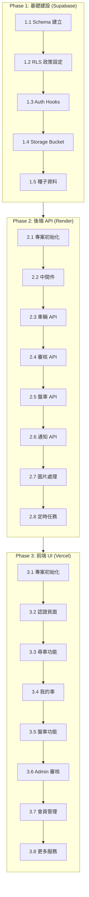

# 發財B平台 - 開發實作計畫

**版本**: 1.1.0  
**建立日期**: 2026-03-18  
**最後修訂**: 2026-03-19 (安全性修補 - ANALYZE-01)  
**對應規格書**: spec.md v1.5.0  
**對應資料模型**: data-model.md v1.1.0

---

## 📌 版本更新記錄

| 版本 | 日期 | 變更內容 |
|------|------|----------|
| 1.1.0 | 2026-03-19 | 🔒 安全性修補：新增階層一致性 Migration、停權帳號阻擋中間件、補全 RLS 政策 |
| 1.0.0 | 2026-03-18 | 初始版本 |

---

## 一、專案目錄結構

```
car_v1/
├── .github/
│   └── prompts/
│       └── speckit.plan.prompt.md
├── .specify/
│   └── features/
│       └── car-platform/
│           ├── spec.md                    # 功能規格書
│           ├── data-model.md              # 資料庫設計
│           └── plan.md                    # 開發計畫（本文件）
│
├── frontend/                              # Next.js 前端（部署至 Vercel）
│   ├── .env.local                         # 環境變數
│   ├── .env.example
│   ├── next.config.js
│   ├── tailwind.config.js
│   ├── tsconfig.json
│   ├── package.json
│   │
│   ├── public/
│   │   ├── favicon.ico
│   │   └── images/
│   │
│   └── src/
│       ├── app/                           # App Router
│       │   ├── layout.tsx                 # 根佈局
│       │   ├── page.tsx                   # 首頁（重定向）
│       │   ├── globals.css
│       │   │
│       │   ├── (auth)/                    # 認證相關頁面
│       │   │   ├── login/
│       │   │   │   └── page.tsx           # 登入頁
│       │   │   ├── register/
│       │   │   │   └── page.tsx           # 註冊頁
│       │   │   └── layout.tsx             # Auth 佈局（無導航列）
│       │   │
│       │   ├── (user)/                    # 車行會員頁面
│       │   │   ├── layout.tsx             # User 佈局（含底部導航）
│       │   │   ├── find-car/
│       │   │   │   ├── page.tsx           # 尋車列表頁
│       │   │   │   └── [id]/
│       │   │   │       └── page.tsx       # 車輛詳情頁
│       │   │   ├── my-cars/
│       │   │   │   ├── page.tsx           # 我的車列表
│       │   │   │   ├── new/
│       │   │   │   │   └── page.tsx       # 上架車輛
│       │   │   │   └── [id]/
│       │   │   │       ├── page.tsx       # 車輛詳情
│       │   │   │       └── edit/
│       │   │   │           └── page.tsx   # 編輯車輛
│       │   │   ├── trade/
│       │   │   │   ├── page.tsx           # 盤車列表
│       │   │   │   ├── new/
│       │   │   │   │   └── page.tsx       # 發布調做
│       │   │   │   └── [id]/
│       │   │   │       └── edit/
│       │   │   │           └── page.tsx   # 編輯調做
│       │   │   ├── services/
│       │   │   │   └── page.tsx           # 更多服務
│       │   │   ├── shop/
│       │   │   │   └── page.tsx           # 線上商城
│       │   │   └── profile/
│       │   │       └── page.tsx           # 個人資料
│       │   │
│       │   └── (admin)/                   # Admin 管理頁面
│       │       ├── layout.tsx             # Admin 佈局（側邊欄）
│       │       ├── dashboard/
│       │       │   └── page.tsx           # 管理首頁
│       │       ├── audit/
│       │       │   ├── page.tsx           # 待審核列表
│       │       │   └── [id]/
│       │       │       └── page.tsx       # 審核詳情
│       │       ├── vehicles/
│       │       │   ├── page.tsx           # 所有車輛
│       │       │   └── new/
│       │       │       └── page.tsx       # 代客建檔
│       │       ├── users/
│       │       │   ├── page.tsx           # 會員管理
│       │       │   └── [id]/
│       │       │       └── page.tsx       # 會員詳情
│       │       ├── dictionary/
│       │       │   ├── page.tsx           # 字典檔管理
│       │       │   └── requests/
│       │       │       └── page.tsx       # 字典申請審核
│       │       ├── services/
│       │       │   └── page.tsx           # 更多服務設定
│       │       └── shop/
│       │           └── page.tsx           # 商城商品管理
│       │
│       ├── components/
│       │   ├── ui/                        # 基礎 UI 元件 (shadcn/ui)
│       │   │   ├── button.tsx
│       │   │   ├── input.tsx
│       │   │   ├── select.tsx
│       │   │   ├── dialog.tsx
│       │   │   ├── alert-dialog.tsx
│       │   │   ├── badge.tsx
│       │   │   ├── card.tsx
│       │   │   ├── dropdown-menu.tsx
│       │   │   ├── toast.tsx
│       │   │   └── ...
│       │   │
│       │   ├── layout/
│       │   │   ├── Header.tsx             # 頂部導航列
│       │   │   ├── BottomNav.tsx          # 底部導航（User）
│       │   │   ├── AdminSidebar.tsx       # 側邊欄（Admin）
│       │   │   ├── NotificationBell.tsx   # 通知鈴鐺
│       │   │   └── HamburgerMenu.tsx      # 漢堡選單
│       │   │
│       │   ├── vehicle/
│       │   │   ├── VehicleCard.tsx        # 車輛卡片
│       │   │   ├── VehicleList.tsx        # 車輛列表（無限滾動）
│       │   │   ├── VehicleDetail.tsx      # 車輛詳情
│       │   │   ├── VehicleForm.tsx        # 車輛表單
│       │   │   ├── VehicleStatusBadge.tsx # 狀態標籤
│       │   │   ├── CascadingSelect.tsx    # 階梯式選單
│       │   │   ├── ImageUploader.tsx      # 圖片上傳
│       │   │   ├── ImageGallery.tsx       # 圖片輪播
│       │   │   └── CostInput.tsx          # 成本輸入
│       │   │
│       │   ├── trade/
│       │   │   ├── TradeRequestCard.tsx   # 調做需求卡片
│       │   │   ├── TradeRequestList.tsx   # 調做列表
│       │   │   ├── TradeRequestForm.tsx   # 調做表單
│       │   │   └── ExpiryBadge.tsx        # 到期標籤
│       │   │
│       │   ├── admin/
│       │   │   ├── AuditCard.tsx          # 審核卡片
│       │   │   ├── UserTable.tsx          # 會員列表
│       │   │   ├── DictionaryManager.tsx  # 字典管理
│       │   │   └── RejectDialog.tsx       # 拒絕對話框
│       │   │
│       │   └── shared/
│       │       ├── SearchBox.tsx          # 搜尋框（模糊搜尋）
│       │       ├── InfiniteScroll.tsx     # 無限滾動
│       │       ├── EmptyState.tsx         # 空狀態
│       │       ├── LoadingSpinner.tsx     # 載入中
│       │       └── ConfirmDialog.tsx      # 確認對話框
│       │
│       ├── hooks/
│       │   ├── useAuth.ts                 # 認證狀態
│       │   ├── useUserRole.ts             # 角色判斷
│       │   ├── useVehicles.ts             # 車輛資料
│       │   ├── useTradeRequests.ts        # 調做資料
│       │   ├── useNotifications.ts        # 通知
│       │   ├── useCascadingSelect.ts      # 階梯式選單
│       │   ├── useInfiniteScroll.ts       # 無限滾動
│       │   └── useDebounce.ts             # 防抖
│       │
│       ├── lib/
│       │   ├── supabase/
│       │   │   ├── client.ts              # Browser Client
│       │   │   ├── server.ts              # Server Client
│       │   │   └── middleware.ts          # Auth Middleware
│       │   ├── api.ts                     # Render API Client
│       │   ├── utils.ts                   # 工具函數
│       │   └── constants.ts               # 常數定義
│       │
│       ├── types/
│       │   ├── database.ts                # Supabase 自動生成類型
│       │   ├── vehicle.ts                 # 車輛類型
│       │   ├── trade.ts                   # 調做類型
│       │   └── user.ts                    # 用戶類型
│       │
│       └── middleware.ts                  # Next.js Middleware（路由守衛）
│
├── backend/                               # Express API（部署至 Render）
│   ├── .env
│   ├── .env.example
│   ├── package.json
│   ├── tsconfig.json
│   │
│   └── src/
│       ├── index.ts                       # 入口點
│       ├── app.ts                         # Express 應用
│       │
│       ├── config/
│       │   ├── supabase.ts                # Supabase Admin Client
│       │   ├── redis.ts                   # Redis Client
│       │   └── env.ts                     # 環境變數驗證
│       │
│       ├── middleware/
│       │   ├── auth.ts                    # JWT 驗證
│       │   ├── admin.ts                   # Admin 權限檢查
│       │   ├── suspendedCheck.ts          # 🔒 [ANALYZE-01] 停權帳號阻擋
│       │   ├── rateLimit.ts               # 限流中間件
│       │   └── errorHandler.ts            # 錯誤處理
│       │
│       ├── routes/
│       │   ├── index.ts                   # 路由彙整
│       │   │
│       │   ├── auth/
│       │   │   └── index.ts               # /api/auth/*
│       │   │
│       │   ├── vehicles/
│       │   │   ├── index.ts               # /api/vehicles/*
│       │   │   ├── search.ts              # /api/vehicles/search
│       │   │   └── upload.ts              # /api/vehicles/upload-image
│       │   │
│       │   ├── trades/
│       │   │   └── index.ts               # /api/trades/*
│       │   │
│       │   ├── dictionary/
│       │   │   └── index.ts               # /api/dictionary/*
│       │   │
│       │   ├── notifications/
│       │   │   └── index.ts               # /api/notifications/*
│       │   │
│       │   └── admin/
│       │       ├── audit.ts               # /api/admin/audit/*
│       │       ├── users.ts               # /api/admin/users/*
│       │       ├── dictionary.ts          # /api/admin/dictionary/*
│       │       ├── vehicles.ts            # /api/admin/vehicles/*
│       │       ├── services.ts            # /api/admin/services/*
│       │       └── shop.ts                # /api/admin/shop/*
│       │
│       ├── services/
│       │   ├── vehicle.service.ts         # 車輛業務邏輯
│       │   ├── trade.service.ts           # 調做業務邏輯
│       │   ├── notification.service.ts    # 通知服務
│       │   ├── image.service.ts           # 圖片處理（Sharp）
│       │   ├── audit.service.ts           # 稽核日誌
│       │   └── cron.service.ts            # 定時任務
│       │
│       ├── types/
│       │   └── index.ts                   # 類型定義
│       │
│       └── utils/
│           ├── response.ts                # 統一回應格式
│           └── validation.ts              # 驗證工具
│
├── supabase/                              # Supabase 設定
│   ├── config.toml                        # 本地開發設定
│   │
│   ├── migrations/
│   │   ├── 20260318000001_init_schema.sql           # 初始 Schema
│   │   ├── 20260318000002_enable_rls.sql            # RLS 政策
│   │   ├── 20260318000003_auth_hooks.sql            # Auth Hooks
│   │   ├── 20260318000004_storage_buckets.sql       # Storage 設定
│   │   ├── 20260318000005_search_functions.sql      # 搜尋函數
│   │   ├── 20260318000006_seed_data.sql             # 種子資料
│   │   │
│   │   │  # 🔒 [ANALYZE-01 修補] 安全性補丁
│   │   ├── 20260319000001_add_hierarchy_trigger.sql     # 階層一致性觸發器
│   │   ├── 20260319000002_dictionary_requests_rls.sql   # dictionary_requests RLS 補全
│   │   └── 20260319000003_suspended_account_blocking.sql # 停權帳號阻擋函數
│   │
│   └── seed/
│       ├── brands.sql                     # 品牌種子
│       ├── specs.sql                      # 規格種子
│       └── models.sql                     # 車型種子
│
├── AGENTS.md                              # 專案說明
├── README.md                              # 專案文件
└── .gitignore
```

---

## 二、開發階段與步驟

### Phase 流程圖



---

## Phase 1: 基礎建設 (Supabase)

### Step 1.1: 建立資料庫 Schema

**目標**：建立所有資料表與關聯

**新增/修改檔案**：
- `supabase/migrations/20260318000001_init_schema.sql`

**執行內容**：
```sql
-- 詳見 data-model.md 第二節
-- 包含：users, brands, specs, models, vehicles, trade_requests, 
--       dictionary_requests, notifications, audit_logs, 
--       app_settings, shop_products
```

**驗證標準**：
- [ ] 所有表建立成功
- [ ] Foreign Key 約束正確
- [ ] 索引建立完成
- [ ] 觸發器運作正常
- [ ] 🔒 **[ANALYZE-01]** `chk_images_array` 約束生效

---

### Step 1.1b: 階層一致性觸發器 🔒 [ANALYZE-01 新增]

**目標**：確保 brand → spec → model 關聯一致性

**新增/修改檔案**：
- `supabase/migrations/20260319000001_add_hierarchy_trigger.sql`

**執行內容**：
```sql
-- 詳見 data-model.md 第 2.5.1 節 & 第 2.6.1 節
-- 1. check_vehicle_hierarchy(): vehicles 表階層驗證
-- 2. check_trade_request_hierarchy(): trade_requests 表階層驗證
```

**驗證標準**：
- [ ] 🔒 Toyota + BMW 3 Series (跨品牌) INSERT 被拒絕
- [ ] 🔒 正確階層 INSERT 成功
- [ ] 🔒 UPDATE 時同樣觸發驗證

---

### Step 1.2: 設定 RLS 政策

**目標**：確保資料隔離與權限控制

**新增/修改檔案**：
- `supabase/migrations/20260318000002_enable_rls.sql`

**執行內容**：
```sql
-- 詳見 data-model.md 第三節
-- 關鍵政策：
-- 1. vehicles: 成本欄位僅擁有者可見
-- 2. trade_requests: 僅有效需求可公開瀏覽
-- 3. notifications: 僅本人可見
-- 4. Admin 使用 JWT Claims 判斷
```

**驗證標準**：
- [ ] 非擁有者無法讀取 acquisition_cost / repair_cost
- [ ] Admin 可查看所有車輛
- [ ] 停權用戶車輛不顯示

---

### Step 1.2b: RLS 政策補全 🔒 [ANALYZE-01 新增]

**目標**：補全 dictionary_requests、audit_logs、app_settings、shop_products 的 RLS 政策

**新增/修改檔案**：
- `supabase/migrations/20260319000002_dictionary_requests_rls.sql`
- `supabase/migrations/20260319000003_suspended_account_blocking.sql`

**執行內容**：
```sql
-- 詳見 data-model.md 第 3.6 ~ 3.9 節
-- 1. dictionary_requests: 用戶可 INSERT/SELECT 自己的，Admin 可 ALL
-- 2. audit_logs: 僅 Admin 可 SELECT
-- 3. app_settings: 已認證用戶可 SELECT，Admin 可 UPDATE
-- 4. shop_products: 已認證用戶可 SELECT 上架商品，Admin 可 ALL
-- 5. is_user_active() / is_user_suspended() 共用函數
```

**驗證標準**：
- [ ] 🔒 dictionary_requests: 用戶可新增/查看自己的申請
- [ ] 🔒 dictionary_requests: Admin 可審核所有申請
- [ ] 🔒 audit_logs: 一般用戶無法查看
- [ ] 🔒 停權帳號無法執行 INSERT 操作（is_user_active() 驗證）

---

### Step 1.3: 設定 Auth Hooks

**目標**：自動初始化用戶角色

**新增/修改檔案**：
- `supabase/migrations/20260318000003_auth_hooks.sql`

**執行內容**：
```sql
-- 詳見 data-model.md 第五節
-- 1. handle_new_user(): 設定預設 role='user'
-- 2. set_user_role(): Admin 修改角色
```

**驗證標準**：
- [ ] 新註冊用戶 JWT 包含 role='user'
- [ ] Admin 可透過 set_user_role 修改角色

---

### Step 1.4: 設定 Storage Bucket

**目標**：建立圖片儲存與 RLS

**新增/修改檔案**：
- `supabase/migrations/20260318000004_storage_buckets.sql`

**執行內容**：
```sql
-- 詳見 data-model.md 第四節
-- Bucket: vehicle-images
-- 結構: vehicles/{vehicle_id}/{uuid}.webp
```

**驗證標準**：
- [ ] Bucket 建立成功
- [ ] 擁有者可上傳
- [ ] 公開可讀取已核准車輛圖片

---

### Step 1.5: 匯入種子資料

**目標**：建立初始字典檔

**新增/修改檔案**：
- `supabase/migrations/20260318000006_seed_data.sql`
- `supabase/seed/brands.sql`
- `supabase/seed/specs.sql`
- `supabase/seed/models.sql`

**執行內容**：
```sql
-- 常見汽車品牌（約 30 個）
-- 每品牌常見規格（約 5-10 個）
-- 每規格常見車型（約 3-5 個）
-- 預設 Admin 帳號
```

**驗證標準**：
- [ ] 字典檔可正常載入
- [ ] 階梯式選單可正確連動

---

## Phase 2: 後端 API (Render)

### Step 2.1: 專案初始化

**目標**：建立 Express 專案基礎

**新增/修改檔案**：
- `backend/package.json`
- `backend/tsconfig.json`
- `backend/.env.example`
- `backend/src/index.ts`
- `backend/src/app.ts`
- `backend/src/config/env.ts`
- `backend/src/config/supabase.ts`

**執行內容**：
```bash
cd backend
npm init -y
npm install express cors helmet dotenv @supabase/supabase-js sharp multer
npm install -D typescript @types/express @types/node ts-node nodemon
```

**環境變數**：
```env
PORT=4000
SUPABASE_URL=
SUPABASE_ANON_KEY=
SUPABASE_SERVICE_ROLE_KEY=
REDIS_URL=
```

**驗證標準**：
- [ ] `npm run dev` 啟動成功
- [ ] Health check endpoint 回應 200

---

### Step 2.2: 中間件設定

**目標**：實作認證、限流、錯誤處理、停權帳號阻擋

**新增/修改檔案**：
- `backend/src/middleware/auth.ts`
- `backend/src/middleware/admin.ts`
- `backend/src/middleware/suspendedCheck.ts` 🔒 **[ANALYZE-01 新增]**
- `backend/src/middleware/rateLimit.ts`
- `backend/src/middleware/errorHandler.ts`
- `backend/src/config/redis.ts`

**執行內容**：
```typescript
// auth.ts: 驗證 Supabase JWT
// admin.ts: 檢查 role='admin'
// suspendedCheck.ts: 🔒 [ANALYZE-01 修補] 阻擋停權帳號操作
// rateLimit.ts: 100 req/min/IP (CLR-022)
```

#### 🔒 [ANALYZE-01 修補] 停權帳號阻擋中間件

> **檔案路徑**: `backend/src/middleware/suspendedCheck.ts`

```typescript
import { Request, Response, NextFunction } from 'express';
import { supabaseAdmin } from '../config/supabase';

/**
 * 🔒 停權帳號阻擋中間件 (ANALYZE-01 修補)
 * 
 * 用途：阻止 status='suspended' 的帳號執行寫入操作
 * 適用於：POST, PUT, DELETE 請求（除了 GET 以外的所有寫入操作）
 */
export const suspendedCheck = async (
  req: Request, 
  res: Response, 
  next: NextFunction
) => {
  // 僅檢查需要阻擋的方法
  if (['GET', 'HEAD', 'OPTIONS'].includes(req.method)) {
    return next();
  }

  const userId = req.user?.id;
  if (!userId) {
    return res.status(401).json({ 
      error: 'Unauthorized', 
      message: '請先登入' 
    });
  }

  try {
    // 查詢用戶狀態
    const { data: user, error } = await supabaseAdmin
      .from('users')
      .select('status, suspended_reason')
      .eq('id', userId)
      .single();

    if (error || !user) {
      return res.status(404).json({ 
        error: 'UserNotFound', 
        message: '找不到用戶資料' 
      });
    }

    if (user.status === 'suspended') {
      return res.status(403).json({ 
        error: 'AccountSuspended', 
        message: '您的帳號已被停權，無法執行此操作',
        reason: user.suspended_reason || '未提供原因'
      });
    }

    next();
  } catch (err) {
    console.error('suspendedCheck error:', err);
    return res.status(500).json({ 
      error: 'InternalError', 
      message: '檢查帳號狀態時發生錯誤' 
    });
  }
};
```

**使用方式**：
```typescript
// 在 app.ts 中全域套用（或針對特定路由）
import { suspendedCheck } from './middleware/suspendedCheck';

// 方案 A：全域套用（所有 POST/PUT/DELETE 都會檢查）
app.use(suspendedCheck);

// 方案 B：針對特定路由
router.post('/vehicles', auth, suspendedCheck, vehicleController.create);
router.post('/trades', auth, suspendedCheck, tradeController.create);
```

**驗證標準**：
- [ ] 無 Token 請求回應 401
- [ ] 非 Admin 存取 Admin API 回應 403
- [ ] 超過限流回應 429
- [ ] 🔒 **[ANALYZE-01]** 停權帳號 POST/PUT/DELETE 回應 403 `AccountSuspended`
- [ ] 🔒 **[ANALYZE-01]** 停權帳號 GET 請求正常通過（僅阻擋寫入）

---

### Step 2.3: 車輛 API

**目標**：實作車輛 CRUD 與搜尋

**新增/修改檔案**：
- `backend/src/routes/vehicles/index.ts`
- `backend/src/routes/vehicles/search.ts`
- `backend/src/services/vehicle.service.ts`

**API 端點**：
| Method | Path | 說明 |
|--------|------|------|
| GET | /api/vehicles | 車輛列表（無限滾動） |
| GET | /api/vehicles/search | 模糊搜尋 |
| GET | /api/vehicles/:id | 車輛詳情 |
| POST | /api/vehicles | 新增車輛 |
| PUT | /api/vehicles/:id | 更新車輛 |
| PUT | /api/vehicles/:id/archive | 下架車輛 |
| DELETE | /api/vehicles/:id | 永久刪除 |
| PUT | /api/vehicles/:id/resubmit | 重新送審 |

**驗證標準**：
- [ ] 游標分頁正確運作
- [ ] pg_trgm 模糊搜尋正確
- [ ] 成本欄位正確隔離

---

### Step 2.4: 審核 API (Admin)

**目標**：實作審核與代客建檔

**新增/修改檔案**：
- `backend/src/routes/admin/audit.ts`
- `backend/src/routes/admin/vehicles.ts`
- `backend/src/services/audit.service.ts`

**API 端點**：
| Method | Path | 說明 |
|--------|------|------|
| GET | /api/admin/audit | 待審核列表 |
| GET | /api/admin/audit/:id | 審核詳情 |
| POST | /api/admin/audit/:id/approve | 核准 |
| POST | /api/admin/audit/:id/reject | 拒絕 |
| POST | /api/admin/vehicles/proxy | 代客建檔 |

**驗證標準**：
- [ ] 使用 Service Role Key 繞過 RLS (CLR-001)
- [ ] 審核完成發送通知 (CLR-012)
- [ ] 稽核日誌正確記錄

---

### Step 2.5: 盤車 API

**目標**：實作調做需求 CRUD

**新增/修改檔案**：
- `backend/src/routes/trades/index.ts`
- `backend/src/services/trade.service.ts`

**API 端點**：
| Method | Path | 說明 |
|--------|------|------|
| GET | /api/trades | 調做列表 |
| GET | /api/trades/my | 我的調做 |
| POST | /api/trades | 發布調做 |
| PUT | /api/trades/:id | 更新調做 |
| PUT | /api/trades/:id/extend | 續期 |
| DELETE | /api/trades/:id | 刪除（Hard Delete） |

**驗證標準**：
- [ ] 品牌必填驗證 (CLR-020)
- [ ] 有效期正確計算 (CLR-003)
- [ ] Hard Delete 正確執行 (CLR-025)

---

### Step 2.6: 通知 API

**目標**：實作站內通知

**新增/修改檔案**：
- `backend/src/routes/notifications/index.ts`
- `backend/src/services/notification.service.ts`

**API 端點**：
| Method | Path | 說明 |
|--------|------|------|
| GET | /api/notifications | 通知列表 |
| GET | /api/notifications/unread-count | 未讀計數 |
| PUT | /api/notifications/:id/read | 標記已讀 |
| PUT | /api/notifications/read-all | 全部已讀 |

**驗證標準**：
- [ ] 僅回傳本人通知
- [ ] 未讀計數正確

---

### Step 2.7: 圖片處理

**目標**：實作圖片壓縮與上傳

**新增/修改檔案**：
- `backend/src/routes/vehicles/upload.ts`
- `backend/src/services/image.service.ts`

**處理流程**：
1. 接收原始圖片
2. Sharp 壓縮至 1200x800
3. 轉換為 WebP 格式
4. 上傳至 Supabase Storage

**驗證標準**：
- [ ] 輸出統一為 WebP (CLR-008)
- [ ] 尺寸正確壓縮
- [ ] Storage 路徑正確

---

### Step 2.8: 定時任務

**目標**：實作到期提醒

**新增/修改檔案**：
- `backend/src/services/cron.service.ts`

**任務**：
| Cron | 任務 | 說明 |
|------|------|------|
| 0 9 * * * | sendExpirationReminders | 調做到期提醒 |
| 0 3 * * * | cleanupExpiredTrades | 清理過期調做 |
| 0 4 * * * | cleanupOrphanImages | 清理孤兒圖片 |

**驗證標準**：
- [ ] 到期前 1 天發送通知 (CLR-003)
- [ ] 不重複提醒

---

## Phase 3: 前端 UI (Vercel)

### Step 3.1: 專案初始化

**目標**：建立 Next.js 專案基礎

**新增/修改檔案**：
- `frontend/package.json`
- `frontend/next.config.js`
- `frontend/tailwind.config.js`
- `frontend/tsconfig.json`
- `frontend/.env.example`
- `frontend/src/app/layout.tsx`
- `frontend/src/app/globals.css`
- `frontend/src/lib/supabase/client.ts`
- `frontend/src/lib/supabase/server.ts`
- `frontend/src/lib/supabase/middleware.ts`
- `frontend/src/lib/api.ts`
- `frontend/src/middleware.ts`

**執行內容**：
```bash
cd frontend
npx create-next-app@latest . --typescript --tailwind --app --src-dir
npm install @supabase/supabase-js @supabase/auth-helpers-nextjs
npm install swr react-hook-form zod @hookform/resolvers
npx shadcn-ui@latest init
```

**驗證標準**：
- [ ] `npm run dev` 啟動成功
- [ ] Tailwind 樣式正確
- [ ] Supabase Client 連線成功

---

### Step 3.2: 認證頁面

**目標**：實作登入/註冊/登出

**新增/修改檔案**：
- `frontend/src/app/(auth)/layout.tsx`
- `frontend/src/app/(auth)/login/page.tsx`
- `frontend/src/app/(auth)/register/page.tsx`
- `frontend/src/hooks/useAuth.ts`
- `frontend/src/hooks/useUserRole.ts`
- `frontend/src/components/layout/Header.tsx`

**功能**：
- 登入表單（Email + 密碼）
- 註冊表單（Email + 密碼 + 車行資訊）
- 依角色重定向 (FR-026)
- 路由守衛

**驗證標準**：
- [ ] 登入成功取得 JWT
- [ ] JWT 包含 role Claim (CLR-021)
- [ ] User 導向 /find-car
- [ ] Admin 導向 /dashboard

---

### Step 3.3: 尋車功能

**目標**：實作車輛搜尋與瀏覽

**新增/修改檔案**：
- `frontend/src/app/(user)/layout.tsx`
- `frontend/src/app/(user)/find-car/page.tsx`
- `frontend/src/app/(user)/find-car/[id]/page.tsx`
- `frontend/src/components/vehicle/VehicleCard.tsx`
- `frontend/src/components/vehicle/VehicleList.tsx`
- `frontend/src/components/vehicle/VehicleDetail.tsx`
- `frontend/src/components/vehicle/CascadingSelect.tsx`
- `frontend/src/components/vehicle/ImageGallery.tsx`
- `frontend/src/components/shared/SearchBox.tsx`
- `frontend/src/components/shared/InfiniteScroll.tsx`
- `frontend/src/hooks/useVehicles.ts`
- `frontend/src/hooks/useCascadingSelect.ts`
- `frontend/src/hooks/useInfiniteScroll.ts`

**功能**：
- 階梯式選單（品牌 → 規格 → 車型）(FR-004)
- 年份區間篩選 (CLR-018)
- 模糊搜尋 + 自動完成 (CLR-010)
- 無限滾動 (CLR-009)
- 車輛詳情頁

**驗證標準**：
- [ ] 選單連動正確
- [ ] 搜尋建議正常顯示
- [ ] 滾動載入下一頁
- [ ] 不顯示其他車行成本

---

### Step 3.4: 我的車功能

**目標**：實作車輛管理

**新增/修改檔案**：
- `frontend/src/app/(user)/my-cars/page.tsx`
- `frontend/src/app/(user)/my-cars/new/page.tsx`
- `frontend/src/app/(user)/my-cars/[id]/page.tsx`
- `frontend/src/app/(user)/my-cars/[id]/edit/page.tsx`
- `frontend/src/components/vehicle/VehicleForm.tsx`
- `frontend/src/components/vehicle/ImageUploader.tsx`
- `frontend/src/components/vehicle/CostInput.tsx`
- `frontend/src/components/vehicle/VehicleStatusBadge.tsx`

**功能**：
- 車輛列表（含各狀態）
- 新增車輛 + 圖片上傳
- 編輯車輛（退件可全欄位編輯）(CLR-015)
- 下架/重新上架
- 永久刪除（二次確認）(CLR-023)
- 成本輸入（僅顯示數字）(CLR-013)

**驗證標準**：
- [ ] 上傳圖片 1-10 張
- [ ] 退件理由雙重顯示 (CLR-011)
- [ ] 成本正確儲存與顯示

---

### Step 3.5: 盤車功能

**目標**：實作調做需求

**新增/修改檔案**：
- `frontend/src/app/(user)/trade/page.tsx`
- `frontend/src/app/(user)/trade/new/page.tsx`
- `frontend/src/app/(user)/trade/[id]/edit/page.tsx`
- `frontend/src/components/trade/TradeRequestCard.tsx`
- `frontend/src/components/trade/TradeRequestList.tsx`
- `frontend/src/components/trade/TradeRequestForm.tsx`
- `frontend/src/components/trade/ExpiryBadge.tsx`
- `frontend/src/hooks/useTradeRequests.ts`

**功能**：
- 調做列表（含車行聯絡方式）
- 發布調做（品牌必填）(CLR-020)
- 有效期選擇 (CLR-003)
- 編輯/續期/刪除

**驗證標準**：
- [ ] 品牌必填驗證
- [ ] 剩餘天數正確顯示
- [ ] 聯絡方式正確顯示

---

### Step 3.6: Admin 審核

**目標**：實作車輛審核

**新增/修改檔案**：
- `frontend/src/app/(admin)/layout.tsx`
- `frontend/src/app/(admin)/dashboard/page.tsx`
- `frontend/src/app/(admin)/audit/page.tsx`
- `frontend/src/app/(admin)/audit/[id]/page.tsx`
- `frontend/src/app/(admin)/vehicles/new/page.tsx`
- `frontend/src/components/admin/AuditCard.tsx`
- `frontend/src/components/admin/RejectDialog.tsx`
- `frontend/src/components/layout/AdminSidebar.tsx`

**功能**：
- 待審核列表
- 核准/拒絕（需填理由）
- 代客建檔（選擇車行）
- 車行選擇器

**驗證標準**：
- [ ] 拒絕需填寫理由 (FR-008)
- [ ] 代客建檔綁定正確 (CLR-001)
- [ ] 通知正確發送

---

### Step 3.7: 會員管理

**目標**：實作會員 CRUD

**新增/修改檔案**：
- `frontend/src/app/(admin)/users/page.tsx`
- `frontend/src/app/(admin)/users/[id]/page.tsx`
- `frontend/src/app/(admin)/dictionary/page.tsx`
- `frontend/src/app/(admin)/dictionary/requests/page.tsx`
- `frontend/src/components/admin/UserTable.tsx`
- `frontend/src/components/admin/DictionaryManager.tsx`

**功能**：
- 會員列表（含狀態）
- 停權/啟用（連帶隱藏資料）(CLR-024)
- 字典檔管理
- 字典申請審核

**驗證標準**：
- [ ] 停權連帶隱藏車輛
- [ ] 解除停權恢復資料
- [ ] 字典申請通知

---

### Step 3.8: 更多服務與商城

**目標**：實作導流與商城

**新增/修改檔案**：
- `frontend/src/app/(user)/services/page.tsx`
- `frontend/src/app/(user)/shop/page.tsx`
- `frontend/src/app/(admin)/services/page.tsx`
- `frontend/src/app/(admin)/shop/page.tsx`
- `frontend/src/components/layout/HamburgerMenu.tsx`

**功能**：
- 更多服務列表
- 外部連結開新分頁
- 服務未設定顯示「準備中」
- 商城商品展示

**驗證標準**：
- [ ] 未設定網址顯示 disabled
- [ ] 連結正確開新分頁

---

## 三、API 端點完整列表

### 公開 API（需認證）

| Method | Path | 說明 | 限流 |
|--------|------|------|------|
| GET | /api/vehicles | 車輛列表 | 100/min |
| GET | /api/vehicles/search | 模糊搜尋 | 30/min |
| GET | /api/vehicles/:id | 車輛詳情 | 100/min |
| POST | /api/vehicles | 新增車輛 | 100/min |
| PUT | /api/vehicles/:id | 更新車輛 | 100/min |
| PUT | /api/vehicles/:id/archive | 下架 | 100/min |
| DELETE | /api/vehicles/:id | 永久刪除 | 100/min |
| PUT | /api/vehicles/:id/resubmit | 重新送審 | 100/min |
| POST | /api/vehicles/upload-image | 上傳圖片 | 100/min |
| GET | /api/trades | 調做列表 | 30/min |
| GET | /api/trades/my | 我的調做 | 100/min |
| POST | /api/trades | 發布調做 | 100/min |
| PUT | /api/trades/:id | 更新調做 | 100/min |
| PUT | /api/trades/:id/extend | 續期 | 100/min |
| DELETE | /api/trades/:id | 刪除調做 | 100/min |
| GET | /api/dictionary/brands | 品牌列表 | 100/min |
| GET | /api/dictionary/specs | 規格列表 | 100/min |
| GET | /api/dictionary/models | 車型列表 | 100/min |
| POST | /api/dictionary/requests | 字典申請 | 100/min |
| GET | /api/notifications | 通知列表 | 100/min |
| GET | /api/notifications/unread-count | 未讀計數 | 100/min |
| PUT | /api/notifications/:id/read | 標記已讀 | 100/min |
| PUT | /api/notifications/read-all | 全部已讀 | 100/min |
| GET | /api/services | 更多服務 | 100/min |
| GET | /api/shop | 商城商品 | 100/min |

### Admin API（需 Admin 權限）

| Method | Path | 說明 |
|--------|------|------|
| GET | /api/admin/audit | 待審核列表 |
| GET | /api/admin/audit/:id | 審核詳情 |
| POST | /api/admin/audit/:id/approve | 核准 |
| POST | /api/admin/audit/:id/reject | 拒絕 |
| POST | /api/admin/vehicles/proxy | 代客建檔 |
| GET | /api/admin/users | 會員列表 |
| GET | /api/admin/users/:id | 會員詳情 |
| PUT | /api/admin/users/:id/suspend | 停權 |
| PUT | /api/admin/users/:id/reactivate | 解除停權 |
| GET | /api/admin/dictionary | 字典管理 |
| POST | /api/admin/dictionary/brands | 新增品牌 |
| POST | /api/admin/dictionary/specs | 新增規格 |
| POST | /api/admin/dictionary/models | 新增車型 |
| GET | /api/admin/dictionary/requests | 字典申請列表 |
| POST | /api/admin/dictionary/requests/:id/approve | 核准申請 |
| POST | /api/admin/dictionary/requests/:id/reject | 拒絕申請 |
| GET | /api/admin/services | 服務設定 |
| PUT | /api/admin/services | 更新服務 |
| GET | /api/admin/shop | 商品列表 |
| POST | /api/admin/shop | 新增商品 |
| PUT | /api/admin/shop/:id | 更新商品 |
| DELETE | /api/admin/shop/:id | 刪除商品 |

---

## 四、部署設定

### Supabase
- 專案建立於 Supabase Dashboard
- 執行所有 migrations
- 設定 Auth Providers（Email）
- 開啟 Storage

### Vercel (Frontend)
```env
NEXT_PUBLIC_SUPABASE_URL=
NEXT_PUBLIC_SUPABASE_ANON_KEY=
NEXT_PUBLIC_API_URL=https://api.xxx.render.com
```

### Render (Backend)
```env
PORT=4000
SUPABASE_URL=
SUPABASE_ANON_KEY=
SUPABASE_SERVICE_ROLE_KEY=
REDIS_URL=
```

---

## 五、驗收檢查清單

### 功能驗收 (FR)

- [ ] FR-001 ~ FR-052 全部通過
- [ ] 所有 User Story 驗收情境通過

### 非功能驗收 (NFR)

- [ ] NFR-001: 尋車列表載入 < 2 秒
- [ ] NFR-002: 圖片上傳 < 5 秒/張
- [ ] NFR-003: API 回應 < 500ms (95th)
- [ ] NFR-004 ~ NFR-007: 安全需求

### 關鍵決策驗收 (CLR)

- [ ] CLR-001: 代客建檔使用 Service Role Key
- [ ] CLR-008: 圖片壓縮至 1200x800 WebP
- [ ] CLR-009: 無限滾動正確運作
- [ ] CLR-010: 模糊搜尋正確運作
- [ ] CLR-021: Admin 角色使用 Custom Claims
- [ ] CLR-022: Rate Limiting 正確觸發
- [ ] CLR-023: 下架 Soft / 刪除 Hard
- [ ] CLR-024: 停權連帶隱藏資料
- [ ] CLR-025: 調做 Hard Delete

---

**文件版本**: 1.0.0 | **最後更新**: 2026-03-18
