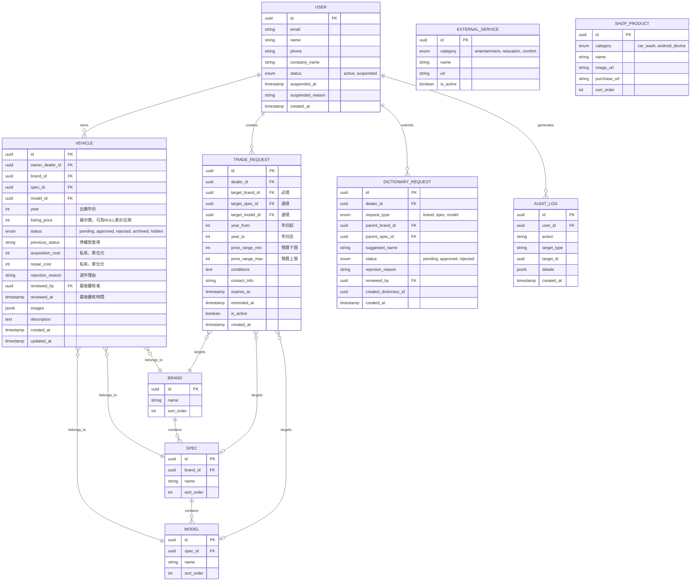
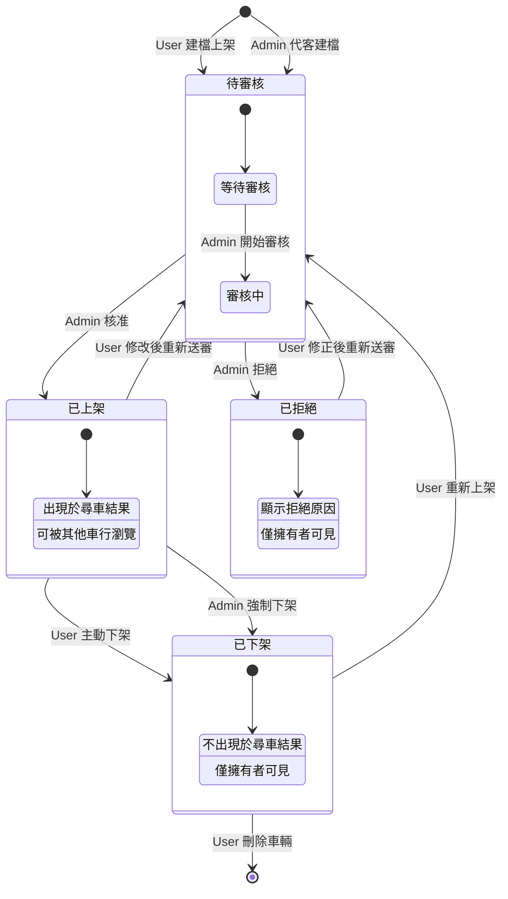

# 功能規格書：發財B車行管理、調做與盤車整合平台

**功能分支**: `001-car-platform-mvp`  
**建立日期**: 2026-03-18  
**狀態**: 草稿  
**輸入來源**: 使用者需求描述

---

## 一、邏輯拆解：系統領域劃分

### 1.1 核心業務領域 (Core Domain)

| 子領域 | 說明 |
|--------|------|
| **車輛 CRUD** | 車輛資訊建檔、修改、下架、查詢；含成本與整備費私有紀錄 |
| **盤車媒合** | 調做需求發布、瀏覽其他車行調做資訊與聯絡方式 |
| **審核流程** | Admin 對車輛上架申請的核准/拒絕流程；代客建檔綁定 |
| **字典檔管理** | 品牌、規格、車型三層階梯式選單資料維護 |

### 1.2 輔助領域 (Supporting Domain)

| 子領域 | 說明 |
|--------|------|
| **身分驗證** | Supabase Auth 整合，User/Admin 角色區分 |
| **檔案儲存** | Supabase Storage 車輛圖片上傳與管理 |
| **更多服務導流** | 娛樂城、紓壓專區、舒服專區網址設定與導流 |
| **線上商城** | 洗車用具、安卓機分類商品展示與外部購買連結 |

---

## 二、使用者情境與測試 *(必填)*

### User Story 1 - 車行會員尋車 (優先級: P1)

車行會員透過階梯式選單（品牌 → 規格 → 車型）快速搜尋平台上已核准上架的車輛，查看詳細資訊與圖片。

**優先級理由**: 尋車是平台核心價值，會員必須能快速找到目標車輛，這是所有交易的起點。

**獨立測試**: 可透過建立測試車輛資料，驗證階梯式選單篩選邏輯與車輛詳情頁面呈現。

**驗收情境**:

1. **Given** 會員已登入且平台有已核准車輛，**When** 會員選擇品牌「Toyota」，**Then** 系統顯示該品牌下所有規格選項
2. **Given** 會員已選擇品牌與規格，**When** 會員選擇特定車型，**Then** 系統列出符合條件的所有車輛卡片
3. **Given** 會員瀏覽車輛列表，**When** 會員點擊某車輛卡片，**Then** 系統顯示車輛完整資訊（不含其他車行的成本資訊）

---

### User Story 2 - 車行會員上架車輛 (優先級: P1)

車行會員新增車輛資訊（含多張圖片），送出後進入待審核狀態，等待 Admin 認證。

**優先級理由**: 上架是車行核心業務，無法上架則平台無車輛可供搜尋。

**獨立測試**: 可透過完整填寫車輛表單並上傳圖片，驗證資料儲存與狀態轉換。

**驗收情境**:

1. **Given** 會員已登入，**When** 會員點擊「上架車」並填寫完整車輛資訊，**Then** 系統顯示圖片上傳區域
2. **Given** 會員已填寫車輛資訊，**When** 會員上傳 1-10 張車輛圖片並送出，**Then** 系統建立車輛記錄，狀態為「待審核」
3. **Given** 車輛已送出待審核，**When** 會員查看「我的車」，**Then** 該車輛顯示「待審核」標籤

---

### User Story 3 - 車行會員管理我的車 (優先級: P1)

車行會員查看自己所有車輛，可修改資訊、記錄成本與整備費（僅自己可見），並可下架車輛。

**優先級理由**: 成本管理是車行私有核心資料，必須確保資料隔離與安全。

**獨立測試**: 可透過建立車輛後，驗證成本欄位僅車輛擁有者可見。

**驗收情境**:

1. **Given** 會員已登入且有已上架車輛，**When** 會員進入「我的車」，**Then** 系統顯示該會員所有車輛（含各狀態）
2. **Given** 會員查看已核准車輛，**When** 會員輸入「收購成本」與「整備費」，**Then** 系統儲存並僅對該會員顯示
3. **Given** 會員查看已核准車輛，**When** 會員點擊「下架」，**Then** 車輛狀態變更為「已下架」，不再出現於尋車結果

---

### User Story 4 - 車行會員盤車調做 (優先級: P2)

車行會員發布自己的調做需求，並可瀏覽其他車行的調做資訊（含聯絡方式）以媒合交易。

**優先級理由**: 盤車媒合是平台差異化功能，但需先有車輛基礎功能。

**獨立測試**: 可透過發布調做需求並切換帳號瀏覽，驗證資訊顯示正確性。

**驗收情境**:

1. **Given** 會員已登入，**When** 會員進入「盤車」並填寫調做需求（車型、價格區間、條件），**Then** 系統發布需求至平台
2. **Given** 平台有多筆調做需求，**When** 會員瀏覽「盤車」列表，**Then** 系統顯示所有調做需求（含發布車行聯絡方式）
3. **Given** 會員查看自己的調做需求，**When** 會員編輯或刪除，**Then** 系統更新或移除該需求

---

### User Story 5 - Admin 車輛審核 (優先級: P1)

Admin 審核車行送出的車輛上架申請，可核准或拒絕，並可代客建檔車輛綁定至指定車行。

**優先級理由**: 審核是品質把關關鍵，代客建檔提升服務彈性。

**獨立測試**: 可透過建立待審核車輛，驗證審核狀態轉換與代客建檔綁定。

**驗收情境**:

1. **Given** Admin 已登入且有待審核車輛，**When** Admin 進入審核列表，**Then** 系統顯示所有待審核車輛詳情
2. **Given** Admin 檢視待審核車輛，**When** Admin 點擊「核准」，**Then** 車輛狀態變更為「已上架」，出現於尋車結果
3. **Given** Admin 檢視待審核車輛，**When** Admin 點擊「拒絕」並填寫原因，**Then** 車輛狀態變更為「已拒絕」，通知車行會員
4. **Given** Admin 需代客建檔，**When** Admin 填寫車輛資訊並選擇綁定車行，**Then** 系統建立車輛並設定擁有權為該車行

---

### User Story 6 - Admin 會員管理 (優先級: P2)

Admin 管理平台會員，包含啟用、停權、CRUD 會員資料。

**優先級理由**: 會員管理是後台基礎功能，但初期可手動操作。

**獨立測試**: 可透過建立測試會員，驗證 CRUD 與權限狀態切換。

**驗收情境**:

1. **Given** Admin 已登入，**When** Admin 進入「管理使用者」，**Then** 系統顯示所有會員列表（含狀態）
2. **Given** Admin 查看會員列表，**When** Admin 停權某會員，**Then** 該會員無法登入且其車輛不顯示於尋車
3. **Given** Admin 查看會員列表，**When** Admin 啟用已停權會員，**Then** 該會員恢復正常使用權限

---

### User Story 7 - Admin 字典檔管理 (優先級: P2)

Admin 維護品牌、規格、車型三層字典檔，供尋車階梯式選單使用。

**優先級理由**: 字典檔是資料基礎，需於上架功能前建立。

**獨立測試**: 可透過新增品牌/規格/車型，驗證階梯式選單即時更新。

**驗收情境**:

1. **Given** Admin 已登入，**When** Admin 新增品牌「BMW」，**Then** 尋車選單出現「BMW」選項
2. **Given** 品牌已存在，**When** Admin 新增該品牌下的規格「3 Series」，**Then** 選擇該品牌時出現「3 Series」
3. **Given** 規格已存在，**When** Admin 新增該規格下的車型「320i」，**Then** 選擇該規格時出現「320i」

---

### User Story 8 - 更多服務與線上商城 (優先級: P3)

會員透過漢堡選單瀏覽 Admin 配置的外部服務連結與線上商城商品。

**優先級理由**: 導流功能為附加價值，可於核心功能完成後加入。

**獨立測試**: 可透過 Admin 設定連結後，驗證會員端顯示與跳轉。

**驗收情境**:

1. **Given** Admin 已設定「娛樂城」網址，**When** 會員點擊「更多服務」中的「娛樂城」，**Then** 系統開啟外部網址（新分頁）
2. **Given** Admin 已新增「洗車用具」商品，**When** 會員瀏覽「線上商城」，**Then** 系統顯示商品圖片、名稱與購買連結
3. **Given** Admin 尚未設定某服務網址，**When** 會員點擊該服務，**Then** 系統顯示「服務準備中」提示

---

### 邊界案例與異常路徑

#### 異常路徑 1：Admin 代客建檔綁定錯誤與併發修改

**問題情境**: Admin 代客建檔時選錯綁定車行，或多位 Admin 同時修改同一車輛。

**應對機制**:
- **綁定確認**: 代客建檔時，系統顯示車行名稱二次確認對話框，需 Admin 明確確認
- **擁有權鎖定**: 車輛建立後，`owner_dealer_id` 欄位設為 immutable，僅能透過特殊流程修正
- **樂觀鎖機制**: 使用 `updated_at` 欄位實作樂觀鎖，併發修改時後提交者收到衝突提示，需重新載入後修改
- **操作日誌**: 記錄所有車輛擁有權變更，供稽核追蹤

#### 異常路徑 2：更多服務/線上商城網址未設定或失效

**問題情境**: User 點擊導流連結時，Admin 尚未設定網址或網址已失效。

**應對機制**:
- **前端容錯**: 
  - 網址為空時，按鈕顯示為 disabled 狀態，點擊顯示「服務準備中，敬請期待」
  - 網址存在時，前端不做有效性驗證（避免 CORS 問題），直接開啟新分頁
- **後端驗證**: Admin 設定網址時，後端驗證 URL 格式正確性
- **定期檢查**: 後台提供「網址健康檢查」功能，Admin 可手動觸發批次驗證

#### 異常路徑 3：Supabase Storage 圖片上傳失敗

**問題情境**: 網路中斷、單檔過大、檔案格式錯誤導致圖片上傳失敗。

**應對機制**:
- **前端容錯**:
  - 上傳前驗證：單檔 < 5MB、總計 < 50MB、僅接受 jpg/png/webp
  - 逐張上傳：採用序列上傳，單張失敗可重試，不影響其他圖片
  - 斷點續傳：記錄已上傳圖片 URL，頁面刷新後可繼續上傳
  - 進度顯示：每張圖片獨立進度條，失敗時顯示重試按鈕
- **後端容錯**:
  - 事務完整性：車輛資料與圖片 URL 在同一事務中儲存，失敗則全部回滾
  - 孤兒圖片清理：定時任務清理已上傳但未關聯車輛的圖片

---

## 三、功能性需求 (Functional Requirements)

### 3.1 核心業務需求

#### 車輛管理

- **FR-001**: 系統必須支援車輛 CRUD 操作（建立、讀取、更新、刪除/下架）
- **FR-002**: 系統必須支援車輛多圖上傳，每輛車 1-10 張圖片
- **FR-003**: 系統必須記錄「收購成本」與「整備費」，且僅車輛擁有者可見
- **FR-004**: 系統必須實作階梯式選單：品牌 → 規格 → 車型
- **FR-005**: 系統必須追蹤車輛狀態：待審核、已上架、已拒絕、已下架

#### 審核流程

- **FR-006**: Admin 必須能審核車輛上架申請（核准/拒絕）
- **FR-007**: Admin 必須能代客建檔車輛並綁定至指定車行
- **FR-008**: 系統必須於拒絕時要求填寫拒絕原因
- **FR-009**: 系統必須於車輛狀態變更時通知車行會員

#### 盤車媒合

- **FR-010**: 系統必須支援調做需求發布（車型、價格區間、條件描述）
- **FR-011**: 系統必須顯示調做需求發布者的聯絡方式
- **FR-012**: 系統必須支援調做需求編輯與刪除（僅發布者）
- **FR-027**: 系統必須支援調做需求有效期設定（3/7/14/30 天可選）
- **FR-028**: 系統必須於調做需求到期前 1 天發送站內通知提醒
- **FR-029**: 系統必須支援調做需求續期功能

#### 字典檔管理

- **FR-013**: Admin 必須能 CRUD 品牌資料
- **FR-014**: Admin 必須能 CRUD 規格資料（關聯品牌）
- **FR-015**: Admin 必須能 CRUD 車型資料（關聯規格）

#### 會員管理

- **FR-016**: Admin 必須能檢視所有會員列表與狀態
- **FR-017**: Admin 必須能啟用/停權會員
- **FR-018**: 停權會員無法登入，其車輛不顯示於尋車結果

### 3.2 輔助領域需求

#### 更多服務

- **FR-019**: Admin 必須能設定「娛樂城」、「紓壓專區」、「舒服專區」導流網址
- **FR-020**: 系統必須於新分頁開啟外部導流網址

#### 線上商城

- **FR-021**: Admin 必須能管理「洗車用具」與「安卓機」兩大分類的商品
- **FR-022**: 商品資訊包含：名稱、圖片、外部購買網址
- **FR-023**: 系統必須於新分頁開啟商品購買網址

#### 身分驗證

- **FR-024**: 系統必須整合 Supabase Auth 進行身分驗證
- **FR-025**: 系統必須區分 User（車行會員）與 Admin（管理員）角色
- **FR-026**: 系統必須於登入後依角色導向不同介面
- **FR-030**: 系統必須實作站內通知功能（通知鈴鐺、未讀計數、通知列表）
- **FR-031**: Admin 代客建檔必須透過後端 Service Role Key 繞過 RLS 寫入資料

#### 圖片處理

- **FR-032**: 系統必須於圖片上傳時自動壓縮至 1200x800 並轉換為 WebP 格式

#### 搜尋與列表

- **FR-033**: 尋車列表必須採用無限滾動載入，每批 20 筆
- **FR-034**: 系統必須提供搜尋框，支援模糊比對品牌/規格/車型名稱（pg_trgm）
- **FR-035**: 搜尋框必須提供自動完成建議

#### 審核流程強化

- **FR-036**: 系統必須於審核列表與車輛詳情頁雙重顯示退件原因
- **FR-037**: 系統必須於車輛審核核准或拒絕時發送站內通知
- **FR-038**: 退件車輛必須支援全部欄位編輯（含圖片重傳）後重新送審
- **FR-039**: 收購成本與整備費欄位必須為純數字，前端顯示時加上幣別符號「$」

---

## 四、非功能性需求 (Non-Functional Requirements)

### 4.1 效能需求

- **NFR-001**: 尋車列表載入時間 < 2 秒（100 筆車輛內）
- **NFR-002**: 圖片上傳回應時間 < 5 秒/張（5MB 以內）
- **NFR-003**: API 回應時間 < 500ms（95th percentile）

### 4.2 安全需求

- **NFR-004**: 必須透過 Supabase RLS 確保車行資料隔離
- **NFR-005**: 成本欄位（收購成本、整備費）必須透過 RLS 限制僅擁有者可讀寫
- **NFR-006**: Admin 操作必須記錄完整稽核日誌
- **NFR-007**: 所有 API 必須驗證 JWT Token 有效性

### 4.3 Supabase RLS 資料隔離策略

```sql
-- 車輛表 RLS 策略範例

-- 政策 1: 車行僅能查看自己的成本資訊
CREATE POLICY "Dealers can view own vehicle costs"
ON vehicles FOR SELECT
USING (
  auth.uid() = owner_dealer_id 
  OR 
  (status = 'approved' AND acquisition_cost IS NULL AND repair_cost IS NULL)
);

-- 政策 2: 車行僅能修改自己的車輛
CREATE POLICY "Dealers can update own vehicles"
ON vehicles FOR UPDATE
USING (auth.uid() = owner_dealer_id);

-- 政策 3: Admin 可查看所有車輛（含成本）- 使用 Custom Claims
CREATE POLICY "Admins can view all vehicles"
ON vehicles FOR SELECT
USING (
  auth.jwt()->>'role' = 'admin'
);

-- 政策 4: 已停權車行的車輛不顯示於尋車（含 hidden 狀態過濾）
CREATE POLICY "Hide suspended dealer vehicles"
ON vehicles FOR SELECT
USING (
  status = 'approved' AND
  status != 'hidden' AND
  EXISTS (
    SELECT 1 FROM users 
    WHERE id = vehicles.owner_dealer_id AND status = 'active'
  )
);

-- 政策 5: Admin 可刪除任何車輛 - 使用 Custom Claims
CREATE POLICY "Admins can delete vehicles"
ON vehicles FOR DELETE
USING (
  auth.jwt()->>'role' = 'admin'
);
```

### 4.4 可用性需求

- **NFR-008**: 系統可用性 > 99.5%（月）
- **NFR-009**: 計劃性維護需提前 24 小時通知

### 4.5 相容性需求

- **NFR-010**: 前端必須支援 Chrome、Safari、Edge 最新兩個主要版本
- **NFR-011**: 前端必須支援 iOS Safari、Android Chrome 最新兩個主要版本
- **NFR-012**: 響應式設計支援 375px - 1920px 螢幕寬度

---

## 五、關鍵實體 (Key Entities)

| 實體 | 說明 | 關鍵屬性 |
|------|------|----------|
| **User/Dealer** | 車行會員 | id, email, name, phone, company_name, status, **suspended_at**, **suspended_reason**, created_at |
| **Admin** | 管理員（透過 app_metadata.role = 'admin' 識別） | 同 User，JWT 內嵌 role = 'admin' |
| **Vehicle** | 車輛 | id, owner_dealer_id, brand_id, spec_id, model_id, **year**, **listing_price**, status, **previous_status**, acquisition_cost, repair_cost, images[], created_by |
| **Brand** | 品牌字典 | id, name, sort_order |
| **Spec** | 規格字典 | id, brand_id, name, sort_order |
| **Model** | 車型字典 | id, spec_id, name, sort_order |
| **TradeRequest** | 盤車調做需求 | id, dealer_id, **target_brand_id**, **target_spec_id**, **target_model_id**, **year_from**, **year_to**, **price_range_min**, **price_range_max**, conditions, contact_info, expires_at, reminded_at |
| **DictionaryRequest** | 字典檔新增申請 | id, dealer_id, request_type, parent_brand_id, parent_spec_id, suggested_name, status, rejection_reason, created_dictionary_id |
| **AppSettings** | 全域設定（含導流網址） | key, value (JSONB), updated_at |
| **ShopProduct** | 線上商城商品 | id, category, name, image_url, purchase_url, sort_order, is_active |
| **Notification** | 站內通知 | id, user_id, type, title, message, action_url, is_read |
| **AuditLog** | 稽核日誌 | id, user_id, action, target_type, target_id, details, created_at |

---

## 六、成功標準 (Success Criteria)

### 可量測成果

- **SC-001**: 車行會員可在 3 分鐘內完成車輛上架（含圖片上傳）
- **SC-002**: Admin 可在 1 分鐘內完成單一車輛審核
- **SC-003**: 尋車階梯式選單操作可在 10 秒內找到目標車型
- **SC-004**: 系統支援同時 100 位使用者操作無效能衰退
- **SC-005**: 車行成本資訊 100% 隔離，其他車行無法存取

---

## 七、圖像理解

### 7.1 實體關聯草圖 (ER Diagram Draft)



### 7.2 車輛狀態機圖 (State Diagram)



---

## 八、技術架構摘要

| 層級 | 技術 | 部署平台 |
|------|------|----------|
| 前端 | React/Next.js | Vercel |
| 後端 API | Node.js/Express 或 Next.js API Routes | Render |
| 資料庫 | PostgreSQL | Supabase |
| 身分驗證 | Supabase Auth | Supabase |
| 檔案儲存 | Supabase Storage | Supabase |

---

## 九、澄清事項 (Clarifications)

> 本區塊記錄規格制定過程中的關鍵決策，確保開發團隊理解設計背後的考量。

### 9.1 資料庫與權限層

#### CLR-001：Admin 代客建檔的資料擁有權綁定方式

| 項目 | 內容 |
|------|------|
| **決策** | **Service Role Key 繞過 RLS** |
| **方案描述** | Admin 後端使用 `service_role` key 直接寫入資料庫，`owner_dealer_id` 設為目標車行 ID，後續車行透過 RLS 自然取得權限 |
| **選擇理由** | 開發效率最高，無需額外 RLS 政策或身分模擬邏輯；`service_role` 用於後端可控操作是 Supabase 標準做法 |

**實作細節**:
```typescript
// Render API 端 (使用 service_role)
const supabaseAdmin = createClient(SUPABASE_URL, SUPABASE_SERVICE_ROLE_KEY);

async function createVehicleForDealer(vehicleData: VehicleInput, targetDealerId: string, adminId: string) {
  const { data, error } = await supabaseAdmin
    .from('vehicles')
    .insert({
      ...vehicleData,
      owner_dealer_id: targetDealerId,  // 綁定至目標車行
      created_by: adminId,               // 記錄建檔者
      status: 'pending'
    });
  
  // 記錄稽核日誌
  await supabaseAdmin.from('audit_logs').insert({
    user_id: adminId,
    action: 'PROXY_CREATE_VEHICLE',
    target_type: 'vehicle',
    target_id: data.id,
    details: { target_dealer_id: targetDealerId }
  });
}
```

---

#### CLR-002：「更多服務」與「線上商城」資料儲存結構

| 項目 | 內容 |
|------|------|
| **決策** | **混合模式** |
| **方案描述** | 導流網址使用 JSONB 設定檔（數量少、結構固定）；商城商品使用獨立資料表（數量多、需擴充） |
| **選擇理由** | 導流網址僅 3 筆固定項目，JSONB 快速實作；商品未來若需分頁、搜尋、排序，獨立表效能更佳 |

**資料結構設計**:

```sql
-- 導流網址：JSONB 設定檔
CREATE TABLE app_settings (
  key VARCHAR(50) PRIMARY KEY,
  value JSONB NOT NULL,
  updated_at TIMESTAMP DEFAULT NOW()
);

-- 預設資料
INSERT INTO app_settings (key, value) VALUES 
('external_services', '{
  "entertainment": { "name": "娛樂城", "url": null, "is_active": false },
  "relaxation": { "name": "紓壓專區", "url": null, "is_active": false },
  "comfort": { "name": "舒服專區", "url": null, "is_active": false }
}');

-- 商城商品：獨立關聯式資料表
CREATE TABLE shop_products (
  id UUID PRIMARY KEY DEFAULT gen_random_uuid(),
  category VARCHAR(20) NOT NULL CHECK (category IN ('car_wash', 'android_device')),
  name VARCHAR(100) NOT NULL,
  image_url TEXT,
  purchase_url TEXT NOT NULL,
  sort_order INT DEFAULT 0,
  is_active BOOLEAN DEFAULT true,
  created_at TIMESTAMP DEFAULT NOW(),
  updated_at TIMESTAMP DEFAULT NOW()
);

CREATE INDEX idx_shop_products_category ON shop_products(category, sort_order);
```

---

#### CLR-005：Supabase Storage 圖片組織結構

| 項目 | 內容 |
|------|------|
| **決策** | **單一 Bucket + 車輛 ID 子目錄** |
| **方案描述** | 檔案路徑為 `vehicles/{vehicle_id}/{uuid}.jpg`，RLS 依車輛擁有者控制存取 |
| **選擇理由** | 單一 bucket 管理簡單，子目錄結構清晰；便於批次刪除車輛圖片 |

**Storage 結構與 RLS**:

```
Bucket: vehicle-images
├── {vehicle_id_1}/
│   ├── a1b2c3d4.jpg
│   ├── e5f6g7h8.jpg
│   └── i9j0k1l2.webp
├── {vehicle_id_2}/
│   └── m3n4o5p6.png
```

```sql
-- Storage RLS 政策
CREATE POLICY "Vehicle owners can upload images"
ON storage.objects FOR INSERT
WITH CHECK (
  bucket_id = 'vehicle-images' AND
  EXISTS (
    SELECT 1 FROM vehicles 
    WHERE id::text = (storage.foldername(name))[1]
    AND owner_dealer_id = auth.uid()
  )
);

CREATE POLICY "Public can view approved vehicle images"
ON storage.objects FOR SELECT
USING (
  bucket_id = 'vehicle-images' AND
  EXISTS (
    SELECT 1 FROM vehicles 
    WHERE id::text = (storage.foldername(name))[1]
    AND status = 'approved'
  )
);

CREATE POLICY "Owners can delete own vehicle images"
ON storage.objects FOR DELETE
USING (
  bucket_id = 'vehicle-images' AND
  EXISTS (
    SELECT 1 FROM vehicles 
    WHERE id::text = (storage.foldername(name))[1]
    AND owner_dealer_id = auth.uid()
  )
);
```

---

### 9.2 業務與流程層

#### CLR-003：盤車調做需求的生命週期與時效性

| 項目 | 內容 |
|------|------|
| **決策** | **彈性時效設定** |
| **方案描述** | 車行發布時自選有效期（3/7/14/30 天），到期前 1 天系統提醒，可續期或下架 |
| **選擇理由** | 滿足不同車行需求，緊急調做可選短期，長期尋車可選 30 天；提醒機制確保資訊時效性 |

**實作細節**:

```sql
-- 調做需求表結構更新
ALTER TABLE trade_requests ADD COLUMN expires_at TIMESTAMP NOT NULL;
ALTER TABLE trade_requests ADD COLUMN reminded_at TIMESTAMP;  -- 已發送提醒的時間

-- 查詢有效需求
CREATE VIEW active_trade_requests AS
SELECT * FROM trade_requests
WHERE expires_at > NOW()
ORDER BY created_at DESC;
```

**前端 UI**:
- 發布表單新增「有效期」下拉選單：3 天 / 7 天 / 14 天 / 30 天
- 「我的調做」列表顯示剩餘天數，< 1 天顯示紅色警示
- 提供「續期」按鈕，點擊後重設有效期

**後端定時任務** (Render Cron Job):
```typescript
// 每日執行：發送到期提醒
async function sendExpirationReminders() {
  const tomorrow = new Date(Date.now() + 24 * 60 * 60 * 1000);
  
  const expiringRequests = await supabase
    .from('trade_requests')
    .select('*, dealers(email, name)')
    .gte('expires_at', new Date().toISOString())
    .lte('expires_at', tomorrow.toISOString())
    .is('reminded_at', null);
  
  for (const request of expiringRequests.data) {
    // 發送站內通知
    await createNotification(request.dealer_id, {
      type: 'TRADE_REQUEST_EXPIRING',
      message: `您的調做需求「${request.target_model}」將於明日到期`,
      action_url: `/my-trades/${request.id}`
    });
    
    // 標記已提醒
    await supabase
      .from('trade_requests')
      .update({ reminded_at: new Date().toISOString() })
      .eq('id', request.id);
  }
}
```

---

### 9.3 UI/UX 體驗層

#### CLR-004：車輛狀態變更通知管道

| 項目 | 內容 |
|------|------|
| **決策** | **僅站內通知** |
| **方案描述** | 登入後顯示通知鈴鐺/紅點，點擊查看狀態變更詳情 |
| **選擇理由** | MVP 階段最簡實作，無需整合第三方郵件服務；車行會員多為頻繁登入用戶，站內通知足夠 |

**實作細節**:

```sql
-- 通知表
CREATE TABLE notifications (
  id UUID PRIMARY KEY DEFAULT gen_random_uuid(),
  user_id UUID REFERENCES users(id) NOT NULL,
  type VARCHAR(50) NOT NULL,
  title VARCHAR(100) NOT NULL,
  message TEXT,
  action_url TEXT,
  is_read BOOLEAN DEFAULT false,
  created_at TIMESTAMP DEFAULT NOW()
);

CREATE INDEX idx_notifications_user_unread ON notifications(user_id, is_read) WHERE is_read = false;

-- RLS: 用戶僅能查看自己的通知
CREATE POLICY "Users can view own notifications"
ON notifications FOR SELECT
USING (auth.uid() = user_id);

CREATE POLICY "Users can mark own notifications as read"
ON notifications FOR UPDATE
USING (auth.uid() = user_id);
```

**通知類型**:
| type | 觸發時機 | 訊息範例 |
|------|----------|----------|
| `VEHICLE_APPROVED` | 車輛審核通過 | 您的車輛「Toyota Camry」已通過審核，現已上架 |
| `VEHICLE_REJECTED` | 車輛審核拒絕 | 您的車輛「Honda CR-V」審核未通過，原因：照片模糊 |
| `TRADE_REQUEST_EXPIRING` | 調做需求即將到期 | 您的調做需求「BMW 3 Series」將於明日到期 |
| `ACCOUNT_SUSPENDED` | 帳號被停權 | 您的帳號已被停權，如有疑問請聯繫客服 |

**前端元件**:
```tsx
// Header 通知鈴鐺
<NotificationBell>
  {unreadCount > 0 && <Badge>{unreadCount}</Badge>}
</NotificationBell>

// 通知下拉面板
<NotificationPanel>
  {notifications.map(n => (
    <NotificationItem 
      key={n.id}
      isUnread={!n.is_read}
      onClick={() => {
        markAsRead(n.id);
        router.push(n.action_url);
      }}
    >
      <Title>{n.title}</Title>
      <Message>{n.message}</Message>
      <Time>{formatRelative(n.created_at)}</Time>
    </NotificationItem>
  ))}
</NotificationPanel>
```

---

### 9.4 決策摘要表

| 編號 | 類別 | 問題 | 決策 |
|------|------|------|------|
| CLR-001 | 資料庫與權限 | Admin 代客建檔綁定方式 | Service Role Key 繞過 RLS |
| CLR-002 | 資料庫與權限 | 更多服務/商城儲存結構 | 混合模式（JSONB + 獨立表） |
| CLR-003 | 業務與流程 | 盤車調做時效性 | 彈性時效（3/7/14/30 天可選） |
| CLR-004 | UI/UX 體驗 | 狀態變更通知管道 | 僅站內通知 |
| CLR-005 | 資料庫與權限 | Storage 圖片組織結構 | 單一 Bucket + 車輛 ID 子目錄 |
| CLR-006 | 儲存與資源管理 | 車輛下架/刪除時圖片處理 | 下架保留 / 永久刪除時清理 |
| CLR-007 | 儲存與資源管理 | 車輛圖片浮水印 | 不加浮水印（MVP 階段簡化） |
| CLR-008 | 儲存與資源管理 | 上傳圖片標準化 | 後端壓縮至 1200x800 + WebP |
| CLR-009 | 搜尋與 API 效能 | 尋車列表載入策略 | 無限滾動 (Infinite Scroll) |
| CLR-010 | 搜尋與 API 效能 | 尋車搜尋模式 | 進階智慧搜尋（pg_trgm 模糊比對） |
| CLR-011 | 審核與通知 | 退件理由顯示位置 | 雙重顯示（列表 + 詳情頁） |
| CLR-012 | 審核與通知 | 審核結果通知時機 | 核准與拒絕皆發送通知 |
| CLR-013 | 資料結構 | 收購成本欄位型態 | 純數字（前端顯示加幣別符號） |
| CLR-014 | 審核與通知 | 審核歷史紀錄 | 不保留歷史，僅記錄最新狀態 |
| CLR-015 | 審核與通知 | 退件後編輯權限 | 全部欄位可編輯（含圖片重傳） |
| CLR-016 | 商業邏輯 | 車輛價格結構 | 單一售價欄位（listing_price） |
| CLR-017 | 商業邏輯 | 盤車媒合機制 | 混合模式（MVP 純 BBS，預留媒合結構） |
| CLR-018 | 商業邏輯 | 車輛年份欄位 | 新增 year (INT) 結構化欄位 |
| CLR-019 | 資料防呆 | 字典檔缺項處理 | 字典檔 + 新增申請流程 |
| CLR-020 | 資料防呆 | 調做需求車型指定 | 混合模式（品牌必填，規格/車型選填 + 年份區間） |
| CLR-021 | 資安與權限 | Admin 角色識別機制 | Custom Claims（JWT 內嵌角色） |
| CLR-022 | 資安與權限 | API 安全防護 | 基本 Rate Limiting（100 req/min/IP） |
| CLR-023 | 資料庫維護 | 車輛刪除策略 | 混合策略（下架 Soft / 永久刪除 Hard） |
| CLR-024 | 資料庫維護 | 會員停權處理 | 連帶隱藏所有資料 |
| CLR-025 | 資料庫維護 | 調做需求刪除策略 | Hard Delete（直接刪除） |

---

### 9.5 第二輪澄清：圖片與搜尋效能（2026-03-18）

#### [儲存與資源管理層]

#### CLR-006：車輛下架/刪除時的圖片處理策略

| 項目 | 內容 |
|------|------|
| **決策** | **下架保留 / 永久刪除時清理** |
| **方案描述** | 下架時保留圖片（支援重新上架）；僅「永久刪除」時清理 Storage 圖片 |
| **選擇理由** | 車行常有「暫時下架、稍後重上」需求，保留圖片避免重複上傳；永久刪除時清理確保儲存成本可控 |

**實作細節**:

```typescript
// 車輛狀態與圖片處理對應
const vehicleImagePolicy = {
  'archived': 'KEEP',      // 下架：保留圖片
  'deleted': 'HARD_DELETE' // 永久刪除：清理圖片
};

// 永久刪除車輛時的圖片清理
async function permanentlyDeleteVehicle(vehicleId: string) {
  // 1. 取得車輛圖片列表
  const { data: files } = await supabaseAdmin.storage
    .from('vehicle-images')
    .list(vehicleId);
  
  // 2. 批次刪除 Storage 檔案
  if (files?.length) {
    const filePaths = files.map(f => `${vehicleId}/${f.name}`);
    await supabaseAdmin.storage
      .from('vehicle-images')
      .remove(filePaths);
  }
  
  // 3. 刪除車輛資料庫記錄
  await supabaseAdmin
    .from('vehicles')
    .delete()
    .eq('id', vehicleId);
  
  // 4. 記錄稽核日誌
  await logAudit('VEHICLE_PERMANENTLY_DELETED', vehicleId);
}
```

**前端 UI 流程**:
- 「下架」按鈕：狀態改為 `archived`，圖片保留，可隨時「重新上架」
- 「永久刪除」按鈕：顯示二次確認對話框「此操作無法復原，車輛資料與圖片將永久刪除」

---

#### CLR-007：車輛圖片是否需要加上平台浮水印

| 項目 | 內容 |
|------|------|
| **決策** | **不加浮水印** |
| **方案描述** | 保持原圖，簡化流程，由車行自行決定是否預先加浮水印 |
| **選擇理由** | MVP 階段簡化流程；無需額外 Edge Function 或儲存多版本圖片；車行間互信度高，盜圖風險相對低 |

**備註**: 浮水印功能可作為 V2 功能，屆時可採用 Supabase Image Transform 動態疊加。

---

#### CLR-008：上傳圖片的尺寸與格式標準化

| 項目 | 內容 |
|------|------|
| **決策** | **上傳時後端壓縮** |
| **方案描述** | 透過 Supabase Edge Function 或 Render API 將圖片統一壓縮為 1200x800，轉 WebP 格式 |
| **選擇理由** | WebP 比 JPEG 小 25-35%，節省儲存成本；統一尺寸確保前端列表載入速度一致；版面整齊美觀 |

**實作細節**:

```typescript
// Render API: 圖片處理端點
import sharp from 'sharp';

async function processVehicleImage(file: Buffer, vehicleId: string): Promise<string> {
  // 1. 壓縮並轉換格式
  const processedBuffer = await sharp(file)
    .resize(1200, 800, {
      fit: 'cover',
      position: 'center'
    })
    .webp({ quality: 85 })
    .toBuffer();
  
  // 2. 產生檔名
  const filename = `${vehicleId}/${crypto.randomUUID()}.webp`;
  
  // 3. 上傳至 Supabase Storage
  const { data, error } = await supabaseAdmin.storage
    .from('vehicle-images')
    .upload(filename, processedBuffer, {
      contentType: 'image/webp',
      upsert: false
    });
  
  // 4. 回傳公開 URL
  return supabaseAdmin.storage
    .from('vehicle-images')
    .getPublicUrl(filename).data.publicUrl;
}
```

**前端上傳流程**:
```tsx
// 前端：透過 Render API 上傳（非直傳 Supabase）
const uploadImage = async (file: File, vehicleId: string) => {
  const formData = new FormData();
  formData.append('image', file);
  formData.append('vehicleId', vehicleId);
  
  const response = await fetch(`${RENDER_API_URL}/api/vehicles/upload-image`, {
    method: 'POST',
    headers: { Authorization: `Bearer ${token}` },
    body: formData
  });
  
  return response.json(); // { url: 'https://...' }
};
```

**新增功能性需求**:
- **FR-032**: 系統必須於圖片上傳時自動壓縮至 1200x800 並轉換為 WebP 格式

---

#### [搜尋與 API 效能層]

#### CLR-009：尋車列表的載入策略

| 項目 | 內容 |
|------|------|
| **決策** | **無限滾動 (Infinite Scroll)** |
| **方案描述** | 滾動至底部自動載入下一批（每批 20 筆），適合瀏覽探索 |
| **選擇理由** | 車行尋車多為瀏覽探索型，無限滾動更符合行為模式；行動裝置滑動操作比點擊頁碼更自然 |

**實作細節**:

```typescript
// API: 游標分頁
app.get('/api/vehicles', async (req, res) => {
  const { brand_id, spec_id, model_id, cursor, limit = 20 } = req.query;
  
  let query = supabase
    .from('vehicles')
    .select('*, brands(name), specs(name), models(name)')
    .eq('status', 'approved')
    .order('created_at', { ascending: false })
    .limit(limit);
  
  // 階梯式篩選
  if (brand_id) query = query.eq('brand_id', brand_id);
  if (spec_id) query = query.eq('spec_id', spec_id);
  if (model_id) query = query.eq('model_id', model_id);
  
  // 游標分頁
  if (cursor) {
    query = query.lt('created_at', cursor);
  }
  
  const { data, error } = await query;
  
  res.json({
    vehicles: data,
    nextCursor: data?.length === limit ? data[data.length - 1].created_at : null
  });
});
```

```tsx
// 前端: useSWRInfinite
import useSWRInfinite from 'swr/infinite';
import { useInView } from 'react-intersection-observer';

function VehicleList({ filters }) {
  const { ref, inView } = useInView();
  
  const getKey = (pageIndex, previousPageData) => {
    if (previousPageData && !previousPageData.nextCursor) return null;
    const cursor = previousPageData?.nextCursor || '';
    return `/api/vehicles?${new URLSearchParams({ ...filters, cursor })}`;
  };
  
  const { data, size, setSize, isValidating } = useSWRInfinite(getKey, fetcher);
  
  // 自動載入下一頁
  useEffect(() => {
    if (inView && !isValidating) {
      setSize(size + 1);
    }
  }, [inView]);
  
  const vehicles = data?.flatMap(page => page.vehicles) || [];
  
  return (
    <>
      <div className="grid grid-cols-2 md:grid-cols-3 gap-4">
        {vehicles.map(v => <VehicleCard key={v.id} vehicle={v} />)}
      </div>
      <div ref={ref} className="h-10">
        {isValidating && <Spinner />}
      </div>
    </>
  );
}
```

**新增功能性需求**:
- **FR-033**: 尋車列表必須採用無限滾動載入，每批 20 筆

---

#### CLR-010：尋車搜尋是否需要支援模糊比對

| 項目 | 內容 |
|------|------|
| **決策** | **進階智慧搜尋（pg_trgm 模糊比對）** |
| **方案描述** | 整合 PostgreSQL `pg_trgm` 擴充，支援拼寫容錯、相似度搜尋 |
| **選擇理由** | 提升使用者體驗，即使輸入「Camery」也能找到「Camry」；pg_trgm 為 Supabase 內建擴充，無額外費用 |

**實作細節**:

```sql
-- 啟用 pg_trgm 擴充
CREATE EXTENSION IF NOT EXISTS pg_trgm;

-- 建立品牌/規格/車型的 trigram 索引
CREATE INDEX idx_brands_name_trgm ON brands USING gin (name gin_trgm_ops);
CREATE INDEX idx_specs_name_trgm ON specs USING gin (name gin_trgm_ops);
CREATE INDEX idx_models_name_trgm ON models USING gin (name gin_trgm_ops);

-- 模糊搜尋函數
CREATE OR REPLACE FUNCTION search_vehicles(search_term TEXT, similarity_threshold FLOAT DEFAULT 0.3)
RETURNS TABLE (
  vehicle_id UUID,
  brand_name TEXT,
  spec_name TEXT,
  model_name TEXT,
  similarity_score FLOAT
) AS $$
BEGIN
  RETURN QUERY
  SELECT 
    v.id,
    b.name,
    s.name,
    m.name,
    GREATEST(
      similarity(b.name, search_term),
      similarity(s.name, search_term),
      similarity(m.name, search_term)
    ) as score
  FROM vehicles v
  JOIN brands b ON v.brand_id = b.id
  JOIN specs s ON v.spec_id = s.id
  JOIN models m ON v.model_id = m.id
  WHERE v.status = 'approved'
    AND (
      b.name % search_term OR
      s.name % search_term OR
      m.name % search_term
    )
  ORDER BY score DESC;
END;
$$ LANGUAGE plpgsql;
```

**API 端點**:

```typescript
// 搜尋 API
app.get('/api/vehicles/search', async (req, res) => {
  const { q, limit = 20 } = req.query;
  
  if (!q || q.length < 2) {
    return res.json({ vehicles: [], suggestions: [] });
  }
  
  // 1. 模糊搜尋車輛
  const { data: vehicles } = await supabase
    .rpc('search_vehicles', { search_term: q })
    .limit(limit);
  
  // 2. 搜尋建議（自動完成）
  const { data: suggestions } = await supabase
    .from('models')
    .select('name')
    .ilike('name', `%${q}%`)
    .limit(5);
  
  res.json({ vehicles, suggestions });
});
```

**前端 UI**:

```tsx
// 搜尋框元件
function VehicleSearch() {
  const [query, setQuery] = useState('');
  const [suggestions, setSuggestions] = useState([]);
  const debouncedQuery = useDebounce(query, 300);
  
  useEffect(() => {
    if (debouncedQuery.length >= 2) {
      fetch(`/api/vehicles/search?q=${debouncedQuery}`)
        .then(res => res.json())
        .then(data => setSuggestions(data.suggestions));
    }
  }, [debouncedQuery]);
  
  return (
    <div className="relative">
      <input
        type="text"
        placeholder="搜尋品牌、規格或車型..."
        value={query}
        onChange={e => setQuery(e.target.value)}
        className="w-full px-4 py-2 border rounded-lg"
      />
      {suggestions.length > 0 && (
        <ul className="absolute w-full bg-white border rounded-lg mt-1 shadow-lg">
          {suggestions.map(s => (
            <li key={s.name} 
                className="px-4 py-2 hover:bg-gray-100 cursor-pointer"
                onClick={() => setQuery(s.name)}>
              {s.name}
            </li>
          ))}
        </ul>
      )}
    </div>
  );
}
```

**新增功能性需求**:
- **FR-034**: 系統必須提供搜尋框，支援模糊比對品牌/規格/車型名稱
- **FR-035**: 搜尋框必須提供自動完成建議

---

### 9.6 第三輪澄清：審核流程與通知機制（2026-03-18）

#### [審核與通知層]

#### CLR-011：退件理由的顯示位置

| 項目 | 內容 |
|------|------|
| **決策** | **雙重顯示（列表 + 詳情頁）** |
| **方案描述** | 「我的車輛」列表以紅字簡要顯示退件理由，點入詳情頁可見完整退件說明 |
| **選擇理由** | 車行一眼可知退件概況，無需逐一點入；詳情頁提供完整資訊方便修正 |

**實作細節**:

```tsx
// 「我的車輛」列表項目
function VehicleListItem({ vehicle }: { vehicle: Vehicle }) {
  const isRejected = vehicle.status === 'rejected';
  
  return (
    <div className="flex items-center justify-between p-4 border rounded-lg">
      <div className="flex items-center gap-4">
        
        <div>
          <h3 className="font-medium">{vehicle.brand} {vehicle.model}</h3>
          <StatusBadge status={vehicle.status} />
          {/* 列表顯示截斷的退件理由 */}
          {isRejected && vehicle.rejection_reason && (
            <p className="text-sm text-red-600 mt-1 line-clamp-1">
              退件原因：{vehicle.rejection_reason}
            </p>
          )}
        </div>
      </div>
      <ChevronRight className="text-gray-400" />
    </div>
  );
}

// 車輛詳情頁退件區塊
function RejectionAlert({ reason }: { reason: string }) {
  return (
    <div className="bg-red-50 border border-red-200 rounded-lg p-4 mb-6">
      <div className="flex items-start gap-3">
        <AlertCircle className="text-red-500 w-5 h-5 mt-0.5" />
        <div>
          <h4 className="font-medium text-red-800">審核未通過</h4>
          <p className="text-red-700 mt-1">{reason}</p>
          <Button variant="outline" className="mt-3">
            修改並重新送審
          </Button>
        </div>
      </div>
    </div>
  );
}
```

---

#### CLR-012：審核結果的通知時機

| 項目 | 內容 |
|------|------|
| **決策** | **核准與拒絕皆發送通知** |
| **方案描述** | 審核完成後立即觸發站內通知，核准/拒絕皆通知車行 |
| **選擇理由** | 車行需即時掌握車輛狀態，核准可立即推廣，拒絕可盡速修正 |

**實作細節**:

```typescript
// 審核完成後觸發通知
async function completeVehicleReview(
  vehicleId: string, 
  status: 'approved' | 'rejected',
  rejectionReason?: string,
  adminId: string
) {
  // 1. 更新車輛狀態
  const { data: vehicle } = await supabaseAdmin
    .from('vehicles')
    .update({ 
      status,
      rejection_reason: status === 'rejected' ? rejectionReason : null,
      reviewed_by: adminId,
      reviewed_at: new Date().toISOString()
    })
    .eq('id', vehicleId)
    .select('owner_dealer_id, brand:brands(name), model:models(name)')
    .single();
  
  // 2. 發送站內通知（核准與拒絕皆通知）
  const notificationData = status === 'approved' 
    ? {
        type: 'VEHICLE_APPROVED',
        title: '車輛審核通過',
        message: `您的車輛「${vehicle.brand.name} ${vehicle.model.name}」已通過審核，現已上架展示`,
        action_url: `/vehicles/${vehicleId}`
      }
    : {
        type: 'VEHICLE_REJECTED',
        title: '車輛審核未通過',
        message: `您的車輛「${vehicle.brand.name} ${vehicle.model.name}」審核未通過：${rejectionReason}`,
        action_url: `/my-vehicles/${vehicleId}/edit`
      };
  
  await supabaseAdmin.from('notifications').insert({
    user_id: vehicle.owner_dealer_id,
    ...notificationData
  });
  
  // 3. 記錄稽核日誌
  await supabaseAdmin.from('audit_logs').insert({
    user_id: adminId,
    action: status === 'approved' ? 'VEHICLE_APPROVED' : 'VEHICLE_REJECTED',
    target_type: 'vehicle',
    target_id: vehicleId,
    details: { rejection_reason: rejectionReason }
  });
}
```

**通知類型更新**:
| type | 觸發時機 | 訊息範例 |
|------|----------|----------|
| `VEHICLE_APPROVED` | 車輛審核通過 | 您的車輛「Toyota Camry」已通過審核，現已上架展示 |
| `VEHICLE_REJECTED` | 車輛審核拒絕 | 您的車輛「Honda CR-V」審核未通過：照片模糊，請重新上傳清晰圖片 |

---

#### CLR-013：收購成本欄位的資料型態

| 項目 | 內容 |
|------|------|
| **決策** | **純數字（前端顯示時加幣別符號）** |
| **方案描述** | 資料庫儲存整數（單位：元），前端顯示時加上「$」符號與千分位 |
| **選擇理由** | 便於計算利潤報表、排序、篩選；避免貨幣符號混雜造成解析問題 |

**資料庫設計**:

```sql
-- vehicles 表金額欄位為整數
ALTER TABLE vehicles 
  ALTER COLUMN acquisition_cost TYPE INTEGER,
  ALTER COLUMN repair_cost TYPE INTEGER;

-- 約束：金額必須為正整數
ALTER TABLE vehicles
  ADD CONSTRAINT chk_acquisition_cost_positive CHECK (acquisition_cost >= 0),
  ADD CONSTRAINT chk_repair_cost_positive CHECK (repair_cost >= 0);
```

**前端格式化**:

```tsx
// 金額格式化工具函數
function formatCurrency(amount: number): string {
  return `$${amount.toLocaleString('zh-TW')}`;
}

// 使用範例
<div className="text-gray-600">
  收購成本：{formatCurrency(vehicle.acquisition_cost)}
</div>
// 顯示結果：收購成本：$1,250,000

// 表單輸入（僅接受數字）
<Input
  type="number"
  min={0}
  placeholder="請輸入金額（元）"
  value={acquisitionCost}
  onChange={e => setAcquisitionCost(parseInt(e.target.value) || 0)}
/>
```

---

#### CLR-014：是否保留審核歷史紀錄

| 項目 | 內容 |
|------|------|
| **決策** | **不保留歷史，僅記錄最新狀態** |
| **方案描述** | 車輛表僅存最新審核狀態與退件理由，歷史審核記錄不另外儲存 |
| **選擇理由** | MVP 階段簡化資料結構；重新送審視為「新案」，舊退件理由即被覆蓋 |

**資料結構**:

```sql
-- vehicles 表審核相關欄位（僅最新狀態）
-- status: 當前狀態
-- rejection_reason: 當前退件理由（核准時清空）
-- reviewed_by: 最後審核者
-- reviewed_at: 最後審核時間

-- 無獨立審核歷史表
-- 稽核需求由 audit_logs 表滿足（僅記錄操作日誌，非狀態快照）
```

**狀態更新邏輯**:

```typescript
// 重新送審時清除退件理由
async function resubmitVehicle(vehicleId: string, updatedData: VehicleInput) {
  await supabaseAdmin
    .from('vehicles')
    .update({
      ...updatedData,
      status: 'pending',
      rejection_reason: null,  // 清除舊退件理由
      reviewed_by: null,
      reviewed_at: null
    })
    .eq('id', vehicleId);
}
```

---

#### CLR-015：退件後的編輯權限範圍

| 項目 | 內容 |
|------|------|
| **決策** | **全部欄位可編輯（含圖片重傳）** |
| **方案描述** | 退件車輛進入編輯模式時，所有欄位皆可修改，包含重新上傳全部圖片 |
| **選擇理由** | 退件原因可能涉及任何欄位（品牌誤選、照片模糊、價格錯誤等），全開放編輯最具彈性 |

**前端實作**:

```tsx
// 退件車輛編輯頁面
function RejectedVehicleEditPage({ vehicleId }: { vehicleId: string }) {
  const { data: vehicle } = useVehicle(vehicleId);
  
  // 表單狀態包含所有欄位
  const [formData, setFormData] = useState<VehicleFormData>({
    brand_id: vehicle?.brand_id,
    spec_id: vehicle?.spec_id,
    model_id: vehicle?.model_id,
    acquisition_cost: vehicle?.acquisition_cost,
    repair_cost: vehicle?.repair_cost,
    description: vehicle?.description,
    images: vehicle?.images || []  // 可重新上傳
  });
  
  // 退件原因提示
  const rejectionReason = vehicle?.rejection_reason;
  
  return (
    <form onSubmit={handleResubmit}>
      {/* 退件原因提示區塊 */}
      {rejectionReason && (
        <div className="bg-yellow-50 border border-yellow-200 rounded-lg p-4 mb-6">
          <p className="text-yellow-800 font-medium">請根據以下原因修正後重新送審：</p>
          <p className="text-yellow-700 mt-1">{rejectionReason}</p>
        </div>
      )}
      
      {/* 品牌/規格/車型選單（全部可改） */}
      <CascadingSelect
        brandId={formData.brand_id}
        specId={formData.spec_id}
        modelId={formData.model_id}
        onChange={(brand, spec, model) => 
          setFormData(prev => ({ ...prev, brand_id: brand, spec_id: spec, model_id: model }))
        }
      />
      
      {/* 金額欄位（全部可改） */}
      <CostInputGroup
        acquisitionCost={formData.acquisition_cost}
        repairCost={formData.repair_cost}
        onChange={(acq, rep) => 
          setFormData(prev => ({ ...prev, acquisition_cost: acq, repair_cost: rep }))
        }
      />
      
      {/* 圖片上傳（可重新上傳全部） */}
      <ImageUploader
        images={formData.images}
        onChange={images => setFormData(prev => ({ ...prev, images }))}
        maxImages={10}
        allowReplace={true}  // 允許替換現有圖片
      />
      
      <Button type="submit" className="w-full mt-6">
        重新送審
      </Button>
    </form>
  );
}
```

**後端驗證**:

```typescript
// 重新送審 API
app.put('/api/vehicles/:id/resubmit', async (req, res) => {
  const { id } = req.params;
  const userId = req.user.id;
  
  // 1. 驗證車輛存在且為退件狀態
  const { data: vehicle } = await supabase
    .from('vehicles')
    .select('status, owner_dealer_id')
    .eq('id', id)
    .single();
  
  if (!vehicle) return res.status(404).json({ error: '車輛不存在' });
  if (vehicle.owner_dealer_id !== userId) return res.status(403).json({ error: '無權限' });
  if (vehicle.status !== 'rejected') {
    return res.status(400).json({ error: '僅退件車輛可重新送審' });
  }
  
  // 2. 更新所有欄位（全部可編輯）
  const { brand_id, spec_id, model_id, acquisition_cost, repair_cost, description, images } = req.body;
  
  await supabaseAdmin
    .from('vehicles')
    .update({
      brand_id,
      spec_id,
      model_id,
      acquisition_cost,
      repair_cost,
      description,
      images,
      status: 'pending',
      rejection_reason: null,
      reviewed_by: null,
      reviewed_at: null,
      updated_at: new Date().toISOString()
    })
    .eq('id', id);
  
  res.json({ success: true });
});
```

---

### 9.7 第四輪澄清：B2B 盤車業務與字典檔（2026-03-18）

#### [商業邏輯層]

#### CLR-016：車輛價格結構是否需要區分「前端展示價」與「同行盤價」

| 項目 | 內容 |
|------|------|
| **決策** | **僅單一售價欄位** |
| **方案描述** | Vehicle 新增 `listing_price`（展示價），所有訪客看到相同價格，價格談判在平台外進行（電話/LINE） |
| **選擇理由** | MVP 階段簡化開發，避免價格顯示邏輯複雜化；車行間本就習慣電話議價，單一展示價足以作為談判起點 |

**資料結構調整**:

```sql
-- vehicles 表新增售價欄位
ALTER TABLE vehicles ADD COLUMN listing_price INTEGER;

-- 約束：售價必須為正整數（可為 NULL 表示「洽詢」）
ALTER TABLE vehicles
  ADD CONSTRAINT chk_listing_price_positive CHECK (listing_price IS NULL OR listing_price >= 0);
```

**前端顯示邏輯**:

```tsx
// 車輛卡片價格顯示
function VehiclePrice({ price }: { price: number | null }) {
  if (price === null || price === 0) {
    return <span className="text-gray-500 font-medium">洽詢</span>;
  }
  return (
    <span className="text-red-600 font-bold text-lg">
      ${price.toLocaleString('zh-TW')}
    </span>
  );
}
```

**備註**: 雙價格體系（門市價/同行價）可列入 V2 功能，屆時需調整 RLS 策略依登入狀態顯示不同價格。

---

#### CLR-017：盤車調做功能的媒合機制

| 項目 | 內容 |
|------|------|
| **決策** | **混合模式（MVP 純 BBS，資料結構預留媒合）** |
| **方案描述** | MVP 階段為純 BBS 佈告欄（發布需求 + 瀏覽列表），但資料結構預先設計關聯字典檔欄位，V2 可快速實作自動媒合 |
| **選擇理由** | MVP 快速上線；資料結構預先正規化（調做需求關聯 brand_id/spec_id/model_id），日後開發自動媒合僅需加一層查詢邏輯，無需資料遷移 |

**資料結構設計（預留媒合）**:

```sql
-- trade_requests 表結構（新設計）
CREATE TABLE trade_requests (
  id UUID PRIMARY KEY DEFAULT gen_random_uuid(),
  dealer_id UUID REFERENCES users(id) NOT NULL,
  
  -- 結構化車型指定（支援未來媒合）
  target_brand_id UUID REFERENCES brands(id) NOT NULL,  -- 品牌必填
  target_spec_id UUID REFERENCES specs(id),              -- 規格選填
  target_model_id UUID REFERENCES models(id),            -- 車型選填
  
  -- 年份區間
  year_from INTEGER CHECK (year_from >= 1990 AND year_from <= 2030),
  year_to INTEGER CHECK (year_to >= 1990 AND year_to <= 2030),
  
  -- 其他條件
  price_range_min INTEGER,  -- 預算下限
  price_range_max INTEGER,  -- 預算上限
  conditions TEXT,          -- 其他條件描述（里程、顏色、配備等）
  
  -- 聯絡方式
  contact_info TEXT NOT NULL,
  
  -- 有效期與狀態
  expires_at TIMESTAMP NOT NULL,
  reminded_at TIMESTAMP,
  is_active BOOLEAN DEFAULT true,
  
  created_at TIMESTAMP DEFAULT NOW(),
  updated_at TIMESTAMP DEFAULT NOW(),
  
  -- 約束：年份區間合理
  CONSTRAINT chk_year_range CHECK (year_from IS NULL OR year_to IS NULL OR year_from <= year_to)
);

-- 索引：加速媒合查詢
CREATE INDEX idx_trade_requests_brand ON trade_requests(target_brand_id) WHERE is_active = true;
CREATE INDEX idx_trade_requests_spec ON trade_requests(target_spec_id) WHERE is_active = true;
CREATE INDEX idx_trade_requests_model ON trade_requests(target_model_id) WHERE is_active = true;
```

**MVP 階段前端 UI**:

```tsx
// 發布調做需求表單
function TradeRequestForm() {
  const [formData, setFormData] = useState({
    target_brand_id: '',      // 必填
    target_spec_id: null,      // 選填
    target_model_id: null,     // 選填
    year_from: null,
    year_to: null,
    price_range_min: null,
    price_range_max: null,
    conditions: '',
    contact_info: '',
    expires_days: 7
  });
  
  return (
    <form onSubmit={handleSubmit}>
      {/* 品牌必填 */}
      <BrandSelect 
        value={formData.target_brand_id}
        onChange={v => setFormData(prev => ({ ...prev, target_brand_id: v }))}
        required
      />
      
      {/* 規格選填 */}
      <SpecSelect
        brandId={formData.target_brand_id}
        value={formData.target_spec_id}
        onChange={v => setFormData(prev => ({ ...prev, target_spec_id: v }))}
        placeholder="不限規格"
      />
      
      {/* 車型選填 */}
      <ModelSelect
        specId={formData.target_spec_id}
        value={formData.target_model_id}
        onChange={v => setFormData(prev => ({ ...prev, target_model_id: v }))}
        placeholder="不限車型"
        disabled={!formData.target_spec_id}
      />
      
      {/* 年份區間 */}
      <div className="flex gap-2">
        <YearSelect value={formData.year_from} onChange={...} placeholder="年份起" />
        <span className="self-center">~</span>
        <YearSelect value={formData.year_to} onChange={...} placeholder="年份迄" />
      </div>
      
      {/* 預算區間 */}
      <PriceRangeInput
        min={formData.price_range_min}
        max={formData.price_range_max}
        onChange={(min, max) => setFormData(prev => ({ ...prev, price_range_min: min, price_range_max: max }))}
      />
      
      {/* 其他條件 */}
      <Textarea
        value={formData.conditions}
        onChange={e => setFormData(prev => ({ ...prev, conditions: e.target.value }))}
        placeholder="其他條件：里程、顏色、配備需求等"
      />
      
      <Button type="submit">發布調做需求</Button>
    </form>
  );
}
```

**V2 自動媒合邏輯（預留）**:

```typescript
// 車輛審核通過時觸發媒合檢查
async function checkTradeRequestMatches(vehicle: Vehicle) {
  // 查詢符合條件的有效調做需求
  const { data: matches } = await supabase
    .from('trade_requests')
    .select('*, dealers(name, phone)')
    .eq('target_brand_id', vehicle.brand_id)
    .eq('is_active', true)
    .gt('expires_at', new Date().toISOString())
    .or(`target_spec_id.is.null,target_spec_id.eq.${vehicle.spec_id}`)
    .or(`target_model_id.is.null,target_model_id.eq.${vehicle.model_id}`)
    .or(`year_from.is.null,year_from.lte.${vehicle.year}`)
    .or(`year_to.is.null,year_to.gte.${vehicle.year}`);
  
  // 發送媒合通知
  for (const request of matches) {
    await createNotification(request.dealer_id, {
      type: 'TRADE_REQUEST_MATCH',
      title: '符合您需求的車輛已上架',
      message: `${vehicle.brand.name} ${vehicle.model.name} ${vehicle.year}年 符合您的調做需求`,
      action_url: `/vehicles/${vehicle.id}`
    });
  }
}
```

---

#### CLR-018：車輛資訊是否需包含「年份」欄位

| 項目 | 內容 |
|------|------|
| **決策** | **新增年份欄位** |
| **方案描述** | Vehicle 新增 `year` (INT)，代表出廠年份；調做需求支援 `year_from` / `year_to` 區間篩選 |
| **選擇理由** | 年份是中古車核心篩選條件，結構化欄位便於排序、區間篩選、自動媒合；避免車型字典爆炸（每個車型 × 每年份） |

**資料結構調整**:

```sql
-- vehicles 表新增年份欄位
ALTER TABLE vehicles ADD COLUMN year INTEGER;

-- 約束：年份合理範圍
ALTER TABLE vehicles
  ADD CONSTRAINT chk_year_range CHECK (year >= 1990 AND year <= EXTRACT(YEAR FROM NOW()) + 1);

-- 索引：加速年份篩選
CREATE INDEX idx_vehicles_year ON vehicles(year) WHERE status = 'approved';
```

**前端篩選 UI**:

```tsx
// 尋車頁面新增年份篩選
function VehicleFilters() {
  const [filters, setFilters] = useState({
    brand_id: null,
    spec_id: null,
    model_id: null,
    year_from: null,
    year_to: null
  });
  
  return (
    <div className="space-y-4">
      {/* 階梯式選單 */}
      <CascadingSelect ... />
      
      {/* 年份區間篩選 */}
      <div className="flex items-center gap-2">
        <label className="text-sm font-medium">年份</label>
        <select 
          value={filters.year_from || ''} 
          onChange={e => setFilters(prev => ({ ...prev, year_from: e.target.value || null }))}
          className="border rounded px-2 py-1"
        >
          <option value="">不限</option>
          {Array.from({ length: 15 }, (_, i) => new Date().getFullYear() - i).map(y => (
            <option key={y} value={y}>{y}</option>
          ))}
        </select>
        <span>~</span>
        <select 
          value={filters.year_to || ''} 
          onChange={e => setFilters(prev => ({ ...prev, year_to: e.target.value || null }))}
          className="border rounded px-2 py-1"
        >
          <option value="">不限</option>
          {Array.from({ length: 15 }, (_, i) => new Date().getFullYear() - i).map(y => (
            <option key={y} value={y}>{y}</option>
          ))}
        </select>
      </div>
    </div>
  );
}
```

---

#### [資料防呆層]

#### CLR-019：車行上架時「找不到車型」的處理方式

| 項目 | 內容 |
|------|------|
| **決策** | **字典檔 + 新增申請** |
| **方案描述** | 提供「申請新增車型」按鈕，車行填寫品牌/規格/車型名稱送出申請，Admin 審核後加入字典檔 |
| **選擇理由** | 兼顧資料品質與使用者體驗；車行不需線下溝通，系統內完成申請流程；Admin 審核可避免重複或錯誤字典 |

**資料結構**:

```sql
-- 字典檔新增申請表
CREATE TABLE dictionary_requests (
  id UUID PRIMARY KEY DEFAULT gen_random_uuid(),
  dealer_id UUID REFERENCES users(id) NOT NULL,
  
  -- 申請類型與內容
  request_type VARCHAR(20) NOT NULL CHECK (request_type IN ('brand', 'spec', 'model')),
  parent_brand_id UUID REFERENCES brands(id),  -- 申請 spec/model 時必填
  parent_spec_id UUID REFERENCES specs(id),    -- 申請 model 時必填
  suggested_name VARCHAR(100) NOT NULL,
  
  -- 審核狀態
  status VARCHAR(20) DEFAULT 'pending' CHECK (status IN ('pending', 'approved', 'rejected')),
  rejection_reason TEXT,
  reviewed_by UUID REFERENCES users(id),
  reviewed_at TIMESTAMP,
  
  -- 審核通過後關聯的字典 ID
  created_dictionary_id UUID,
  
  created_at TIMESTAMP DEFAULT NOW()
);

CREATE INDEX idx_dictionary_requests_status ON dictionary_requests(status) WHERE status = 'pending';
```

**前端申請流程**:

```tsx
// 階梯式選單增加「找不到？申請新增」連結
function CascadingSelectWithRequest({ onSelect }) {
  const [showRequestModal, setShowRequestModal] = useState(false);
  const [requestType, setRequestType] = useState<'brand' | 'spec' | 'model'>('model');
  
  return (
    <>
      <div className="space-y-4">
        <BrandSelect onChange={setBrand} />
        {brand && (
          <>
            <SpecSelect brandId={brand} onChange={setSpec} />
            <button 
              type="button"
              className="text-sm text-blue-600 hover:underline"
              onClick={() => { setRequestType('spec'); setShowRequestModal(true); }}
            >
              找不到規格？申請新增
            </button>
          </>
        )}
        {spec && (
          <>
            <ModelSelect specId={spec} onChange={setModel} />
            <button 
              type="button"
              className="text-sm text-blue-600 hover:underline"
              onClick={() => { setRequestType('model'); setShowRequestModal(true); }}
            >
              找不到車型？申請新增
            </button>
          </>
        )}
      </div>
      
      {/* 申請新增 Modal */}
      <DictionaryRequestModal
        open={showRequestModal}
        onClose={() => setShowRequestModal(false)}
        type={requestType}
        parentBrandId={brand}
        parentSpecId={spec}
      />
    </>
  );
}

// 申請新增對話框
function DictionaryRequestModal({ open, onClose, type, parentBrandId, parentSpecId }) {
  const [name, setName] = useState('');
  
  const handleSubmit = async () => {
    await fetch('/api/dictionary-requests', {
      method: 'POST',
      body: JSON.stringify({
        request_type: type,
        parent_brand_id: parentBrandId,
        parent_spec_id: parentSpecId,
        suggested_name: name
      })
    });
    toast.success('已送出申請，Admin 審核後將通知您');
    onClose();
  };
  
  const typeLabels = { brand: '品牌', spec: '規格', model: '車型' };
  
  return (
    <Modal open={open} onClose={onClose}>
      <h3 className="text-lg font-medium">申請新增{typeLabels[type]}</h3>
      <Input
        label={`${typeLabels[type]}名稱`}
        value={name}
        onChange={e => setName(e.target.value)}
        placeholder={`例如：${type === 'brand' ? 'Genesis' : type === 'spec' ? 'G70' : 'G70 3.3T'}`}
      />
      <p className="text-sm text-gray-500 mt-2">
        送出後，Admin 將審核您的申請。審核通過後，新{typeLabels[type]}將自動加入選單。
      </p>
      <div className="flex justify-end gap-2 mt-4">
        <Button variant="outline" onClick={onClose}>取消</Button>
        <Button onClick={handleSubmit} disabled={!name.trim()}>送出申請</Button>
      </div>
    </Modal>
  );
}
```

**Admin 審核介面**:

```tsx
// Admin 字典檔申請審核列表
function DictionaryRequestList() {
  const { data: requests } = useSWR('/api/admin/dictionary-requests?status=pending');
  
  const handleApprove = async (request) => {
    await fetch(`/api/admin/dictionary-requests/${request.id}/approve`, { method: 'POST' });
    mutate('/api/admin/dictionary-requests?status=pending');
  };
  
  const handleReject = async (request, reason) => {
    await fetch(`/api/admin/dictionary-requests/${request.id}/reject`, {
      method: 'POST',
      body: JSON.stringify({ reason })
    });
    mutate('/api/admin/dictionary-requests?status=pending');
  };
  
  return (
    <div className="space-y-4">
      <h2 className="text-xl font-bold">字典檔新增申請</h2>
      {requests?.map(req => (
        <div key={req.id} className="border rounded-lg p-4">
          <div className="flex justify-between">
            <div>
              <span className="text-sm text-gray-500">
                {req.dealers.company_name} 申請新增
              </span>
              <p className="font-medium">
                {req.request_type === 'brand' && `品牌：${req.suggested_name}`}
                {req.request_type === 'spec' && `${req.parent_brand.name} > ${req.suggested_name}`}
                {req.request_type === 'model' && `${req.parent_brand.name} > ${req.parent_spec.name} > ${req.suggested_name}`}
              </p>
            </div>
            <div className="flex gap-2">
              <Button size="sm" onClick={() => handleApprove(req)}>核准</Button>
              <Button size="sm" variant="outline" onClick={() => openRejectModal(req)}>拒絕</Button>
            </div>
          </div>
        </div>
      ))}
    </div>
  );
}
```

**通知類型新增**:
| type | 觸發時機 | 訊息範例 |
|------|----------|----------|
| `DICTIONARY_REQUEST_APPROVED` | 字典檔申請通過 | 您申請的車型「Toyota Supra MK5」已新增至系統，現可於上架時選擇 |
| `DICTIONARY_REQUEST_REJECTED` | 字典檔申請拒絕 | 您申請的車型「Toyota Sprua」未通過：請確認拼寫是否正確（正確為 Supra） |

---

#### CLR-020：「調做需求」的車型指定方式

| 項目 | 內容 |
|------|------|
| **決策** | **混合模式（品牌必填，規格/車型選填 + 年份區間）** |
| **方案描述** | 必填 `target_brand_id`，選填 `target_spec_id` / `target_model_id`，搭配 `year_from` / `year_to` 區間 |
| **選擇理由** | 品牌為必填確保資料可分類與媒合；規格/車型選填符合實務（有時車行只知道「要找 BMW」但不限系列）；年份區間支援常見需求 |

**資料結構**: 已於 CLR-017 中定義完整的 `trade_requests` 表結構。

**調做列表顯示**:

```tsx
// 調做需求卡片
function TradeRequestCard({ request }: { request: TradeRequest }) {
  // 組合顯示車型條件
  const vehicleCondition = [
    request.brand.name,
    request.spec?.name,
    request.model?.name
  ].filter(Boolean).join(' > ');
  
  const yearRange = request.year_from || request.year_to
    ? `${request.year_from || '不限'} ~ ${request.year_to || '不限'}年`
    : null;
  
  const priceRange = request.price_range_min || request.price_range_max
    ? `${request.price_range_min ? `$${request.price_range_min.toLocaleString()}` : '不限'} ~ ${request.price_range_max ? `$${request.price_range_max.toLocaleString()}` : '不限'}`
    : null;
  
  return (
    <div className="border rounded-lg p-4 hover:shadow-md transition-shadow">
      <div className="flex justify-between items-start">
        <div>
          <h3 className="font-bold text-lg">{vehicleCondition}</h3>
          <div className="text-sm text-gray-600 mt-1 space-y-1">
            {yearRange && <p>年份：{yearRange}</p>}
            {priceRange && <p>預算：{priceRange}</p>}
          </div>
          {request.conditions && (
            <p className="text-gray-700 mt-2">{request.conditions}</p>
          )}
        </div>
        <ExpiryBadge expiresAt={request.expires_at} />
      </div>
      
      <div className="mt-4 pt-4 border-t flex justify-between items-center">
        <div className="text-sm">
          <p className="font-medium">{request.dealer.company_name}</p>
          <p className="text-gray-500">{request.contact_info}</p>
        </div>
        <Button variant="outline" size="sm" asChild>
          <a href={`tel:${request.dealer.phone}`}>聯繫車行</a>
        </Button>
      </div>
    </div>
  );
}
```

---

### 9.8 第四輪功能性需求更新

基於 CLR-016 ~ CLR-020 決策，新增以下功能性需求：

#### 車輛管理

- **FR-040**: 系統必須支援車輛「展示價」欄位（listing_price），可為空表示「洽詢」
- **FR-041**: 系統必須支援車輛「年份」欄位（year），為必填整數

#### 盤車媒合

- **FR-042**: 調做需求必須包含品牌（必填）、規格（選填）、車型（選填）結構化欄位
- **FR-043**: 調做需求必須支援年份區間（year_from / year_to）與預算區間（price_range_min / price_range_max）
- **FR-044**: 系統必須於調做列表顯示車型條件、年份區間、預算區間與聯絡方式

#### 字典檔管理

- **FR-045**: 系統必須提供「申請新增字典」功能（品牌/規格/車型）
- **FR-046**: Admin 必須能審核字典檔新增申請（核准/拒絕）
- **FR-047**: 系統必須於字典檔申請審核完成後通知申請者

#### 身分驗證與安全

- **FR-048**: 系統必須使用 Supabase Auth Custom Claims（app_metadata）儲存使用者角色
- **FR-049**: Render API 必須實作 IP 層級 Rate Limiting（100 req/min/IP）
- **FR-050**: 系統必須於會員停權時連帶隱藏其所有車輛與調做需求

#### 資料刪除

- **FR-051**: 車輛「永久刪除」必須為 Hard Delete，同時清理 Storage 圖片
- **FR-052**: 調做需求刪除必須為 Hard Delete，僅保留 audit_logs 記錄

---

**文件版本**: 1.5.0 | **最後更新**: 2026-03-18

---

### 9.9 第五輪澄清：身分架構與資料刪除（2026-03-18）

#### [資安與權限層]

#### CLR-021：Supabase 中區分 Admin 與 User 的做法

| 項目 | 內容 |
|------|------|
| **決策** | **Custom Claims（JWT 內嵌角色）** |
| **方案描述** | 使用 Supabase Auth Hook 將 `role` 寫入 JWT 的 `app_metadata`，RLS 透過 `auth.jwt()->>'role'` 讀取，無需查表 |
| **選擇理由** | Custom Claims 寫入 JWT 後，每次 RLS 驗證無需額外查表，效能最佳；Supabase 官方推薦此做法；未來擴充可在 `app_metadata` 新增欄位 |

**實作細節**:

```sql
-- 1. 建立 Auth Hook 函數（於用戶註冊/登入時設定 role）
CREATE OR REPLACE FUNCTION public.handle_new_user()
RETURNS TRIGGER AS $$
BEGIN
  -- 預設角色為 'user'
  UPDATE auth.users
  SET raw_app_meta_data = raw_app_meta_data || '{"role": "user"}'::jsonb
  WHERE id = NEW.id;
  
  RETURN NEW;
END;
$$ LANGUAGE plpgsql SECURITY DEFINER;

-- 2. 建立觸發器
CREATE TRIGGER on_auth_user_created
  AFTER INSERT ON auth.users
  FOR EACH ROW EXECUTE FUNCTION public.handle_new_user();

-- 3. Admin 設定 role 的函數（僅 Admin 可呼叫）
CREATE OR REPLACE FUNCTION public.set_user_role(target_user_id UUID, new_role TEXT)
RETURNS VOID AS $$
BEGIN
  -- 驗證呼叫者為 Admin
  IF NOT (auth.jwt()->>'role' = 'admin') THEN
    RAISE EXCEPTION 'Unauthorized';
  END IF;
  
  -- 驗證 role 值合法
  IF new_role NOT IN ('user', 'admin') THEN
    RAISE EXCEPTION 'Invalid role';
  END IF;
  
  -- 更新目標用戶的 role
  UPDATE auth.users
  SET raw_app_meta_data = raw_app_meta_data || jsonb_build_object('role', new_role)
  WHERE id = target_user_id;
END;
$$ LANGUAGE plpgsql SECURITY DEFINER;
```

**RLS 政策更新**:

```sql
-- 使用 JWT Claims 判斷 Admin（取代原本的 user_roles 表查詢）
CREATE POLICY "Admins can view all vehicles"
ON vehicles FOR SELECT
USING (
  auth.jwt()->>'role' = 'admin'
);

CREATE POLICY "Admins can update all vehicles"
ON vehicles FOR UPDATE
USING (
  auth.jwt()->>'role' = 'admin'
);

CREATE POLICY "Admins can delete vehicles"
ON vehicles FOR DELETE
USING (
  auth.jwt()->>'role' = 'admin'
);
```

**前端角色判斷**:

```typescript
// 從 Supabase Session 取得角色
import { useSession } from '@supabase/auth-helpers-react';

function useUserRole() {
  const session = useSession();
  const role = session?.user?.app_metadata?.role || 'user';
  
  return {
    role,
    isAdmin: role === 'admin',
    isUser: role === 'user'
  };
}

// 路由守衛
function AdminRoute({ children }: { children: React.ReactNode }) {
  const { isAdmin } = useUserRole();
  const router = useRouter();
  
  useEffect(() => {
    if (!isAdmin) {
      router.replace('/');
    }
  }, [isAdmin]);
  
  return isAdmin ? children : null;
}
```

---

#### CLR-022：Render API 是否需要實作 Rate Limiting

| 項目 | 內容 |
|------|------|
| **決策** | **基本 Rate Limiting** |
| **方案描述** | 實作 IP 層級限流（100 req/min/IP），超過則返回 429 Too Many Requests |
| **選擇理由** | MVP 階段採用基本 IP 層級限流即可，實作成本低；B2B 平台正常使用者不會觸發限流；防止被盜帳號無限爬取 |

**實作細節**:

```typescript
// Render API: Express Rate Limiting 中間件
import rateLimit from 'express-rate-limit';
import RedisStore from 'rate-limit-redis';
import { createClient } from 'redis';

// Redis 連線（用於分散式限流）
const redisClient = createClient({ url: process.env.REDIS_URL });
await redisClient.connect();

// 全域限流：100 req/min/IP
const globalLimiter = rateLimit({
  store: new RedisStore({
    sendCommand: (...args: string[]) => redisClient.sendCommand(args),
  }),
  windowMs: 60 * 1000,  // 1 分鐘
  max: 100,              // 每 IP 最多 100 次請求
  standardHeaders: true,
  legacyHeaders: false,
  message: {
    error: 'Too many requests',
    message: '請求過於頻繁，請稍後再試',
    retryAfter: 60
  },
  keyGenerator: (req) => {
    // 優先使用 X-Forwarded-For（Vercel 代理）
    return req.headers['x-forwarded-for']?.toString().split(',')[0] || req.ip;
  }
});

// 敏感端點加強限流：10 req/min/IP（如：登入、註冊）
const authLimiter = rateLimit({
  store: new RedisStore({
    sendCommand: (...args: string[]) => redisClient.sendCommand(args),
  }),
  windowMs: 60 * 1000,
  max: 10,
  message: {
    error: 'Too many attempts',
    message: '嘗試次數過多，請 1 分鐘後再試'
  }
});

// 搜尋端點加強限流：30 req/min/IP（防止批量爬取）
const searchLimiter = rateLimit({
  store: new RedisStore({
    sendCommand: (...args: string[]) => redisClient.sendCommand(args),
  }),
  windowMs: 60 * 1000,
  max: 30,
  message: {
    error: 'Search rate limited',
    message: '搜尋請求過於頻繁，請稍後再試'
  }
});

// 應用中間件
app.use(globalLimiter);
app.use('/api/auth', authLimiter);
app.use('/api/vehicles/search', searchLimiter);
app.use('/api/trade-requests', searchLimiter);
```

**回應標頭**:

```
HTTP/1.1 429 Too Many Requests
Retry-After: 60
X-RateLimit-Limit: 100
X-RateLimit-Remaining: 0
X-RateLimit-Reset: 1679155200

{
  "error": "Too many requests",
  "message": "請求過於頻繁，請稍後再試",
  "retryAfter": 60
}
```

---

#### [資料庫維護層]

#### CLR-023：車輛資料的刪除策略

| 項目 | 內容 |
|------|------|
| **決策** | **混合策略（下架 Soft Delete / 永久刪除 Hard Delete）** |
| **方案描述** | 「下架」僅修改 status = 'archived'（Soft Delete），資料與圖片保留；「永久刪除」為 Hard Delete，從 DB 移除記錄並清理 Storage 圖片 |
| **選擇理由** | 最符合業務需求——下架只是「暫停展示」，車行常需重新上架，保留資料合理；永久刪除才真正從 DB 移除，避免無限累積歷史資料；稽核需求由 `audit_logs` 滿足 |

**實作細節**:

```typescript
// 下架車輛（Soft Delete）
async function archiveVehicle(vehicleId: string, userId: string) {
  // 1. 驗證擁有權
  const { data: vehicle } = await supabase
    .from('vehicles')
    .select('owner_dealer_id, status')
    .eq('id', vehicleId)
    .single();
  
  if (vehicle.owner_dealer_id !== userId) {
    throw new Error('Unauthorized');
  }
  
  // 2. 更新狀態為 archived（保留所有資料與圖片）
  await supabaseAdmin
    .from('vehicles')
    .update({ 
      status: 'archived',
      updated_at: new Date().toISOString()
    })
    .eq('id', vehicleId);
  
  // 3. 記錄稽核日誌
  await supabaseAdmin.from('audit_logs').insert({
    user_id: userId,
    action: 'VEHICLE_ARCHIVED',
    target_type: 'vehicle',
    target_id: vehicleId,
    details: { previous_status: vehicle.status }
  });
}

// 永久刪除車輛（Hard Delete）
async function permanentlyDeleteVehicle(vehicleId: string, userId: string) {
  // 1. 驗證擁有權與狀態（僅 archived 狀態可永久刪除）
  const { data: vehicle } = await supabase
    .from('vehicles')
    .select('owner_dealer_id, status, images')
    .eq('id', vehicleId)
    .single();
  
  if (vehicle.owner_dealer_id !== userId) {
    throw new Error('Unauthorized');
  }
  
  if (vehicle.status !== 'archived') {
    throw new Error('只有已下架的車輛可以永久刪除');
  }
  
  // 2. 清理 Storage 圖片
  const { data: files } = await supabaseAdmin.storage
    .from('vehicle-images')
    .list(vehicleId);
  
  if (files?.length) {
    const filePaths = files.map(f => `${vehicleId}/${f.name}`);
    await supabaseAdmin.storage
      .from('vehicle-images')
      .remove(filePaths);
  }
  
  // 3. 從資料庫刪除記錄（Hard Delete）
  await supabaseAdmin
    .from('vehicles')
    .delete()
    .eq('id', vehicleId);
  
  // 4. 記錄稽核日誌（永久保留刪除記錄）
  await supabaseAdmin.from('audit_logs').insert({
    user_id: userId,
    action: 'VEHICLE_PERMANENTLY_DELETED',
    target_type: 'vehicle',
    target_id: vehicleId,
    details: { 
      deleted_images_count: files?.length || 0,
      vehicle_snapshot: {
        brand_id: vehicle.brand_id,
        model_id: vehicle.model_id,
        year: vehicle.year
      }
    }
  });
}
```

**前端 UI 流程**:

```tsx
// 「我的車輛」操作按鈕
function VehicleActions({ vehicle }: { vehicle: Vehicle }) {
  const [showDeleteConfirm, setShowDeleteConfirm] = useState(false);
  
  return (
    <div className="flex gap-2">
      {/* 已上架車輛：可下架 */}
      {vehicle.status === 'approved' && (
        <Button variant="outline" onClick={() => handleArchive(vehicle.id)}>
          下架
        </Button>
      )}
      
      {/* 已下架車輛：可重新上架或永久刪除 */}
      {vehicle.status === 'archived' && (
        <>
          <Button onClick={() => handleReactivate(vehicle.id)}>
            重新上架
          </Button>
          <Button 
            variant="destructive" 
            onClick={() => setShowDeleteConfirm(true)}
          >
            永久刪除
          </Button>
        </>
      )}
      
      {/* 永久刪除確認對話框 */}
      <AlertDialog open={showDeleteConfirm} onOpenChange={setShowDeleteConfirm}>
        <AlertDialogContent>
          <AlertDialogHeader>
            <AlertDialogTitle>確定要永久刪除？</AlertDialogTitle>
            <AlertDialogDescription>
              此操作無法復原。車輛資料與所有圖片將被永久刪除。
            </AlertDialogDescription>
          </AlertDialogHeader>
          <AlertDialogFooter>
            <AlertDialogCancel>取消</AlertDialogCancel>
            <AlertDialogAction 
              className="bg-red-600"
              onClick={() => handlePermanentDelete(vehicle.id)}
            >
              確定刪除
            </AlertDialogAction>
          </AlertDialogFooter>
        </AlertDialogContent>
      </AlertDialog>
    </div>
  );
}
```

---

#### CLR-024：會員「停權」的資料處理方式

| 項目 | 內容 |
|------|------|
| **決策** | **連帶隱藏所有資料** |
| **方案描述** | 設 `users.status = 'suspended'`，並將其所有車輛 `status = 'hidden'`，調做需求 `is_active = false` |
| **選擇理由** | 停權會員的資料不應繼續曝光；明確設置 hidden 狀態便於管理與恢復；解除停權時可批次恢復 |

**實作細節**:

```sql
-- vehicles 表新增 hidden 狀態
ALTER TABLE vehicles 
  DROP CONSTRAINT IF EXISTS vehicles_status_check;
  
ALTER TABLE vehicles 
  ADD CONSTRAINT vehicles_status_check 
  CHECK (status IN ('pending', 'approved', 'rejected', 'archived', 'hidden'));

-- RLS 更新：hidden 狀態車輛不顯示於尋車
CREATE OR REPLACE POLICY "Public can view approved vehicles"
ON vehicles FOR SELECT
USING (
  status = 'approved'
  AND EXISTS (
    SELECT 1 FROM users 
    WHERE id = vehicles.owner_dealer_id 
    AND status = 'active'
  )
);
```

```typescript
// Admin 停權會員
async function suspendUser(targetUserId: string, adminId: string, reason: string) {
  // 1. 更新會員狀態
  await supabaseAdmin
    .from('users')
    .update({ 
      status: 'suspended',
      suspended_at: new Date().toISOString(),
      suspended_reason: reason
    })
    .eq('id', targetUserId);
  
  // 2. 批次隱藏所有車輛（保留原狀態以便恢復）
  const { data: vehicles } = await supabaseAdmin
    .from('vehicles')
    .select('id, status')
    .eq('owner_dealer_id', targetUserId)
    .neq('status', 'hidden');
  
  for (const vehicle of vehicles || []) {
    await supabaseAdmin
      .from('vehicles')
      .update({ 
        status: 'hidden',
        previous_status: vehicle.status  // 記錄原狀態
      })
      .eq('id', vehicle.id);
  }
  
  // 3. 批次停用所有調做需求
  await supabaseAdmin
    .from('trade_requests')
    .update({ is_active: false })
    .eq('dealer_id', targetUserId);
  
  // 4. 發送停權通知
  await supabaseAdmin.from('notifications').insert({
    user_id: targetUserId,
    type: 'ACCOUNT_SUSPENDED',
    title: '帳號已被停權',
    message: `您的帳號已被停權，原因：${reason}。如有疑問請聯繫客服。`
  });
  
  // 5. 記錄稽核日誌
  await supabaseAdmin.from('audit_logs').insert({
    user_id: adminId,
    action: 'USER_SUSPENDED',
    target_type: 'user',
    target_id: targetUserId,
    details: { 
      reason,
      hidden_vehicles_count: vehicles?.length || 0
    }
  });
}

// Admin 解除停權
async function reactivateUser(targetUserId: string, adminId: string) {
  // 1. 更新會員狀態
  await supabaseAdmin
    .from('users')
    .update({ 
      status: 'active',
      suspended_at: null,
      suspended_reason: null
    })
    .eq('id', targetUserId);
  
  // 2. 批次恢復車輛原狀態
  const { data: vehicles } = await supabaseAdmin
    .from('vehicles')
    .select('id, previous_status')
    .eq('owner_dealer_id', targetUserId)
    .eq('status', 'hidden');
  
  for (const vehicle of vehicles || []) {
    await supabaseAdmin
      .from('vehicles')
      .update({ 
        status: vehicle.previous_status || 'archived',
        previous_status: null
      })
      .eq('id', vehicle.id);
  }
  
  // 3. 批次恢復調做需求（僅未過期的）
  await supabaseAdmin
    .from('trade_requests')
    .update({ is_active: true })
    .eq('dealer_id', targetUserId)
    .gt('expires_at', new Date().toISOString());
  
  // 4. 發送恢復通知
  await supabaseAdmin.from('notifications').insert({
    user_id: targetUserId,
    type: 'ACCOUNT_REACTIVATED',
    title: '帳號已恢復',
    message: '您的帳號已恢復正常使用，歡迎回來！'
  });
  
  // 5. 記錄稽核日誌
  await supabaseAdmin.from('audit_logs').insert({
    user_id: adminId,
    action: 'USER_REACTIVATED',
    target_type: 'user',
    target_id: targetUserId,
    details: { restored_vehicles_count: vehicles?.length || 0 }
  });
}
```

**資料結構調整**:

```sql
-- users 表新增停權相關欄位
ALTER TABLE users ADD COLUMN suspended_at TIMESTAMP;
ALTER TABLE users ADD COLUMN suspended_reason TEXT;

-- vehicles 表新增原狀態欄位（停權恢復用）
ALTER TABLE vehicles ADD COLUMN previous_status VARCHAR(20);
```

---

#### CLR-025：調做需求的刪除策略

| 項目 | 內容 |
|------|------|
| **決策** | **Hard Delete（直接刪除）** |
| **方案描述** | 車行點擊「刪除」後直接從 DB 移除，僅 `audit_logs` 記錄刪除動作 |
| **選擇理由** | 調做需求本質為「臨時佈告」，業務價值隨時間快速衰減，無需長期保留；Hard Delete 可控制資料庫大小；稽核需求由 `audit_logs` 滿足 |

**實作細節**:

```typescript
// 刪除調做需求
async function deleteTradeRequest(requestId: string, userId: string) {
  // 1. 驗證擁有權
  const { data: request } = await supabase
    .from('trade_requests')
    .select('dealer_id, target_brand_id, target_spec_id, target_model_id')
    .eq('id', requestId)
    .single();
  
  if (!request) {
    throw new Error('調做需求不存在');
  }
  
  if (request.dealer_id !== userId) {
    throw new Error('無權限刪除此調做需求');
  }
  
  // 2. 記錄稽核日誌（保留刪除前的快照）
  await supabaseAdmin.from('audit_logs').insert({
    user_id: userId,
    action: 'TRADE_REQUEST_DELETED',
    target_type: 'trade_request',
    target_id: requestId,
    details: {
      snapshot: {
        target_brand_id: request.target_brand_id,
        target_spec_id: request.target_spec_id,
        target_model_id: request.target_model_id
      }
    }
  });
  
  // 3. Hard Delete
  await supabaseAdmin
    .from('trade_requests')
    .delete()
    .eq('id', requestId);
}
```

**前端 UI**:

```tsx
// 調做需求卡片操作
function TradeRequestActions({ request }: { request: TradeRequest }) {
  const { user } = useUser();
  const isOwner = request.dealer_id === user?.id;
  
  if (!isOwner) return null;
  
  return (
    <DropdownMenu>
      <DropdownMenuTrigger asChild>
        <Button variant="ghost" size="sm">
          <MoreVertical className="w-4 h-4" />
        </Button>
      </DropdownMenuTrigger>
      <DropdownMenuContent>
        <DropdownMenuItem onClick={() => router.push(`/my-trades/${request.id}/edit`)}>
          編輯
        </DropdownMenuItem>
        <DropdownMenuItem onClick={() => handleExtend(request.id)}>
          續期
        </DropdownMenuItem>
        <DropdownMenuSeparator />
        <DropdownMenuItem 
          className="text-red-600"
          onClick={() => handleDelete(request.id)}
        >
          刪除
        </DropdownMenuItem>
      </DropdownMenuContent>
    </DropdownMenu>
  );
}
```

---

### 9.10 第五輪功能性需求更新

基於 CLR-021 ~ CLR-025 決策，已於 9.8 區塊後新增以下功能性需求：

- **FR-048**: 系統必須使用 Supabase Auth Custom Claims（app_metadata）儲存使用者角色
- **FR-049**: Render API 必須實作 IP 層級 Rate Limiting（100 req/min/IP）
- **FR-050**: 系統必須於會員停權時連帶隱藏其所有車輛與調做需求
- **FR-051**: 車輛「永久刪除」必須為 Hard Delete，同時清理 Storage 圖片
- **FR-052**: 調做需求刪除必須為 Hard Delete，僅保留 audit_logs 記錄
