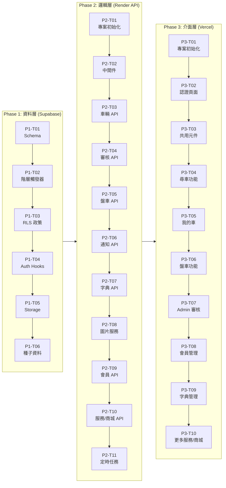

# 發財B平台 - 開發任務清單

**版本**: 1.1.0  
**建立日期**: 2026-03-19  
**最後修訂**: 2026-03-19 (整合 ANALYZE-01 安全性修補)  
**對應計畫書**: plan.md v1.1.0  
**對應資料模型**: data-model.md v1.1.0  

---

## 📊 開發進度總覽

### Phase 架構與相依性



### 預估工時摘要

| Phase | 任務數 | 預估工時 | 累計 |
|-------|--------|---------|------|
| **Phase 1: 資料層** | 6 任務 / 40 子任務 | 16 小時 | 16 小時 |
| **Phase 2: 邏輯層** | 11 任務 / 78 子任務 | 40 小時 | 56 小時 |
| **Phase 3: 介面層** | 10 任務 / 92 子任務 | 48 小時 | 104 小時 |
| **總計** | **27 任務 / 210 子任務** | **104 小時** | - |

### 關鍵路徑 (Critical Path)

```
P1-T01 → P1-T02 → P1-T03 → P2-T01 → P2-T02 → P2-T03 → P3-T01 → P3-T04
```

---

## 🔒 安全性修補標記說明 (ANALYZE-01)

本任務清單已整合 **ANALYZE-01** 報告的安全性修補：

| 標記 | 說明 |
|------|------|
| 🔒 | ANALYZE-01 安全性修補項目 |
| ⚠️ | 需特別注意的相依性 |

---

# Phase 1: 資料層 (Supabase)

> **總工時**: 16 小時  
> **前置條件**: Supabase 專案已建立

---

## P1-T01: 建立資料庫 Schema

**預估工時**: 4 小時  
**前置任務**: 無

### 子任務清單

| ID | 任務描述 | 檔案路徑 | 驗收標準 (AC) | 狀態 |
|----|----------|----------|---------------|------|
| 1.1.1 | 建立 `pg_trgm` 擴充 | `[新增] supabase/migrations/20260318000001_init_schema.sql` | `CREATE EXTENSION IF NOT EXISTS pg_trgm;` 執行成功 | ✅ |
| 1.1.2 | 建立 `update_updated_at_column()` 共用函數 | `[新增] supabase/migrations/20260318000001_init_schema.sql` | 函數可被多表觸發器呼叫 | ✅ |
| 1.1.3 | 建立 `users` 表與觸發器 | `[新增] supabase/migrations/20260318000001_init_schema.sql` | 表結構符合 data-model.md 2.1 節 | ✅ |
| 1.1.4 | 建立 `brands` 表與索引 | `[新增] supabase/migrations/20260318000001_init_schema.sql` | `idx_brands_name_trgm` GIN 索引存在 | ✅ |
| 1.1.5 | 建立 `specs` 表與索引 | `[新增] supabase/migrations/20260318000001_init_schema.sql` | `UNIQUE(brand_id, name)` 約束生效 | ✅ |
| 1.1.6 | 建立 `models` 表與索引 | `[新增] supabase/migrations/20260318000001_init_schema.sql` | `UNIQUE(spec_id, name)` 約束生效 | ✅ |
| 1.1.7 | 建立 `vehicles` 表與索引 | `[新增] supabase/migrations/20260318000001_init_schema.sql` | 🔒 `chk_images_array` CHECK 約束存在 | ✅ |
| 1.1.8 | 建立 `trade_requests` 表與約束 | `[新增] supabase/migrations/20260318000001_init_schema.sql` | `chk_year_range`, `chk_price_range` 約束生效 | ✅ |
| 1.1.9 | 建立 `dictionary_requests` 表 | `[新增] supabase/migrations/20260318000001_init_schema.sql` | `request_type` CHECK 約束生效 | ✅ |
| 1.1.10 | 建立 `notifications` 表與索引 | `[新增] supabase/migrations/20260318000001_init_schema.sql` | `idx_notifications_user_unread` 部分索引存在 | ✅ |
| 1.1.11 | 建立 `audit_logs` 表與索引 | `[新增] supabase/migrations/20260318000001_init_schema.sql` | 三個索引皆建立成功 | ✅ |
| 1.1.12 | 建立 `app_settings` 表與預設資料 | `[新增] supabase/migrations/20260318000001_init_schema.sql` | `external_services` 預設值存在 | ✅ |
| 1.1.13 | 建立 `shop_products` 表與觸發器 | `[新增] supabase/migrations/20260318000001_init_schema.sql` | `trigger_shop_products_updated_at` 觸發器存在 | ✅ |

---

## P1-T02: 建立階層一致性觸發器 🔒

**預估工時**: 2 小時  
**前置任務**: P1-T01  
**安全標記**: ANALYZE-01 修補

### 子任務清單

| ID | 任務描述 | 檔案路徑 | 驗收標準 (AC) | 狀態 |
|----|----------|----------|---------------|------|
| 1.2.1 | 建立 `check_vehicle_hierarchy()` 函數 | `[新增] supabase/migrations/20260319000001_add_hierarchy_trigger.sql` | 函數存在且可編譯 | ✅ |
| 1.2.2 | 綁定 `trigger_check_vehicle_hierarchy` 觸發器 | `[新增] supabase/migrations/20260319000001_add_hierarchy_trigger.sql` | 觸發器綁定至 `vehicles` 表 | ✅ |
| 1.2.3 | 建立 `check_trade_request_hierarchy()` 函數 | `[新增] supabase/migrations/20260319000001_add_hierarchy_trigger.sql` | 函數處理 NULL 欄位邏輯正確 | ✅ |
| 1.2.4 | 綁定 `trigger_check_trade_request_hierarchy` 觸發器 | `[新增] supabase/migrations/20260319000001_add_hierarchy_trigger.sql` | 觸發器綁定至 `trade_requests` 表 | ✅ |
| 1.2.5 | 🔒 測試：跨品牌 INSERT 被拒絕 | - | Toyota 品牌 + BMW 3 Series 規格 INSERT 拋出 `HIERARCHY_VIOLATION` | ✅ |
| 1.2.6 | 🔒 測試：正確階層 INSERT 成功 | - | Toyota + Camry + 2.5 Hybrid INSERT 成功 | ✅ |
| 1.2.7 | 🔒 測試：UPDATE 時觸發驗證 | - | 修改 `spec_id` 為不相容值時被拒絕 | ✅ |

---

## P1-T03: 設定 RLS 政策

**預估工時**: 4 小時  
**前置任務**: P1-T02

### 子任務清單

| ID | 任務描述 | 檔案路徑 | 驗收標準 (AC) | 狀態 |
|----|----------|----------|---------------|------|
| 1.3.1 | 啟用所有表的 RLS | `[新增] supabase/migrations/20260318000002_enable_rls.sql` | 所有 11 個表 `ALTER TABLE ... ENABLE ROW LEVEL SECURITY` | ✅ |
| 1.3.2 | 建立 `users` 表 RLS 政策 (4 條) | `[新增] supabase/migrations/20260318000002_enable_rls.sql` | 用戶可查看/更新自己；Admin 可查看/更新所有 | ✅ |
| 1.3.3 | 建立 `vehicles` 表 RLS 政策 (8 條) | `[新增] supabase/migrations/20260318000002_enable_rls.sql` | 成本欄位隔離正確運作 | ✅ |
| 1.3.4 | 建立 `vehicles_public` VIEW | `[新增] supabase/migrations/20260318000002_enable_rls.sql` | 非擁有者查詢時 `acquisition_cost` = NULL | ✅ |
| 1.3.5 | 建立 `trade_requests` 表 RLS 政策 (6 條) | `[新增] supabase/migrations/20260318000002_enable_rls.sql` | 停權用戶的調做不顯示 | ✅ |
| 1.3.6 | 建立 `notifications` 表 RLS 政策 (2 條) | `[新增] supabase/migrations/20260318000002_enable_rls.sql` | 用戶僅可查看/更新自己的通知 | ✅ |
| 1.3.7 | 建立 `brands/specs/models` 表 RLS 政策 | `[新增] supabase/migrations/20260318000002_enable_rls.sql` | 認證用戶可讀；Admin 可寫 | ✅ |
| 1.3.8 | 🔒 建立 `is_user_active()` 共用函數 | `[新增] supabase/migrations/20260319000003_suspended_account_blocking.sql` | 函數回傳 BOOLEAN | ✅ |
| 1.3.9 | 🔒 建立 `is_user_suspended()` 共用函數 | `[新增] supabase/migrations/20260319000003_suspended_account_blocking.sql` | 函數回傳 BOOLEAN | ✅ |
| 1.3.10 | 🔒 建立 `dictionary_requests` 表 RLS 政策 (5 條) | `[新增] supabase/migrations/20260318000002_enable_rls.sql` | 用戶可 INSERT/SELECT 自己的；Admin 可 ALL | ✅ |
| 1.3.11 | 🔒 建立 `audit_logs` 表 RLS 政策 | `[新增] supabase/migrations/20260318000002_enable_rls.sql` | 僅 Admin 可 SELECT | ✅ |
| 1.3.12 | 🔒 建立 `app_settings` 表 RLS 政策 | `[新增] supabase/migrations/20260318000002_enable_rls.sql` | 認證用戶可 SELECT；Admin 可 UPDATE | ✅ |
| 1.3.13 | 🔒 建立 `shop_products` 表 RLS 政策 | `[新增] supabase/migrations/20260318000002_enable_rls.sql` | 認證用戶可 SELECT 上架商品；Admin 可 ALL | ✅ |
| 1.3.14 | 🔒 測試：停權帳號 INSERT vehicles 被拒絕 | - | RLS WITH CHECK 拒絕 `is_user_active() = false` | ✅ |

---

## P1-T04: 設定 Auth Hooks

**預估工時**: 2 小時  
**前置任務**: P1-T03

### 子任務清單

| ID | 任務描述 | 檔案路徑 | 驗收標準 (AC) | 狀態 |
|----|----------|----------|---------------|------|
| 1.4.1 | 建立 `handle_new_user()` 函數 | `[新增] supabase/migrations/20260318000003_auth_hooks.sql` | 函數設定 `raw_app_meta_data.role = 'user'` | ✅ |
| 1.4.2 | 建立 `on_auth_user_created` 觸發器 | `[新增] supabase/migrations/20260318000003_auth_hooks.sql` | 觸發器綁定至 `auth.users` AFTER INSERT | ✅ |
| 1.4.3 | 同步建立 `public.users` 記錄 | `[新增] supabase/migrations/20260318000003_auth_hooks.sql` | 註冊後 `public.users` 自動新增對應記錄 | ✅ |
| 1.4.4 | 建立 `set_user_role()` 函數 | `[新增] supabase/migrations/20260318000003_auth_hooks.sql` | Admin 可呼叫修改其他用戶角色 | ✅ |
| 1.4.5 | 測試：新註冊用戶 JWT 包含 role | - | JWT Payload 含 `role: 'user'` | ✅ |

---

## P1-T05: 設定 Storage Bucket

**預估工時**: 2 小時  
**前置任務**: P1-T04

### 子任務清單

| ID | 任務描述 | 檔案路徑 | 驗收標準 (AC) | 狀態 |
|----|----------|----------|---------------|------|
| 1.5.1 | 建立 `vehicle-images` Bucket | `[新增] supabase/migrations/20260318000004_storage_buckets.sql` | Bucket 設為 `public = true` | ✅ |
| 1.5.2 | 建立 Storage INSERT 政策 | `[新增] supabase/migrations/20260318000004_storage_buckets.sql` | 擁有者可上傳至 `vehicles/{vehicle_id}/` | ✅ |
| 1.5.3 | 建立 Storage SELECT 政策 (公開) | `[新增] supabase/migrations/20260318000004_storage_buckets.sql` | 已核准車輛圖片可公開讀取 | ✅ |
| 1.5.4 | 建立 Storage SELECT 政策 (擁有者) | `[新增] supabase/migrations/20260318000004_storage_buckets.sql` | 擁有者可讀取待審核圖片 | ✅ |
| 1.5.5 | 建立 Storage DELETE 政策 | `[新增] supabase/migrations/20260318000004_storage_buckets.sql` | 擁有者可刪除自己的圖片 | ✅ |
| 1.5.6 | 建立 Storage Admin 政策 | `[新增] supabase/migrations/20260318000004_storage_buckets.sql` | Admin 可管理所有圖片 | ✅ |

---

## P1-T06: 匯入種子資料

**預估工時**: 2 小時  
**前置任務**: P1-T05

### 子任務清單

| ID | 任務描述 | 檔案路徑 | 驗收標準 (AC) | 狀態 |
|----|----------|----------|---------------|------|
| 1.6.1 | 建立品牌種子資料 (~30 筆) | `[新增] supabase/seed.sql` | Toyota, Honda, BMW, Mercedes-Benz 等常見品牌存在 | ✅ |
| 1.6.2 | 建立規格種子資料 (~40 筆) | `[新增] supabase/seed.sql` | 每品牌約 4-7 個規格，關聯正確 | ✅ |
| 1.6.3 | 建立車型種子資料 (~40 筆) | `[新增] supabase/seed.sql` | 每規格約 3-4 個車型，關聯正確 | ✅ |
| 1.6.4 | 建立種子資料 Migration | `[新增] supabase/migrations/20260318000006_seed_data.sql` | 執行種子資料匯入 | ✅ |
| 1.6.5 | 建立搜尋函數 | `[新增] supabase/migrations/20260318000005_search_functions.sql` | `search_brands()`, `search_specs()`, `search_models()` 函數存在 | ✅ |
| 1.6.6 | 建立預設 Admin 帳號 | `[新增] supabase/seed.sql` | `admin@facai-b.com` 帳號存在且 `role = 'admin'` | ✅ |

---

# Phase 2: 邏輯層 (Render API)

> **總工時**: 40 小時  
> **前置條件**: Phase 1 完成

---

## P2-T01: 專案初始化 ✅

**預估工時**: 3 小時  
**前置任務**: P1-T06

### 子任務清單

| ID | 任務描述 | 檔案路徑 | 驗收標準 (AC) | 狀態 |
|----|----------|----------|---------------|------|
| 2.1.1 | 初始化 npm 專案 | `[新增] backend/package.json` | `npm init -y` 完成 | ✅ |
| 2.1.2 | 安裝 Express 與相依套件 | `[修改] backend/package.json` | express, cors, helmet, dotenv, @supabase/supabase-js 已安裝 | ✅ |
| 2.1.3 | 安裝圖片處理套件 | `[修改] backend/package.json` | sharp, multer 已安裝 | ✅ |
| 2.1.4 | 安裝開發工具 | `[修改] backend/package.json` | typescript, ts-node, nodemon, @types/* 已安裝 | ✅ |
| 2.1.5 | 建立 TypeScript 設定 | `[新增] backend/tsconfig.json` | `strict: true`, `outDir: dist` | ✅ |
| 2.1.6 | 建立環境變數範本 | `[新增] backend/.env.example` | PORT, SUPABASE_URL, SUPABASE_ANON_KEY, SUPABASE_SERVICE_ROLE_KEY, REDIS_URL | ✅ |
| 2.1.7 | 建立環境變數驗證 | `[新增] backend/src/config/env.ts` | 缺少必要變數時拋出錯誤 | ✅ |
| 2.1.8 | 建立 Supabase Admin Client | `[新增] backend/src/config/supabase.ts` | 匯出 `supabaseAdmin` (Service Role Key) | ✅ |
| 2.1.9 | 建立 Express 應用 | `[新增] backend/src/app.ts` | 設定 cors, helmet, json parser | ✅ |
| 2.1.10 | 建立入口點與 Health Check | `[新增] backend/src/index.ts` | `GET /health` 回傳 200 | ✅ |
| 2.1.11 | 建立統一回應格式 | `[新增] backend/src/utils/response.ts` | `success()`, `error()` 函數 | ✅ |
| 2.1.12 | 建立類型定義檔 | `[新增] backend/src/types/index.ts` | User, Vehicle, TradeRequest 等型別 | ✅ |

---

## P2-T02: 中間件設定 🔒 ✅

**預估工時**: 4 小時  
**前置任務**: P2-T01  
**安全標記**: ANALYZE-01 修補 (停權帳號阻擋)

### 子任務清單

| ID | 任務描述 | 檔案路徑 | 驗收標準 (AC) | 狀態 |
|----|----------|----------|---------------|------|
| 2.2.1 | 建立 JWT 驗證中間件 | `[新增] backend/src/middleware/auth.ts` | 解析 Supabase JWT 並設定 `req.user` | ✅ |
| 2.2.2 | 建立 Admin 權限檢查中間件 | `[新增] backend/src/middleware/admin.ts` | 非 Admin 回傳 403 | ✅ |
| 2.2.3 | 🔒 建立停權帳號阻擋中間件 | `[新增] backend/src/middleware/suspendedCheck.ts` | `status = 'suspended'` 的 POST/PUT/DELETE 回傳 403 | ✅ |
| 2.2.4 | 建立 Redis Client | `[新增] backend/src/config/redis.ts` | 連線失敗時 graceful fallback | ✅ |
| 2.2.5 | 建立限流中間件 | `[新增] backend/src/middleware/rateLimit.ts` | 超過 100 req/min/IP 回傳 429 | ✅ |
| 2.2.6 | 建立錯誤處理中間件 | `[新增] backend/src/middleware/errorHandler.ts` | 統一錯誤格式，不洩漏內部細節 | ✅ |
| 2.2.7 | 建立路由彙整檔 | `[新增] backend/src/routes/index.ts` | 匯出所有路由 | ✅ |
| 2.2.8 | 測試：無 Token 請求回應 401 | - | `GET /api/vehicles` 無 Token 回傳 401 | 🔜 |
| 2.2.9 | 測試：非 Admin 存取 Admin API 回應 403 | - | User 存取 `/api/admin/*` 回傳 403 | 🔜 |
| 2.2.10 | 🔒 測試：停權帳號 POST 回應 403 | - | `status='suspended'` 的 POST 回傳 `AccountSuspended` | 🔜 |

---

## P2-T03: 車輛 API ✅

**預估工時**: 5 小時  
**前置任務**: P2-T02

### 子任務清單

| ID | 任務描述 | 檔案路徑 | 驗收標準 (AC) | 狀態 |
|----|----------|----------|---------------|------|
| 2.3.1 | 建立車輛服務層 | `[新增] backend/src/services/vehicle.service.ts` | CRUD 方法完整 | ✅ |
| 2.3.2 | 實作 `GET /api/vehicles` 列表 | `[新增] backend/src/routes/vehicles/index.ts` | 支援游標分頁 `?cursor=&limit=20` | ✅ |
| 2.3.3 | 實作 `GET /api/vehicles/search` 模糊搜尋 | `[修改] backend/src/routes/vehicles/index.ts` | 使用 pg_trgm 搜尋品牌/規格/車型 | ✅ |
| 2.3.4 | 實作 `GET /api/vehicles/:id` 詳情 | `[修改] backend/src/routes/vehicles/index.ts` | 非擁有者查詢時 `acquisition_cost = null` | ✅ |
| 2.3.5 | 實作 `POST /api/vehicles` 新增 | `[修改] backend/src/routes/vehicles/index.ts` | 🔒 套用 `suspendedCheck` 中間件 | ✅ |
| 2.3.6 | 實作 `PUT /api/vehicles/:id` 更新 | `[修改] backend/src/routes/vehicles/index.ts` | 僅擁有者可更新 | ✅ |
| 2.3.7 | 實作 `PUT /api/vehicles/:id/archive` 下架 | `[修改] backend/src/routes/vehicles/index.ts` | 狀態改為 `archived` | ✅ |
| 2.3.8 | 實作 `PUT /api/vehicles/:id/resubmit` 重新送審 | `[修改] backend/src/routes/vehicles/index.ts` | `rejected` → `pending` | ✅ |
| 2.3.9 | 實作 `DELETE /api/vehicles/:id` 永久刪除 | `[修改] backend/src/routes/vehicles/index.ts` | 僅 `archived` 狀態可刪除 | ✅ |
| 2.3.10 | 建立驗證工具 | `[新增] backend/src/utils/validation.ts` | Zod schema 驗證 | ✅ |

---

## P2-T04: 審核 API (Admin) ✅

**預估工時**: 4 小時  
**前置任務**: P2-T03

### 子任務清單

| ID | 任務描述 | 檔案路徑 | 驗收標準 (AC) | 狀態 |
|----|----------|----------|---------------|------|
| 2.4.1 | 建立審核服務層 | `[新增] backend/src/services/audit.service.ts` | 核准/拒絕/寫入 audit_logs | ✅ |
| 2.4.2 | 實作 `GET /api/admin/audit` 待審核列表 | `[新增] backend/src/routes/admin/audit.ts` | 篩選 `status = 'pending'` | ✅ |
| 2.4.3 | 實作 `GET /api/admin/audit/:id` 審核詳情 | `[修改] backend/src/routes/admin/audit.ts` | 含車行資訊與圖片 | ✅ |
| 2.4.4 | 實作 `POST /api/admin/audit/:id/approve` 核准 | `[修改] backend/src/routes/admin/audit.ts` | 狀態 → `approved`，發送通知 | ✅ |
| 2.4.5 | 實作 `POST /api/admin/audit/:id/reject` 拒絕 | `[修改] backend/src/routes/admin/audit.ts` | 必填 `rejection_reason`，發送通知 | ✅ |
| 2.4.6 | 實作 `POST /api/admin/vehicles/proxy` 代客建檔 | `[新增] backend/src/routes/admin/vehicles.ts` | 使用 Service Role Key，設定 `created_by` | ✅ |
| 2.4.7 | 寫入稽核日誌 | `[修改] backend/src/services/audit.service.ts` | 所有 Admin 操作記錄至 `audit_logs` | ✅ |

---

## P2-T05: 盤車 API ✅

**預估工時**: 4 小時  
**前置任務**: P2-T04

### 子任務清單

| ID | 任務描述 | 檔案路徑 | 驗收標準 (AC) | 狀態 |
|----|----------|----------|---------------|------|
| 2.5.1 | 建立調做服務層 | `[新增] backend/src/services/trade.service.ts` | CRUD 方法完整 | ✅ |
| 2.5.2 | 實作 `GET /api/trades` 調做列表 | `[新增] backend/src/routes/trades/index.ts` | 排除停權車行的需求 | ✅ |
| 2.5.3 | 實作 `GET /api/trades/my` 我的調做 | `[修改] backend/src/routes/trades/index.ts` | 篩選 `dealer_id = auth.uid()` | ✅ |
| 2.5.4 | 實作 `POST /api/trades` 發布調做 | `[修改] backend/src/routes/trades/index.ts` | 🔒 套用 `suspendedCheck`，品牌必填 | ✅ |
| 2.5.5 | 實作 `PUT /api/trades/:id` 更新調做 | `[修改] backend/src/routes/trades/index.ts` | 僅擁有者可更新 | ✅ |
| 2.5.6 | 實作 `PUT /api/trades/:id/extend` 續期 | `[修改] backend/src/routes/trades/index.ts` | 延長 `expires_at` | ✅ |
| 2.5.7 | 實作 `DELETE /api/trades/:id` Hard Delete | `[修改] backend/src/routes/trades/index.ts` | 直接從資料庫刪除 | ✅ |

---

## P2-T06: 通知 API ✅

**預估工時**: 3 小時  
**前置任務**: P2-T05

### 子任務清單

| ID | 任務描述 | 檔案路徑 | 驗收標準 (AC) | 狀態 |
|----|----------|----------|---------------|------|
| 2.6.1 | 建立通知服務層 | `[新增] backend/src/services/notification.service.ts` | `send()`, `markAsRead()` 方法 | ✅ |
| 2.6.2 | 實作 `GET /api/notifications` 通知列表 | `[新增] backend/src/routes/notifications/index.ts` | 僅回傳本人通知 | ✅ |
| 2.6.3 | 實作 `GET /api/notifications/unread-count` | `[修改] backend/src/routes/notifications/index.ts` | 回傳 `{ count: number }` | ✅ |
| 2.6.4 | 實作 `PUT /api/notifications/:id/read` | `[修改] backend/src/routes/notifications/index.ts` | 設定 `is_read = true` | ✅ |
| 2.6.5 | 實作 `PUT /api/notifications/read-all` | `[修改] backend/src/routes/notifications/index.ts` | 批次更新所有未讀 | ✅ |
| 2.6.6 | 整合審核通知 | `[修改] backend/src/services/audit.service.ts` | 核准/拒絕時自動發送通知 | ✅ |

---

## P2-T07: 字典 API ✅

**預估工時**: 3 小時  
**前置任務**: P2-T06

### 子任務清單

| ID | 任務描述 | 檔案路徑 | 驗收標準 (AC) | 狀態 |
|----|----------|----------|---------------|------|
| 2.7.1 | 實作 `GET /api/dictionary/brands` | `[新增] backend/src/routes/dictionary/index.ts` | 回傳 `is_active = true` 的品牌 | ✅ |
| 2.7.2 | 實作 `GET /api/dictionary/specs?brand_id=` | `[修改] backend/src/routes/dictionary/index.ts` | 依品牌篩選規格 | ✅ |
| 2.7.3 | 實作 `GET /api/dictionary/models?spec_id=` | `[修改] backend/src/routes/dictionary/index.ts` | 依規格篩選車型 | ✅ |
| 2.7.4 | 實作 `POST /api/dictionary/requests` 字典申請 | `[修改] backend/src/routes/dictionary/index.ts` | 🔒 停權帳號無法申請 | ✅ |
| 2.7.5 | 實作 `GET /api/admin/dictionary/requests` | `[新增] backend/src/routes/admin/dictionary.ts` | Admin 查看所有申請 | ✅ |
| 2.7.6 | 實作 `POST /api/admin/dictionary/requests/:id/approve` | `[修改] backend/src/routes/admin/dictionary.ts` | 核准並建立字典項目 | ✅ |
| 2.7.7 | 實作 `POST /api/admin/dictionary/requests/:id/reject` | `[修改] backend/src/routes/admin/dictionary.ts` | 拒絕並發送通知 | ✅ |
| 2.7.8 | 實作 Admin 字典管理 CRUD | `[修改] backend/src/routes/admin/dictionary.ts` | 新增/編輯/停用品牌/規格/車型 | ✅ |

---

## P2-T08: 圖片處理服務 ✅

**預估工時**: 4 小時  
**前置任務**: P2-T07

### 子任務清單

| ID | 任務描述 | 檔案路徑 | 驗收標準 (AC) | 狀態 |
|----|----------|----------|---------------|------|
| 2.8.1 | 建立圖片服務層 | `[新增] backend/src/services/image.service.ts` | `compress()`, `upload()` 方法 | ✅ |
| 2.8.2 | 實作 Sharp 壓縮邏輯 | `[修改] backend/src/services/image.service.ts` | 輸出 1200x800 WebP | ✅ |
| 2.8.3 | 實作 `POST /api/vehicles/:id/images` | `[新增] backend/src/routes/vehicles/upload.ts` | 接收 multipart/form-data | ✅ |
| 2.8.4 | 整合 Supabase Storage 上傳 | `[修改] backend/src/services/image.service.ts` | 路徑 `vehicles/{vehicle_id}/{uuid}.webp` | ✅ |
| 2.8.5 | 實作圖片刪除 | `[修改] backend/src/services/image.service.ts` | 支援批次刪除 | ✅ |
| 2.8.6 | 實作圖片列表與重排序 | `[修改] backend/src/routes/vehicles/upload.ts` | GET/PUT 圖片端點 | ✅ |

---

## P2-T09: 會員 API (Admin) ✅

**預估工時**: 4 小時  
**前置任務**: P2-T08

### 子任務清單

| ID | 任務描述 | 檔案路徑 | 驗收標準 (AC) | 狀態 |
|----|----------|----------|---------------|------|
| 2.9.1 | 實作 `GET /api/admin/users` 會員列表 | `[新增] backend/src/routes/admin/users.ts` | 支援狀態篩選 | ✅ |
| 2.9.2 | 實作 `GET /api/admin/users/:id` 會員詳情 | `[修改] backend/src/routes/admin/users.ts` | 含車輛數、調做數統計 | ✅ |
| 2.9.3 | 實作 `PUT /api/admin/users/:id/suspend` 停權 | `[修改] backend/src/routes/admin/users.ts` | 設定 `status`, `suspended_at`, `suspended_reason` | ✅ |
| 2.9.4 | 實作停權連帶處理 | `[修改] backend/src/services/user.service.ts` | 車輛設為 `archived`，記錄 `previous_status` | ✅ |
| 2.9.5 | 實作 `PUT /api/admin/users/:id/reactivate` 解除停權 | `[修改] backend/src/routes/admin/users.ts` | 恢復 `previous_status` | ✅ |
| 2.9.6 | 發送停權/解除停權通知 | `[修改] backend/src/services/user.service.ts` | 類型 `account_suspended`, `account_reactivated` | ✅ |
| 2.9.7 | 寫入稽核日誌 | `[修改] backend/src/services/user.service.ts` | 記錄 `USER_SUSPENDED`, `USER_REACTIVATED` | ✅ |

---

## P2-T10: 更多服務與商城 API ✅

**預估工時**: 3 小時  
**前置任務**: P2-T09

### 子任務清單

| ID | 任務描述 | 檔案路徑 | 驗收標準 (AC) | 狀態 |
|----|----------|----------|---------------|------|
| 2.10.1 | 實作 `GET /api/services` 服務列表 | `[新增] backend/src/routes/services/index.ts` | 讀取 `app_settings.external_services` | ✅ |
| 2.10.2 | 實作 `GET /api/admin/services` | `[新增] backend/src/routes/admin/services.ts` | Admin 查看所有服務設定 | ✅ |
| 2.10.3 | 實作 `PUT /api/admin/services` 更新服務 | `[修改] backend/src/routes/admin/services.ts` | 更新 `app_settings` | ✅ |
| 2.10.4 | 實作 `GET /api/shop` 商品列表 | `[新增] backend/src/routes/shop/index.ts` | 篩選 `is_active = true` | ✅ |
| 2.10.5 | 實作 `POST /api/admin/shop` 新增商品 | `[新增] backend/src/routes/admin/shop.ts` | Admin 新增商品 | ✅ |
| 2.10.6 | 實作 `PUT /api/admin/shop/:id` 更新商品 | `[修改] backend/src/routes/admin/shop.ts` | Admin 更新商品 | ✅ |
| 2.10.7 | 實作 `DELETE /api/admin/shop/:id` 刪除商品 | `[修改] backend/src/routes/admin/shop.ts` | Admin 刪除商品 | ✅ |

---

## P2-T11: 定時任務 ✅

**預估工時**: 3 小時  
**前置任務**: P2-T10

### 子任務清單

| ID | 任務描述 | 檔案路徑 | 驗收標準 (AC) | 狀態 |
|----|----------|----------|---------------|------|
| 2.11.1 | 建立 Cron 服務層 | `[新增] backend/src/cron/index.ts` | 使用 node-cron 套件 | ✅ |
| 2.11.2 | 實作到期提醒任務 (每日 09:00) | `[新增] backend/src/cron/jobs/trade-expiry-reminder.ts` | 到期前 1 天發送通知 | ✅ |
| 2.11.3 | 實作清理過期調做任務 (每日 03:00) | `[新增] backend/src/cron/jobs/clean-expired-trades.ts` | 設定 `is_active = false` | ✅ |
| 2.11.4 | 實作清理孤兒圖片任務 (每日 04:00) | `[新增] backend/src/cron/jobs/clean-orphan-images.ts` | 刪除無關聯的 Storage 圖片 | ✅ |
| 2.11.5 | 設定不重複提醒邏輯 | `[修改] backend/src/cron/jobs/trade-expiry-reminder.ts` | 檢查 `reminded_at IS NULL` | ✅ |

---

# Phase 2 完成 ✅

> **Phase 2: 邏輯層 (Render API) 開發已全部完成！**
> 
> - 所有 11 個任務 (P2-T01 ~ P2-T11) 均已完成
> - 包含：專案初始化、中間件、車輛/審核/盤車/通知/字典/圖片/會員/服務/商城 API，以及定時任務
> - 總共實作了 80+ 個 API 端點與後端服務

---

# Phase 3: 介面層 (Vercel 前端)

> **總工時**: 48 小時  
> **前置條件**: Phase 2 完成

---

## P3-T01: 專案初始化 ✅

**預估工時**: 4 小時  
**前置任務**: P2-T11

### 子任務清單

| ID | 任務描述 | 檔案路徑 | 驗收標準 (AC) | 狀態 |
|----|----------|----------|---------------|------|
| 3.1.1 | 執行 create-next-app | `[新增] frontend/package.json` | Next.js 14+ with App Router | ✅ |
| 3.1.2 | 設定 Tailwind CSS | `[新增] frontend/tailwind.config.js` | 自訂色彩主題 | ✅ |
| 3.1.3 | 初始化 shadcn/ui | `[新增] frontend/components.json` | `npx shadcn-ui@latest init` | ✅ |
| 3.1.4 | 安裝 SWR | `[修改] frontend/package.json` | 資料請求與快取 | ✅ |
| 3.1.5 | 安裝 React Hook Form + Zod | `[修改] frontend/package.json` | 表單驗證 | ✅ |
| 3.1.6 | 建立環境變數範本 | `[新增] frontend/.env.example` | NEXT_PUBLIC_SUPABASE_URL, NEXT_PUBLIC_API_URL | ✅ |
| 3.1.7 | 建立 Supabase Browser Client | `[新增] frontend/src/lib/supabase/client.ts` | `createBrowserClient()` | ✅ |
| 3.1.8 | 建立 Supabase Server Client | `[新增] frontend/src/lib/supabase/server.ts` | `createServerClient()` | ✅ |
| 3.1.9 | 建立 API Client | `[新增] frontend/src/lib/api.ts` | 封裝 Render API 請求 | ✅ |
| 3.1.10 | 建立常數定義 | `[新增] frontend/src/lib/constants.ts` | 狀態、通知類型常數 | ✅ |
| 3.1.11 | 建立工具函數 | `[新增] frontend/src/lib/utils.ts` | `cn()`, `formatPrice()` 等 | ✅ |
| 3.1.12 | 建立全域樣式 | `[新增] frontend/src/app/globals.css` | Tailwind 基礎樣式 + 金紙風格主題 | ✅ |
| 3.1.13 | 建立根佈局 | `[新增] frontend/src/app/layout.tsx` | 設定 metadata, font, Toaster | ✅ |
| 3.1.14 | 建立首頁重定向 | `[新增] frontend/src/app/page.tsx` | 重定向至 `/login` 或 `/find-car` | ✅ |
| 3.1.15 | 建立類型定義 | `[新增] frontend/src/types/index.ts` | 類型匯出總覽 | ✅ |
| 3.1.16 | 建立車輛類型 | `[新增] frontend/src/types/vehicle.ts` | Vehicle, VehicleStatus 等 | ✅ |
| 3.1.17 | 建立調做類型 | `[新增] frontend/src/types/trade.ts` | TradeRequest 等 | ✅ |
| 3.1.18 | 建立用戶類型 | `[新增] frontend/src/types/user.ts` | User, UserRole 等 | ✅ |
| 3.1.19 | 安裝 framer-motion | `[修改] frontend/package.json` | 動畫效果庫 | ✅ |
| 3.1.20 | 安裝 lucide-react | `[修改] frontend/package.json` | 圖示庫 | ✅ |
| 3.1.21 | 建立 AnimatedCard 元件 | `[新增] frontend/src/components/ui/AnimatedCard.tsx` | framer-motion 動態卡片 | ✅ |
| 3.1.22 | 建立 Sidebar 元件 | `[新增] frontend/src/components/layout/Sidebar.tsx` | 可收合側邊欄 | ✅ |
| 3.1.23 | 建立 Header 元件 | `[新增] frontend/src/components/layout/Header.tsx` | 頂部導航 + 主題切換 | ✅ |

---

## P3-T02: 認證頁面 ✅

**預估工時**: 5 小時  
**前置任務**: P3-T01  
**完成日期**: 2026-03-20

### 子任務清單

| ID | 任務描述 | 檔案路徑 | 驗收標準 (AC) | 狀態 |
|----|----------|----------|---------------|------|
| 3.2.1 | 建立 Auth 佈局 | `[新增] frontend/src/app/(auth)/layout.tsx` | 無導航列的簡潔佈局 | ✅ |
| 3.2.2 | 建立登入頁面 | `[新增] frontend/src/app/(auth)/login/page.tsx` | Email + 密碼表單 | ✅ |
| 3.2.3 | 建立註冊頁面 | `[新增] frontend/src/app/(auth)/register/page.tsx` | Email + 密碼 + 車行資訊 | ✅ |
| 3.2.4 | 建立 useAuth Hook | `[新增] frontend/src/hooks/useAuth.ts` | `signIn()`, `signUp()`, `signOut()` | ✅ |
| 3.2.5 | 建立 useUserRole Hook | `[新增] frontend/src/hooks/useUserRole.ts` | 從 JWT 解析 role | ✅ |
| 3.2.6 | 建立 Next.js Middleware | `[新增] frontend/src/middleware.ts` | 路由守衛：未登入導向 /login | ✅ |
| 3.2.7 | 建立 Supabase Auth Middleware | `[新增] frontend/src/lib/supabase/middleware.ts` | 刷新 Session | ✅ |
| 3.2.8 | 實作依角色重定向 | `[修改] frontend/src/app/(auth)/login/page.tsx` | User → /find-car, Admin → /dashboard | ✅ |
| 3.2.9 | 建立 shadcn Button 元件 | `[新增] frontend/src/components/ui/button.tsx` | `npx shadcn-ui add button` | ✅ |
| 3.2.10 | 建立 shadcn Input 元件 | `[新增] frontend/src/components/ui/input.tsx` | `npx shadcn-ui add input` | ✅ |
| 3.2.11 | 建立 shadcn Toast 元件 | `[新增] frontend/src/components/ui/sonner.tsx` | `npx shadcn-ui add sonner` | ✅ |

---

## P3-T03: 共用元件與佈局 ✅

**預估工時**: 5 小時  
**前置任務**: P3-T02  
**完成日期**: 2026-03-20

### 子任務清單

| ID | 任務描述 | 檔案路徑 | 驗收標準 (AC) | 狀態 |
|----|----------|----------|---------------|------|
| 3.3.1 | 建立 User 佈局 | `[新增] frontend/src/app/(user)/layout.tsx` | 含 Header + BottomNav | ✅ |
| 3.3.2 | 建立頂部導航列 | `[修改] frontend/src/app/(user)/layout.tsx` | Logo + 通知鈴鐺 + 漢堡選單 | ✅ |
| 3.3.3 | 建立底部導航 | `[新增] frontend/src/components/layout/BottomNav.tsx` | 尋車/我的車/盤車/更多 | ✅ |
| 3.3.4 | 建立通知鈴鐺 | `[新增] frontend/src/components/layout/NotificationBell.tsx` | 顯示未讀計數 | ✅ |
| 3.3.5 | 建立漢堡選單 | `[新增] frontend/src/components/layout/HamburgerMenu.tsx` | 個人資料/登出 | ✅ |
| 3.3.6 | 建立 useNotifications Hook | `[新增] frontend/src/hooks/useNotifications.ts` | 取得通知列表與未讀計數 | ✅ |
| 3.3.7 | 建立載入中元件 | `[新增] frontend/src/components/shared/LoadingSpinner.tsx` | Tailwind 動畫 | ✅ |
| 3.3.8 | 建立空狀態元件 | `[新增] frontend/src/components/shared/EmptyState.tsx` | 圖示 + 文字 + CTA | ✅ |
| 3.3.9 | 建立確認對話框 | `[新增] frontend/src/components/shared/ConfirmDialog.tsx` | 使用 Framer Motion Dialog | ✅ |
| 3.3.10 | 建立搜尋框元件 | `[新增] frontend/src/components/shared/SearchBox.tsx` | 防抖輸入 + 自動完成 | ✅ |
| 3.3.11 | 建立無限滾動元件 | `[新增] frontend/src/components/shared/InfiniteScroll.tsx` | Intersection Observer | ✅ |
| 3.3.12 | 建立 useDebounce Hook | `[新增] frontend/src/hooks/useDebounce.ts` | 300ms 防抖 | ✅ |
| 3.3.13 | 建立 useInfiniteScroll Hook | `[新增] frontend/src/hooks/useInfiniteScroll.ts` | 自動載入下一頁 | ✅ |

---

## P3-T04: 尋車功能

**預估工時**: 6 小時  
**前置任務**: P3-T03

### 子任務清單

| ID | 任務描述 | 檔案路徑 | 驗收標準 (AC) |
|----|----------|----------|---------------|
| 3.4.1 | 建立尋車列表頁 | `[新增] frontend/src/app/(user)/find-car/page.tsx` | 篩選 + 列表 + 無限滾動 |
| 3.4.2 | 建立車輛詳情頁 | `[新增] frontend/src/app/(user)/find-car/[id]/page.tsx` | 圖片輪播 + 規格 + 聯絡 |
| 3.4.3 | 建立階梯式選單元件 | `[新增] frontend/src/components/vehicle/CascadingSelect.tsx` | 品牌 → 規格 → 車型連動 |
| 3.4.4 | 建立 useCascadingSelect Hook | `[新增] frontend/src/hooks/useCascadingSelect.ts` | 管理選單狀態與 API 呼叫 |
| 3.4.5 | 建立車輛卡片元件 | `[新增] frontend/src/components/vehicle/VehicleCard.tsx` | 圖片 + 品牌規格 + 價格 |
| 3.4.6 | 建立車輛列表元件 | `[新增] frontend/src/components/vehicle/VehicleList.tsx` | 整合 InfiniteScroll |
| 3.4.7 | 建立車輛詳情元件 | `[新增] frontend/src/components/vehicle/VehicleDetail.tsx` | 完整資訊展示 |
| 3.4.8 | 建立圖片輪播元件 | `[新增] frontend/src/components/vehicle/ImageGallery.tsx` | Swiper 或原生滑動 |
| 3.4.9 | 建立 useVehicles Hook | `[新增] frontend/src/hooks/useVehicles.ts` | SWR 管理車輛資料 |
| 3.4.10 | 建立年份區間選擇器 | `[修改] frontend/src/components/vehicle/CascadingSelect.tsx` | 年份起迄輸入 |
| 3.4.11 | 測試：成本欄位不顯示 | - | 非擁有者查詢時 `acquisition_cost` 不顯示 |

---

## P3-T05: 我的車功能

**預估工時**: 6 小時  
**前置任務**: P3-T04

### 子任務清單

| ID | 任務描述 | 檔案路徑 | 驗收標準 (AC) |
|----|----------|----------|---------------|
| 3.5.1 | 建立我的車列表頁 | `[新增] frontend/src/app/(user)/my-cars/page.tsx` | 含狀態篩選 |
| 3.5.2 | 建立新增車輛頁 | `[新增] frontend/src/app/(user)/my-cars/new/page.tsx` | 完整表單 + 圖片上傳 |
| 3.5.3 | 建立車輛詳情頁 | `[新增] frontend/src/app/(user)/my-cars/[id]/page.tsx` | 含成本欄位顯示 |
| 3.5.4 | 建立編輯車輛頁 | `[新增] frontend/src/app/(user)/my-cars/[id]/edit/page.tsx` | 退件時可全欄位編輯 |
| 3.5.5 | 建立車輛表單元件 | `[新增] frontend/src/components/vehicle/VehicleForm.tsx` | React Hook Form + Zod |
| 3.5.6 | 建立圖片上傳元件 | `[新增] frontend/src/components/vehicle/ImageUploader.tsx` | 拖放 + 預覽 + 刪除 |
| 3.5.7 | 建立成本輸入元件 | `[新增] frontend/src/components/vehicle/CostInput.tsx` | 僅顯示數字，無千分位 |
| 3.5.8 | 建立狀態標籤元件 | `[新增] frontend/src/components/vehicle/VehicleStatusBadge.tsx` | 各狀態顏色區分 |
| 3.5.9 | 實作下架功能 | `[修改] frontend/src/app/(user)/my-cars/[id]/page.tsx` | 確認後呼叫 archive API |
| 3.5.10 | 實作永久刪除功能 | `[修改] frontend/src/app/(user)/my-cars/[id]/page.tsx` | 二次確認對話框 |
| 3.5.11 | 實作重新送審功能 | `[修改] frontend/src/app/(user)/my-cars/[id]/page.tsx` | rejected → pending |
| 3.5.12 | 退件理由雙重顯示 | `[修改] frontend/src/components/vehicle/VehicleStatusBadge.tsx` | 列表 + 詳情頁皆顯示 |

---

## P3-T06: 盤車功能

**預估工時**: 5 小時  
**前置任務**: P3-T05

### 子任務清單

| ID | 任務描述 | 檔案路徑 | 驗收標準 (AC) |
|----|----------|----------|---------------|
| 3.6.1 | 建立盤車列表頁 | `[新增] frontend/src/app/(user)/trade/page.tsx` | 含車行聯絡方式 |
| 3.6.2 | 建立發布調做頁 | `[新增] frontend/src/app/(user)/trade/new/page.tsx` | 品牌必填驗證 |
| 3.6.3 | 建立編輯調做頁 | `[新增] frontend/src/app/(user)/trade/[id]/edit/page.tsx` | 更新現有調做 |
| 3.6.4 | 建立調做卡片元件 | `[新增] frontend/src/components/trade/TradeRequestCard.tsx` | 條件摘要 + 聯絡方式 |
| 3.6.5 | 建立調做列表元件 | `[新增] frontend/src/components/trade/TradeRequestList.tsx` | 整合 InfiniteScroll |
| 3.6.6 | 建立調做表單元件 | `[新增] frontend/src/components/trade/TradeRequestForm.tsx` | 有效期選擇 |
| 3.6.7 | 建立到期標籤元件 | `[新增] frontend/src/components/trade/ExpiryBadge.tsx` | 顯示剩餘天數 |
| 3.6.8 | 建立 useTradeRequests Hook | `[新增] frontend/src/hooks/useTradeRequests.ts` | SWR 管理調做資料 |
| 3.6.9 | 實作續期功能 | `[修改] frontend/src/app/(user)/trade/[id]/edit/page.tsx` | 延長有效期 |
| 3.6.10 | 實作刪除功能 | `[修改] frontend/src/app/(user)/trade/page.tsx` | Hard Delete |

---

## P3-T07: Admin 審核功能

**預估工時**: 6 小時  
**前置任務**: P3-T06

### 子任務清單

| ID | 任務描述 | 檔案路徑 | 驗收標準 (AC) |
|----|----------|----------|---------------|
| 3.7.1 | 建立 Admin 佈局 | `[新增] frontend/src/app/(admin)/layout.tsx` | 側邊欄 + 主內容區 |
| 3.7.2 | 建立側邊欄元件 | `[新增] frontend/src/components/layout/AdminSidebar.tsx` | 導航連結 + 收合功能 |
| 3.7.3 | 建立管理首頁 | `[新增] frontend/src/app/(admin)/dashboard/page.tsx` | 統計卡片：待審核、會員數、車輛數 |
| 3.7.4 | 建立待審核列表頁 | `[新增] frontend/src/app/(admin)/audit/page.tsx` | 依時間排序 |
| 3.7.5 | 建立審核詳情頁 | `[新增] frontend/src/app/(admin)/audit/[id]/page.tsx` | 完整車輛資訊 + 核准/拒絕 |
| 3.7.6 | 建立審核卡片元件 | `[新增] frontend/src/components/admin/AuditCard.tsx` | 縮圖 + 車行名稱 + 提交時間 |
| 3.7.7 | 建立拒絕對話框 | `[新增] frontend/src/components/admin/RejectDialog.tsx` | 必填拒絕理由 |
| 3.7.8 | 建立代客建檔頁 | `[新增] frontend/src/app/(admin)/vehicles/new/page.tsx` | 車行選擇器 + 車輛表單 |
| 3.7.9 | 建立所有車輛頁 | `[新增] frontend/src/app/(admin)/vehicles/page.tsx` | 篩選 + 搜尋 |
| 3.7.10 | 實作核准功能 | `[修改] frontend/src/app/(admin)/audit/[id]/page.tsx` | 呼叫 approve API |
| 3.7.11 | 實作拒絕功能 | `[修改] frontend/src/app/(admin)/audit/[id]/page.tsx` | 呼叫 reject API |

---

## P3-T08: 會員管理功能

**預估工時**: 5 小時  
**前置任務**: P3-T07

### 子任務清單

| ID | 任務描述 | 檔案路徑 | 驗收標準 (AC) |
|----|----------|----------|---------------|
| 3.8.1 | 建立會員列表頁 | `[新增] frontend/src/app/(admin)/users/page.tsx` | 含狀態篩選 |
| 3.8.2 | 建立會員詳情頁 | `[新增] frontend/src/app/(admin)/users/[id]/page.tsx` | 車輛列表 + 調做列表 |
| 3.8.3 | 建立會員表格元件 | `[新增] frontend/src/components/admin/UserTable.tsx` | 排序 + 分頁 |
| 3.8.4 | 實作停權功能 | `[修改] frontend/src/app/(admin)/users/[id]/page.tsx` | 填寫停權原因 |
| 3.8.5 | 實作解除停權功能 | `[修改] frontend/src/app/(admin)/users/[id]/page.tsx` | 恢復帳號狀態 |
| 3.8.6 | 顯示停權原因 | `[修改] frontend/src/components/admin/UserTable.tsx` | 懸停顯示原因 |
| 3.8.7 | 建立個人資料頁 | `[新增] frontend/src/app/(user)/profile/page.tsx` | User 編輯自己資料 |

---

## P3-T09: 字典管理功能

**預估工時**: 5 小時  
**前置任務**: P3-T08

### 子任務清單

| ID | 任務描述 | 檔案路徑 | 驗收標準 (AC) |
|----|----------|----------|---------------|
| 3.9.1 | 建立字典管理頁 | `[新增] frontend/src/app/(admin)/dictionary/page.tsx` | 品牌/規格/車型分頁 |
| 3.9.2 | 建立字典申請審核頁 | `[新增] frontend/src/app/(admin)/dictionary/requests/page.tsx` | 待審核申請列表 |
| 3.9.3 | 建立字典管理元件 | `[新增] frontend/src/components/admin/DictionaryManager.tsx` | 新增/編輯/停用 |
| 3.9.4 | 實作新增品牌功能 | `[修改] frontend/src/components/admin/DictionaryManager.tsx` | 表單驗證 |
| 3.9.5 | 實作新增規格功能 | `[修改] frontend/src/components/admin/DictionaryManager.tsx` | 選擇所屬品牌 |
| 3.9.6 | 實作新增車型功能 | `[修改] frontend/src/components/admin/DictionaryManager.tsx` | 選擇所屬規格 |
| 3.9.7 | 實作字典申請核准 | `[修改] frontend/src/app/(admin)/dictionary/requests/page.tsx` | 自動建立字典項目 |
| 3.9.8 | 實作字典申請拒絕 | `[修改] frontend/src/app/(admin)/dictionary/requests/page.tsx` | 填寫拒絕原因 |
| 3.9.9 | 實作排序調整 | `[修改] frontend/src/components/admin/DictionaryManager.tsx` | 拖放或按鈕調整 |

---

## P3-T10: 更多服務與商城功能

**預估工時**: 5 小時  
**前置任務**: P3-T09  
**完成日期**: 2026-03-23

### 子任務清單

| ID | 任務描述 | 檔案路徑 | 驗收標準 (AC) | 狀態 |
|----|----------|----------|---------------|------|
| 3.10.1 | 建立更多服務頁 (User) | `[新增] frontend/src/app/(user)/services/page.tsx` | 動態載入4項服務：娛樂城、紓壓專區、舒服專區、線上商城 | ✅ |
| 3.10.2 | 在漢堡選單添加更多服務 | `[修改] frontend/src/components/layout/HamburgerMenu.tsx` | 「更多服務」選項導向 /services | ✅ |
| 3.10.3 | 建立服務類型定義 | `[修改] frontend/src/types/index.ts` | 新增 ServiceType, ExternalService, AppSettings 型別 | ✅ |
| 3.10.4 | 建立 Mock 服務資料 | `[修改] frontend/src/lib/mockData.ts` | mockExternalServices 包含4項服務 + 管理函數 | ✅ |
| 3.10.5 | 建立 Admin 服務管理頁 | `[新增] frontend/src/app/(admin)/services/page.tsx` | 管理員可編輯服務網址 + 客服電話設定 | ✅ |
| 3.10.6 | 建立 Admin 商城管理頁 | `[新增] frontend/src/app/(admin)/shop/page.tsx` | 按分類篩選、新增/編輯/上下架商品 | ✅ |
| 3.10.7 | 實作外部連結開新分頁 | `[修改] frontend/src/app/(user)/services/page.tsx` | 娛樂城、紓壓、舒服均 target="_blank" | ✅ |
| 3.10.8 | 實作商品分類顯示 | `[修改] frontend/src/app/(admin)/shop/page.tsx` | 洗車用具、安卓機、其他三分類 | ✅ |
| 3.10.9 | 客服電話動態顯示 | `[修改] frontend/src/app/(user)/services/page.tsx` | 從 Mock 資料動態載入客服電話 | ✅ |

---

# 📋 驗收檢查清單

## 功能驗收 (FR)

| 類別 | 項目 | 狀態 |
|------|------|------|
| 認證 | 登入/註冊/登出 | ⬜ |
| 認證 | 角色判斷與重定向 | ⬜ |
| 尋車 | 階梯式選單連動 | ⬜ |
| 尋車 | 模糊搜尋 + 自動完成 | ⬜ |
| 尋車 | 無限滾動分頁 | ⬜ |
| 尋車 | 成本欄位隔離 | ⬜ |
| 我的車 | 新增/編輯/下架/刪除 | ⬜ |
| 我的車 | 圖片上傳 1-10 張 | ⬜ |
| 我的車 | 退件理由雙重顯示 | ⬜ |
| 盤車 | 發布/編輯/續期/刪除 | ⬜ |
| 盤車 | 品牌必填驗證 | ⬜ |
| 盤車 | 到期提醒通知 | ⬜ |
| 審核 | 核准/拒絕 + 通知 | ⬜ |
| 審核 | 代客建檔 | ⬜ |
| 會員 | 停權/解除停權 | ⬜ |
| 會員 | 停權連帶隱藏資料 | ⬜ |
| 字典 | 管理 + 申請審核 | ⬜ |
| 服務 | 更多服務導流 | ⬜ |
| 商城 | 商品展示 + 購買連結 | ⬜ |

## 安全性驗收 (ANALYZE-01) 🔒

| 項目 | 狀態 |
|------|------|
| 🔒 階層一致性觸發器 (vehicles) | ⬜ |
| 🔒 階層一致性觸發器 (trade_requests) | ⬜ |
| 🔒 停權帳號 RLS 阻擋 | ⬜ |
| 🔒 停權帳號 API 中間件阻擋 | ⬜ |
| 🔒 dictionary_requests RLS 完整 | ⬜ |
| 🔒 audit_logs RLS 限制 | ⬜ |

## 效能驗收 (NFR)

| 項目 | 目標 | 狀態 |
|------|------|------|
| 尋車列表載入 | < 2 秒 | ⬜ |
| 圖片上傳 | < 5 秒/張 | ⬜ |
| API 回應 (95th) | < 500ms | ⬜ |
| 限流觸發 | 100 req/min | ⬜ |

---
